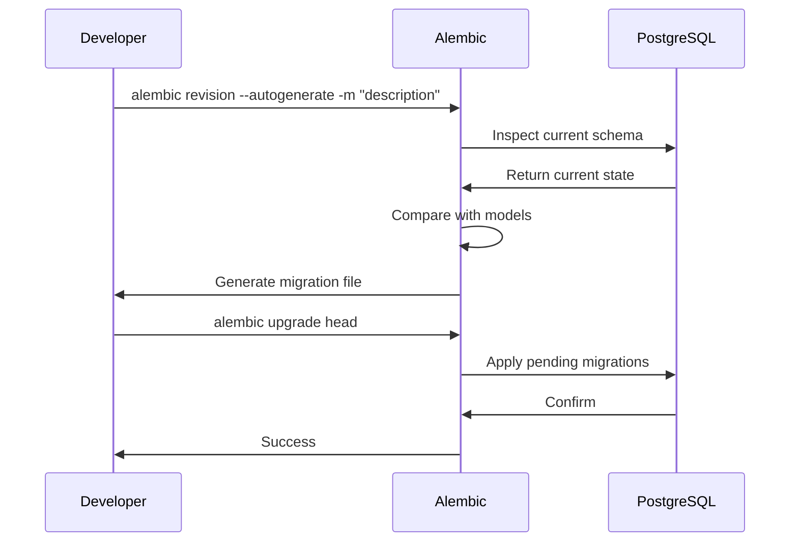

# Architecture Guide

This document describes the architecture, design principles, and operational workflows of the AI Healthcare Follow-up Assistant.

## Table of Contents

- [Architecture Overview](#architecture-overview)
- [Layer Responsibilities](#layer-responsibilities)
- [Request Lifecycle](#request-lifecycle)
- [AI Workflow](#ai-workflow)
- [Database Workflow](#database-workflow)
- [Deployment Workflow](#deployment-workflow)
- [Design Principles](#design-principles)
- [Future Scalability](#future-scalability)

---

## Architecture Overview

```
┌──────────────────────────────────────────────────────────────────────────┐
│                            CLIENT LAYER                                   │
│                                                                          │
│  ┌─────────────────────────┐  ┌─────────────────────────┐               │
│  │     Next.js Frontend    │  │    External Clients      │               │
│  │     (SSR + SPA)         │  │    (Postman, curl,       │               │
│  │     Port 3000           │  │     mobile apps)         │               │
│  └───────────┬─────────────┘  └───────────┬─────────────┘               │
│              │ HTTP/JSON                  │ HTTP/JSON                     │
│              │ Bearer Token               │ Bearer Token                  │
└──────────────┼────────────────────────────┼──────────────────────────────┘
               │                            │
               ▼                            ▼
┌──────────────────────────────────────────────────────────────────────────┐
│                         API GATEWAY - FastAPI (Port 8000)                 │
│                                                                          │
│  ┌──────────┐  ┌──────────┐  ┌──────────────┐  ┌────────────┐          │
│  │  CORS    │  │   CSRF   │  │ Rate Limit   │  │   Error    │          │
│  │Middleware│  │Middleware│  │ Middleware    │  │  Handler   │          │
│  └────┬─────┘  └────┬─────┘  └──────┬───────┘  └─────┬──────┘          │
│       └──────────────┴──────────────┴─────────────────┘                 │
│                               │                                          │
│               ┌───────────────┴───────────────┐                         │
│               │        Route Handlers         │                         │
│               │   auth, patients, doctors,     │                         │
│               │   reports, chat, appointments  │                         │
│               └───────────────┬───────────────┘                         │
│                               │                                          │
│               ┌───────────────┴───────────────┐                         │
│               │        Service Layer           │                         │
│               │  Auth, Patient, Doctor, Report, │                         │
│               │  Chat, Medicine, Adherence,     │                         │
│               │  Emergency, Summary, Appointment│                         │
│               └───────────────┬───────────────┘                         │
│                               │                                          │
│               ┌───────────────┴───────────────┐                         │
│               │      Repository Layer          │                         │
│               │   BaseRepository + 8 repos     │                         │
│               └───────────────┬───────────────┘                         │
└───────────────────────────────┼─────────────────────────────────────────┘
                                │
┌───────────────────────────────┼─────────────────────────────────────────┐
│                    AI / RAG LAYER (app/ai, app/embeddings, etc.)         │
│                               │                                          │
│  ┌────────────────────────────┴────────────────────────────┐            │
│  │                    Document Ingestion Pipeline           │            │
│  │  Upload ─▶ OCR ─▶ Clean ─▶ Classify ─▶ Section Detect ─▶│            │
│  │  Chunk ─▶ Enrich Metadata ─▶ Embed ─▶ Store (ChromaDB)  │            │
│  └──────────────────────────────────────────────────────────┘            │
│                               │                                          │
│  ┌────────────────────────────┴────────────────────────────┐            │
│  │                    Retrieval Layer (app/retrieval/)       │            │
│  │  Query ─▶ Embed ─▶ Vector Search ─▶ Score ─▶ Filter ─▶  │            │
│  │  RetrievedDocuments                                       │            │
│  └──────────────────────────────────────────────────────────┘            │
│                               │                                          │
│  ┌────────────────────────────┴────────────────────────────┐            │
│  │                 Context Builder (app/context/)            │            │
│  │  RetrievedDocs ─▶ Dedup ─▶ Rank ─▶ Compress ─▶          │            │
│  │  Token Budget ─▶ Citation ─▶ Assemble ─▶ Context String  │            │
│  └──────────────────────────────────────────────────────────┘            │
│                               │                                          │
│  ┌────────────────────────────┴────────────────────────────┐            │
│  │           RAG Engine + Medical QA Agent (✅ Complete)    │            │
│  │  Context ─▶ LLM ─▶ Guardrails ─▶ Response ─▶ Sources     │            │
│  └──────────────────────────────────────────────────────────┘            │
│                                                                          │
│  ┌──────────────────────────────────────────────────────────────────────┐│
│  │             AI Infrastructure Layers (Independent of LLM)             ││
│  │                                                                      ││
│  │  ┌──────────────────┐  ┌─────────────────┐  ┌──────────────────┐   ││
│  │  │  Prompt System   │  │ Embedding Layer │  │  Provider Layer  │   ││
│  │  │  (app/prompts/)  │  │ (app/embeddings/)│  │  (app/ai/)      │   ││
│  │  │  Versioned,      │  │ ABC → Registry  │  │  ABC → Registry  │   ││
│  │  │  Cached,         │  │ → Factory →     │  │  → Factory →     │   ││
│  │  │  Registry-based  │  │ → Service →     │  │  → Service →     │   ││
│  │  │                  │  │ → Providers     │  │  → Providers     │   ││
│  │  └──────────────────┘  └─────────────────┘  └──────────────────┘   ││
│  └──────────────────────────────────────────────────────────────────────┘│
└──────────────────────────────────────────────────────────────────────────┘
                                │
        ┌───────────────────────┼───────────────────────┐
        │                       │                       │
        ▼                       ▼                       ▼
┌─────────────────┐  ┌──────────────────┐  ┌──────────────────────┐
│   PostgreSQL    │  │    ChromaDB      │  │  Google Vision OCR   │
│   (Primary DB)  │  │  (Vector Store)  │  │  + Tesseract         │
│   Port 5432     │  │  Port 8001       │  │                      │
│                 │  │                  │  │                      │
│  Relational     │  │  Embeddings +    │  │  Image → Text        │
│  data, users,   │  │  metadata for    │  │  extraction          │
│  medical records│  │  semantic search │  │                      │
└─────────────────┘  └──────────────────┘  └──────────────────────┘
```

---

## Layer Responsibilities

### 1. Middleware Layer

Files: `app/middleware/`

| Middleware           | Responsibility                                                      |
|----------------------|---------------------------------------------------------------------|
| `CORSMiddleware`      | Allows cross-origin requests from configured frontend origins       |
| `CSRFTokenMiddleware` | Validates Origin/Referer headers on state-changing requests         |
| `RateLimitMiddleware` | Enforces per-IP rate limits for login and global endpoints          |
| `ErrorHandler`        | Catches all exceptions and returns structured JSON error responses  |

**Stacking order** (outermost first):
1. `CORSMiddleware` — must be first to handle preflight OPTIONS.
2. `CSRFTokenMiddleware` — validates origin before request processing.
3. `RateLimitMiddleware` — checks limits after origin validation.
4. `ErrorHandler` — wraps the entire stack (both middleware and app).

### 2. Route Handler Layer

Files: `app/api/v1/`

Responsible for:
- HTTP method and path matching.
- Request validation via Pydantic dependency injection (`Depends()`).
- Authentication via `get_current_user()` and role-based dependencies.
- Delegating to services and returning HTTP responses.

Each route handler should be **thin** — no business logic, no direct database access.

```python
@router.post("", response_model=AppointmentResponse)
def create_appointment(
    data: AppointmentCreate,
    payload: dict = Depends(get_current_patient),
    db: Session = Depends(get_db),
):
    service = AppointmentService(db)
    return service.create_appointment(data.model_dump())
```

### 3. Service Layer

Files: `app/services/`

Responsible for:
- All business logic and validation.
- Orchestrating multiple repository calls.
- Enforcing ownership and authorization rules.
- Raising domain exceptions (`NotFoundException`, `ForbiddenException`, etc.).

Services should be **testable in isolation** — dependencies (repositories, external APIs) are injected via constructor.

```python
class AppointmentService:
    def __init__(self, db: Session):
        self.db = db
        self.repository = AppointmentRepository(db)

    def create_appointment(self, data: dict) -> Appointment:
        processed = {}
        for key, value in data.items():
            if key in ("patient_id", "doctor_id", "id") and isinstance(value, str):
                processed[key] = uuid.UUID(value)
            else:
                processed[key] = value
        return self.repository.create(**processed)
```

### 4. Repository Layer

Files: `app/repositories/`

Responsible for:
- Data access (CRUD operations) via SQLAlchemy.
- Query building (filters, ordering, pagination).
- Type conversion for cross-database compatibility (e.g., string → UUID for SQLite).

All repositories inherit from `BaseRepository`:

```python
class BaseRepository(Generic[ModelType]):
    def create(self, **kwargs) -> ModelType: ...
    def get(self, id: Any) -> Optional[ModelType]: ...
    def get_multi(self, ...) -> list[ModelType]: ...
    def update(self, id: Any, **kwargs) -> Optional[ModelType]: ...
    def delete(self, id: Any) -> bool: ...
    def count(self, filters: Optional[dict] = None) -> int: ...
```

### 5. Model Layer

Files: `app/models/`

Responsible for:
- SQLAlchemy ORM model definitions.
- Table relationships, indexes, and constraints.
- Mixin classes (`TimestampMixin`, `UUIDMixin`).

### 6. Schema Layer

Files: `app/schemas/`

Responsible for:
- Pydantic models for request validation and response serialization.
- Input validation rules (password strength, phone format, date ranges).
- Response schemas with `from_attributes = True` for ORM mode.

### 7. Agent Framework Layer

Files: `app/agents/` (22 files)

Responsible for:
- **BaseAgent** ABC — 10 lifecycle methods: initialize, can_handle, prepare_context, retrieve_memory, retrieve_documents, invoke_rag, invoke_tools, post_process, validate_response, cleanup
- **Agent Registry** — `AgentRegistry` with global singleton, auto-registers `medical_qa` at import time
- **Agent Factory** — `AgentFactory.create()` — config-driven instantiation matching the ABC→Registry→Factory pattern
- **Agent Executor** — `AgentExecutor` — full lifecycle orchestration with error recovery, retry logic, and timing
- **Agent Service** — `AgentService.run()` — high-level entry point for external consumers
- **MedicalQAAgent** — inherits BaseAgent, wraps existing `ChatService`, zero regressions
- **5 future agent skeletons** — Reminder, Emergency, Doctor Summary, FollowUp, Appointment
- **AgentContext/AgentState/AgentResponse** — standardized context, state tracking, and response types
- All agents follow same architecture: ABC → Registry → Factory → Executor/Service


### 8. Tool Calling Framework Layer

Files: `app/tools/` (28 files)

Responsible for providing AI agents with safe, authorized access to backend capabilities.

**Architecture:** ABC `->` ToolRegistry `->` ToolFactory `->` ToolExecutor `->` ToolService

| Module | Responsibility |
|--------|---------------|
| `base_tool.py` | `BaseTool` ABC -- 6 lifecycle methods: validate, authorize, execute, verify, audit, cleanup |
| `config.py` | `ToolConfig` -- max_retries, retry_delay, timeout, require flags for each phase |
| `tool_context.py` | `ToolContext` -- tool_name, action, user_id, user_role, parameters, metadata |
| `tool_result.py` | `ToolResult` -- ok() and error_factory() class methods |
| `tool_registry.py` | `ToolRegistry` + global singleton |
| `tool_factory.py` | `ToolFactory.create()` / `create_or_none()` |
| `tool_executor.py` | `ToolExecutor` -- validate, authorize, execute, verify, audit, cleanup |
| `tool_selector.py` | `ToolSelector` -- rule-based intent->tool mapping (15+ patterns) |
| `tool_service.py` | `ToolService` -- run(), run_with_tool(), run_from_query(), list_tools() |
| `tools/appointment/` | `AppointmentTool` -- book, cancel, reschedule, list |
| `tools/patient/` | `PatientTool` -- get_profile, active_reports |
| `tools/doctor/` | `DoctorTool` -- assigned_doctor, specialization, availability |
| `tools/report/` | `ReportTool` -- list, summarize, metadata |
| `tools/medication/` | `MedicationTool` -- schedule, explain |
| `tools/future/` | `NotificationTool`, `CalendarTool`, `EmailTool`, `SMSTool` (skeletons) |
| `exceptions.py` | 13 exception classes rooted at `ToolError` |

**Lifecycle** (executed by ToolExecutor):
1. `validate(ctx)` -- validate input parameters
2. `authorize(ctx)` -- check user permissions
3. `execute(ctx)` -- run domain logic (with retry)
4. `verify(result)` -- verify output quality
5. `audit(ctx, result)` -- log execution metadata
6. `cleanup(ctx)` -- release resources

**Design Decisions:**
- Tools use lazy imports for services (inside method bodies) to avoid circular imports
- `db_session` passed via context parameters for flexible DI
- Tool Selector is rule-based, designed for AI replacement
- 9 tools auto-registered in global registry at import time

### 8. Core Layer

Files: `app/core/`

| Module       | Responsibility                                         |
|-------------|--------------------------------------------------------|
| `config.py` | Centralized configuration via `pydantic-settings`       |
| `security.py` | JWT creation/validation, password hashing, token hashing |
| `logging.py` | Loguru configuration with rotation and retention       |
| `exceptions.py` | Domain exception hierarchy                         |

### 9. AI Provider Layer

Files: `app/ai/`

Responsible for abstracting LLM provider access (Google Gemini, OpenAI, etc.).
Follows ABC → Registry → Factory → Provider → Service pattern. Fully implemented
with Gemini as the active provider; OpenAI and Anthropic skeletons ready.

### 10. Prompt Management Layer

Files: `app/prompts/`

Responsible for loading, caching, versioning, and rendering prompt templates.
18 prompts across 6 categories stored as Markdown files with YAML frontmatter.
`PromptManager` provides registry, discovery, preloading, and cache invalidation.

### 11. Embedding Layer

Files: `app/embeddings/`

Responsible for converting text to vector embeddings. Provider-independent
architecture: `BaseEmbedding` ABC → `EmbeddingRegistry` → `EmbeddingFactory` →
`EmbeddingService`. Active provider: Gemini. Skeletons: OpenAI, SentenceTransformers, Voyage.

### 12. Document Pipeline Layer

Files: `app/document_pipeline/`

| Module              | Responsibility                                             |
|---------------------|------------------------------------------------------------|
| `pipeline.py`       | `DocumentPipeline` orchestrator — clean → classify → detect sections → chunk → enrich |
| `document.py`       | `ProcessedDocument`, `SectionInfo` models                  |
| `chunk.py`          | `DocumentChunk`, `ChunkMetadata` schemas                   |
| `chunker.py`        | 5 chunking strategies: fixed, recursive, semantic, medical_section, sentence |
| `cleaner.py`        | `DefaultDocumentCleaner` — null bytes, whitespace, page separators |
| `metadata.py`       | `DefaultMetadataExtractor` — enriches chunks with versions, types, source |
| `versioning.py`     | `VersionInfo`, `DefaultVersionTracker` for doc/extraction/schema/embedding versions |
| `interfaces.py`     | `DocumentCleaner`, `DocumentClassifier`, `SectionDetector`, `Chunker`, `MetadataExtractor`, `VersionTracker` ABCs |
| `config.py`         | `DocumentPipelineConfig` dataclass with validation |
| `exceptions.py`     | 11 exception classes for the document pipeline |

### 13. Vector Store Layer

Files: `app/vector_store/`

Responsible for storing and querying document embeddings. Provider-independent
architecture: `BaseVectorStore` ABC → `VectorStoreRegistry` → `VectorStoreFactory` →
`VectorService`. Active provider: ChromaDB. Skeletons: Qdrant, Weaviate, Pinecone.

Supports:
- Collection management (create, get, list, delete)
- Document storage with metadata
- Semantic search with score and metadata filtering
- Health checks and lifecycle management

### 14. Retrieval Layer

Files: `app/retrieval/`

Responsible for high-level semantic search across indexed documents. Provider-independent
architecture: `BaseRetriever` ABC → `RetrieverRegistry` → `RetrieverFactory` →
`RetrieverService`.

| Module              | Responsibility                                             |
|---------------------|------------------------------------------------------------|
| `base_retriever.py` | `BaseRetriever` ABC — retrieve, retrieve_by_patient, retrieve_by_report, retrieve_with_scores |
| `retriever_registry.py` | `RetrieverRegistry` — provider registration with persistence |
| `retriever_factory.py` | `RetrieverFactory.create(config)` — configuration-driven instantiation |
| `retriever_service.py` | `RetrieverService` — high-level search with patient/report/doc-type filtering |
| `config.py`         | `RetrieverConfig` dataclass — provider, top_k, threshold, filters |
| `models.py`         | `RetrievalQuery`, `RetrievalResult`, `RetrievedDocument`, `RetrievalMetrics` |
| `exceptions.py`     | 8 exception classes for the retrieval layer |
| `providers/vector_retriever.py` | `VectorRetriever` — wraps `VectorService`, translates `SearchResult` → `RetrievalResult` |
| `providers/future/` | `HybridRetriever`, `KeywordRetriever` skeletons |

Active provider: `VectorRetriever` (wraps ChromaDB via VectorService).

### 15. Context Builder Layer

Files: `app/context/`

Responsible for transforming retrieved documents into an optimized, LLM-ready context
string. Operates independently of any LLM — a pure data transformation pipeline.

Pipeline stages (all optional, driven by `ContextConfig`):
1. **Deduplicate** — exact text match, chunk ID match, configurable overlap detection
2. **Rank** — priority sections first, then by relevance score descending
3. **Compress** — merge adjacent/overlapping fragments from same report/section
4. **Token Budget** — 3 strategies: fixed_max (hard cap), priority_truncation (drop low priority), section_preserve (keep complete sections)
5. **Citations** — extract unique citations, format citation block, annotate fragments with source metadata
6. **Assemble** — combine into final context string

| Module              | Responsibility                                             |
|---------------------|------------------------------------------------------------|
| `context_builder.py` | `ContextBuilder` — orchestrates the full pipeline          |
| `deduplicator.py`   | `Deduplicator` — exact text, chunk ID, overlap dedup       |
| `ranker.py`         | `Ranker` — priority section + score-based sorting           |
| `compressor.py`     | `Compressor` — adjacent/overlap fragment merging            |
| `citation.py`       | `CitationGenerator` — citation block + fragment annotation  |
| `token_budget.py`   | `TokenBudgetManager` — 3 budget strategies + token estimation |
| `config.py`         | `ContextConfig` dataclass — max_tokens, strategy, thresholds |
| `models.py`         | `ContextFragment`, `CitationInfo`, `TokenUsageInfo`, `BuildContextInput`, `BuildContextResult` |
| `exceptions.py`     | 7 exception classes for context building |

---

## Request Lifecycle

### Standard API Request

```
Client                    FastAPI                             Database
  │                         │                                    │
  │─── HTTP Request ───────▶│                                    │
  │                         │                                    │
  │                    ┌────┴────┐                               │
  │                    │  CORS   │───Allowed origin?───No───▶403│
  │                    └────┬────┘                               │
  │                         │                                    │
  │                    ┌────┴────┐                               │
  │                    │  CSRF   │───State-changing?───Yes───▶  │
  │                    │  Check  │   Origin valid?      No──▶403│
  │                    └────┬────┘                               │
  │                         │                                    │
  │                    ┌────┴────┐                               │
  │                    │  Rate   │───Limit exceeded?───Yes──▶429│
  │                    │  Limit  │                               │
  │                    └────┬────┘                               │
  │                         │                                    │
  │                    ┌────┴────┐                               │
  │                    │  Auth   │───Valid token?───No───▶401   │
  │                    │  Check  │───Has role?──────No───▶403   │
  │                    └────┬────┘                               │
  │                         │                                    │
  │                    ┌────┴────┐                               │
  │                    │  Route  │───Validate body──────────────▶│
  │                    │ Handler │───Call service───────────────▶│
  │                    └────┬────┘   │                           │
  │                         │        │───Repository call────────▶│
  │                         │        │                           │───SQL──▶
  │                         │        │◄────Result────────────────│
  │                         │        │                           │◄───Result
  │                         │◄───────┘                           │
  │                    ┌────┴────┐                               │
  │                    │Response │───Serialize───────────────────▶│
  │                    │ Builder │                               │
  │                    └────┬────┘                               │
  │                         │                                    │
  │◄─── HTTP Response ──────┤                                    │
  │                         │                                    │
```

### Authentication Flow

```
┌─────────┐     ┌──────────┐     ┌───────────┐     ┌──────────┐
│ Client  │     │  Backend │     │ Database  │     │   JWT    │
└────┬────┘     └────┬─────┘     └─────┬─────┘     └────┬─────┘
     │                │                 │                │
     │ POST /register │                 │                │
     │───────────────▶│ Validate input  │                │
     │                │────────────────▶│                │
     │                │ Check duplicate│                │
     │                │◀────────────────│                │
     │                │                 │                │
     │                │ Hash password  │                │
     │                │ Create user    │                │
     │                │────────────────▶│                │
     │                │◀────────────────│                │
     │                │                 │                │
     │                │ Generate       │                │
     │                │ token pair     │────────────────▶│
     │                │◀────────────────│                │
     │                │                 │                │
     │                │ Store refresh  │                │
     │                │ token hash     │                │
     │                │────────────────▶│                │
     │                │◀────────────────│                │
     │                │                 │                │
     │ 201 Created    │                 │                │
     │◀───────────────│                 │                │
┌────┴────┐          │                 │                │
│ Client  │          │                 │                │
│ Stores  │          │                 │                │
│ tokens  │          │                 │                │
└─────────┘          │                 │                │
     │                │                 │                │
     │ POST /login    │                 │                │
     │───────────────▶│ Verify password│                │
     │                │────────────────▶│                │
     │                │◀────────────────│                │
     │                │ Generate pair  │────────────────▶│
     │                │ Store refresh  │                │
     │                │────────────────▶│                │
     │ 200 + tokens   │                 │                │
     │◀───────────────│                 │                │
     │                │                 │                │
```

---

## AI Workflow

### Full AI Pipeline (Implemented + Upcoming)

```
Upload Report                      Patient Question
    │                                     │
    ▼                                     ▼
┌──────────────────┐             ┌──────────────────┐
│  OCR Extraction  │             │  Query Embedding │
│  (Google Vision  │             │  (Embedding Layer)│
│   + Tesseract)   │             └────────┬─────────┘
└────────┬─────────┘                      │
         │                                ▼
         ▼                     ┌──────────────────────┐
┌──────────────────┐           │  Retrieval Layer     │
│  Document        │           │  (VectorRetriever)   │
│  Pipeline        │           │  ChromaDB Semantic   │
│  Clean → Classify│           │  Search + Filter     │
│  → Sections →    │           └──────────┬───────────┘
│  → Chunk → Meta  │                      │
└────────┬─────────┘                      │
         │                                ▼
         ▼                     ┌──────────────────────┐
┌──────────────────┐           │  Context Builder     │
│  Embedding Layer │           │  Dedup → Rank →      │
│  (Gemini)        │           │  Compress → Budget   │
└────────┬─────────┘           │  → Citations →       │
         │                     │  → Assemble          │
         ▼                     └──────────┬───────────┘
┌──────────────────┐                      │
│  Vector Store    │                      │
│  (ChromaDB)      │                      │
│  Store & Index   │                      │
└──────────────────┘                      │
         │                                │
         └────────────┬───────────────────┘
                      │
                      ▼
          ┌──────────────────────┐
          │  (UPCOMING)          │
           │  RAG Engine          │
           │  + Medical QA Agent  │
          │  Context + LLM       │
          │  → Response + Sources│
          └──────────────────────┘
```

### AI Infrastructure: ABC → Registry → Factory → Provider → Service

Every AI component follows the same provider-independent pattern:

```
┌──────────────────────────────────────────────────────────┐
│                   Base ABC                                │
│  Defines interface (abstract methods, properties)         │
└──────────────────────────┬───────────────────────────────┘
                           │
┌──────────────────────────▼───────────────────────────────┐
│                   Registry                                │
│  Global mapping: provider_name → Type[BaseABC]            │
│  register(), get(), list_providers(), clear()             │
└──────────────────────────┬───────────────────────────────┘
                           │
┌──────────────────────────▼───────────────────────────────┐
│                   Factory                                 │
│  create(config) → instantiated provider                   │
│  Config-driven: config.provider selects implementation    │
└──────────────────────────┬───────────────────────────────┘
                           │
┌──────────────────────────▼───────────────────────────────┐
│                   Provider(s)                              │
│  ┌──────────┐  ┌──────────┐  ┌──────────┐  ┌──────────┐ │
│  │ Gemini   │  │ Active   │  │ Future   │  │ Future   │ │
│  │ (active) │  │ Provider │  │ Skeleton │  │ Skeleton │ │
│  └──────────┘  └──────────┘  └──────────┘  └──────────┘ │
└──────────────────────────┬───────────────────────────────┘
                           │
┌──────────────────────────▼───────────────────────────────┐
│                   High-Level Service                      │
│  Wraps provider, adds: metadata tracking, logging,        │
│  error handling, config validation                        │
└──────────────────────────────────────────────────────────┘
```

This pattern is used for:
- **AI Providers** (`app/ai/`) — LLM inference
- **Embeddings** (`app/embeddings/`) — Text → Vector
- **Vector Store** (`app/vector_store/`) — Store & Query vectors
- **Retrieval** (`app/retrieval/`) — Semantic search

### Dependency Injection & Provider Abstraction

All AI infrastructure components use constructor-based dependency injection.
Providers are selected at runtime via configuration (not imports):

```python
from app.retrieval import RetrieverConfig, RetrieverFactory, RetrieverService

config = RetrieverConfig(provider="vector", top_k=10, threshold=0.7)
retriever = RetrieverFactory.create(config)
service = RetrieverService(retriever=retriever)

results = service.search("patient symptoms", patient_id="pat_001")
```

This design ensures:
- Zero code changes to switch providers
- All components independently testable with mock providers
- Future providers implement the same ABC contract
- Configuration-driven behavior throughout

### Agent Orchestration (Implemented)

The Agent Framework (`app/agents/`) uses a lifecycle-based architecture shared by all agents:

```
Agent Directory:
  base_agent.py       → BaseAgent ABC — 10 lifecycle methods
  config.py           → AgentConfig — per-agent configuration
  agent_context.py    → AgentContext — shared context dataclass
  agent_state.py      → AgentState — phase tracking, timing, errors
  agent_response.py   → AgentResponse — standardized response
  agent_registry.py   → AgentRegistry + global singleton
  agent_factory.py    → AgentFactory.create() — config-driven instantiation
  agent_executor.py   → AgentExecutor — lifecycle orchestration with retry
  agent_service.py    → AgentService — high-level run() entry point
  agents/             → Concrete agent implementations (MedicalQAAgent + future)
  future/             → Agent skeletons (Reminder, Emergency, etc.)
```

**Lifecycle Phases** (executed sequentially by AgentExecutor):

1. `initialize()` — prepare internal resources
2. `can_handle()` — check if agent can process this request
3. `prepare_context()` — augment/transform context
4. `retrieve_memory()` — [if enabled] load memory entries
5. `retrieve_documents()` — [if enabled] load evidence
6. `invoke_rag()` — execute RAG pipeline → returns AgentResponse
7. `invoke_tools()` — [if enabled, placeholder] external tool calls
8. `post_process()` — transform/enrich raw response
9. `validate_response()` — validate before returning
10. `cleanup()` — release resources

```python
# Example: MedicalQAAgent
class MedicalQAAgent(BaseAgent):
    def initialize(self) -> None:
        self._chat_service = ChatService(
            ai_service=self.config.rag_params["ai_service"],
            retriever_service=self.config.rag_params["retriever_service"],
        )
    
    def can_handle(self, context: AgentContext) -> bool:
        return bool(context.query)
    
    def invoke_rag(self, context: AgentContext) -> AgentResponse:
        result = self._chat_service.ask(
            question=context.query,
            patient_id=context.patient_id,
            session_id=context.session_id,
        )
        return AgentResponse.ok(
            answer=result["answer"],
            data=result.get("metadata"),
        )
    
    def validate_response(self, response: AgentResponse) -> AgentResponse:
        if not response.answer:
            raise AgentValidationError("Answer is empty")
        return response
```

**Executor drives lifecycle** with automatic retry and error recovery:

### Memory Framework

Files: `app/memory/` (26 files)

The Memory Framework provides provider-independent memory management:

| Module | Responsibility |
|--------|---------------|
| `config.py` | `MemoryConfig` — provider, default_ttl (1800s), per-type/policy enable flags, retention_days |
| `models.py` | 8 Pydantic models/enums: `MemoryType`, `MemoryEntry`, `MemoryQuery`, `MemorySearchResult`, `MemorySummary`, `MemoryStats`, `MemoryImportance`, `PruningStrategy` |
| `exceptions.py` | 15 exception classes for the memory layer |
| `base_memory.py` | `BaseMemory` ABC — `remember`, `recall`, `forget`, `clear` |
| `store/base_store.py` | `BaseMemoryStore` ABC — CRUD + search + health check |
| `store/in_memory_store.py` | `InMemoryStore` — dict-based with session index, deep copy, search filtering by session/type/expired/importance/time_range |
| `store/future/` | Redis and Postgres store skeletons |
| `types/` | 5 memory types: `ConversationMemory`, `DocumentContext`, `PatientContext`, `PreferenceMemory`, `ToolMemory` |
| `processors/extractor.py` | `MemoryExtractor` — 5 extraction methods (entities, keywords, summary, sentiment, facts) |
| `processors/retriever.py` | `MemoryRetriever` — 6 retrieval methods (recent, relevant, keyword, temporal, importance, hybrid) |
| `processors/summarizer.py` | `MemorySummarizer` — per-conversation + per-type summary generation |
| `processors/pruner.py` | `MemoryPruner` — importance-based + expired-entry pruning |
| `policies/retention.py` | `RetentionPolicy` — days-based retention + session count limit |
| `policies/privacy.py` | `PrivacyPolicy` — strict mode PII sanitization, role-based access |
| `policies/expiry.py` | `ExpiryPolicy` — per-type TTL overrides, absolute expiry |
| `registry.py` | `MemoryRegistry` — memory type registration |
| `factory.py` | `MemoryFactory.create()` — type-driven instantiation |
| `service.py` | `MemoryService` — `remember()`, `recall()`, `forget()`, `clear()`, `extract()`, `summarize()`, `prune()`, `health_check()` |

### Evaluation & Benchmarking Framework

Files: `app/evaluation/` (16 files)

| Module | Responsibility |
|--------|---------------|
| `config.py` | `EvaluationConfig` — provider, model, top_k, k_values, enable flags |
| `exceptions.py` | 12 exception classes for evaluation |
| `models.py` | `Metric`, `MetricResult`, `MetricRegistry`, `BenchmarkResults` |
| `benchmark_runner.py` | `BenchmarkRunner` — load dataset → execute (warmup + multi-run) → aggregate → report |
| `report_generator.py` | `ReportGenerator` — JSON + text summary output |
| `dataset_loader.py` | `DatasetLoader` — JSON/JSONL from 6 dataset directories |
| `ground_truth.py` | `GroundTruthSet`, `GroundTruthValidator` |
| `retrieval_metrics.py` | `recall_at_k`, `precision_at_k`, `MRR`, `NDCG` |
| `rag_metrics.py` | `groundedness`, `citation_accuracy`, `context_precision/recall`, `answer_relevance`, medical QA metrics |
| `hallucination_detection.py` | `detect_hallucinated_claims`, `hallucination_rate`, pattern matching |
| `citation_metrics.py` | `citation_precision/recall/f1`, `citation_coverage`, `citation_redundancy` |
| `performance_metrics.py` | `LatencyTracker` (p95/p99), `PerformanceAnalyzer`, `TokenUsageTracker` |

### Prompt Templates

Prompts are stored as standalone Markdown files in `backend/prompts/` (18 prompts across 6 categories).

#### Prompt Management System (`app/prompts/`)
| Module | Responsibility |
|--------|---------------|
| `manager.py` | `PromptManager` — registry with `list_categories()`, `list_prompts()`, `get_prompt()`, `render()`, `get_version()`, `preload_all()`, `invalidate_cache()` |
| `loader.py` | `RAGPromptLoader` wrapping `CorePromptLoader`, `RAGPrompt` with `PromptVersion`, content hashing |
| `cache.py` | `PromptCache` — TTL+LRU cache with per-key TTL, hit/miss stats |

#### Embedding Layer (`app/embeddings/`)
| Module | Responsibility |
|--------|---------------|
| `base_embedding.py` | `BaseEmbedding` ABC — `embed_text`, `embed_batch`, `embed_query`, `dimension`, `model_name`, `provider_name`, `health_check` |
| `embedding_registry.py` | `EmbeddingRegistry` — maps provider names to `Type[BaseEmbedding]` |
| `embedding_factory.py` | `EmbeddingFactory.create()` — configuration-driven provider instantiation |
| `embedding_service.py` | `EmbeddingService` (high-level embed/batch/query) + `ReEmbeddingService` ABC |
| `providers/gemini_embedding.py` | Full Gemini implementation using `google.generativeai` |

#### Vector Store Layer (`app/vector_store/`)
| Module | Responsibility |
|--------|---------------|
| `base_vector_store.py` | `BaseVectorStore` ABC — `create_collection`, `add_documents`, `search`, `delete_collection`, `health_check` |
| `vector_store_registry.py` | `VectorStoreRegistry` — maps provider names to `Type[BaseVectorStore]` |
| `vector_store_factory.py` | `VectorStoreFactory.create()` — configuration-driven instantiation |
| `vector_service.py` | `VectorService` (high-level add/search/delete/list with logging, error handling) |
| `providers/chromadb_store.py` | Full ChromaDB implementation |
| `providers/future/` | Qdrant, Weaviate, Pinecone skeletons |

#### Retrieval Layer (`app/retrieval/`)
| Module | Responsibility |
|--------|---------------|
| `base_retriever.py` | `BaseRetriever` ABC — retrieve, retrieve_by_patient, retrieve_by_report, retrieve_with_scores, health_check |
| `retriever_registry.py` | `RetrieverRegistry` — provider registration with persistence |
| `retriever_factory.py` | `RetrieverFactory.create(config)` — config-driven instantiation |
| `retriever_service.py` | `RetrieverService` — search, search_by_patient, search_by_report, health_check |
| `providers/vector_retriever.py` | `VectorRetriever` — wraps VectorService, translates SearchResult → RetrievalResult |

#### Context Builder (`app/context/`)
| Module | Responsibility |
|--------|---------------|
| `context_builder.py` | `ContextBuilder` — orchestrates full pipeline (dedup → rank → compress → budget → citations → assemble) |
| `deduplicator.py` | `Deduplicator` — exact text match, chunk ID match, overlap detection |
| `ranker.py` | `Ranker` — priority section + score descending |
| `compressor.py` | `Compressor` — adjacent/overlap merging |
| `citation.py` | `CitationGenerator` — citation block + fragment annotation |
| `token_budget.py` | `TokenBudgetManager` — 3 strategies: fixed_max, priority_truncation, section_preserve |

---

## Database Workflow

### Schema

```
┌─────────────────────────────────────────────────────────────────────────┐
│                                                                          │
│   ┌──────────┐     ┌───────────────┐     ┌───────────────┐              │
│   │ Patient  │────▶│ PatientDoctor │◀────│   Doctor      │              │
│   └────┬─────┘     └───────────────┘     └──────┬────────┘              │
│        │                                        │                        │
│        │  ┌──────────────────┐                  │                        │
│        ├──│    Report        │                  │                        │
│        │  └────────┬─────────┘                  │                        │
│        │           │                            │                        │
│        │  ┌────────▼─────────┐                  │                        │
│        ├──│   Medicine       │                  │                        │
│        │  └────────┬─────────┘                  │                        │
│        │           │                            │                        │
│        │  ┌────────▼─────────┐     ┌────────────▼────────┐              │
│        ├──│ AdherenceLog     │     │     Appointment     │              │
│        │  └──────────────────┘     └─────────────────────┘              │
│        │                                                               │
│        │  ┌──────────────────┐     ┌──────────────────┐                 │
│        ├──│   ChatHistory    │     │  EmergencyAlert  │                 │
│        │  └──────────────────┘     └──────────────────┘                 │
│        │                                                               │
│        │  ┌──────────────────┐                                          │
│        └──│  RefreshToken    │                                          │
│           └──────────────────┘                                          │
└─────────────────────────────────────────────────────────────────────────┘
```

All tables include `created_at` and `updated_at` timestamps via `TimestampMixin`. Primary keys are UUIDs via `UUIDMixin`.

### Migration Workflow



### Connection Pooling

- Pool size: 10 connections (configurable via `DATABASE_POOL_SIZE`).
- Max overflow: 20 connections (`DATABASE_MAX_OVERFLOW`).
- `pool_pre_ping=True` — checks connection health before use.

---

## Deployment Workflow

### Local Development

```
Docker Compose (docker/docker-compose.yml):
  ├── PostgreSQL 16 (port 5432)
  ├── ChromaDB (port 8001)
  ├── Backend FastAPI (port 8000) — hot-reload enabled
  └── Frontend Next.js (port 3000) — hot-reload enabled
```

### Production Deployment

```
                     ┌────────────────────┐
                     │   Load Balancer    │
                     └────────┬───────────┘
                              │
              ┌───────────────┼───────────────┐
              │               │               │
      ┌───────▼───────┐ ┌────▼───────┐ ┌─────▼────────┐
      │  Backend      │ │  Backend   │ │   Backend    │
      │  Instance 1   │ │ Instance 2 │ │  Instance 3  │
      │               │ │            │ │              │
      │   uvicorn     │ │  uvicorn   │ │   uvicorn    │
      │   workers:4   │ │  workers:4 │ │   workers:4  │
      └───────┬───────┘ └────┬───────┘ └──────┬────────┘
              │              │                │
              └──────────────┼────────────────┘
                             │
                    ┌────────▼────────┐
                    │   PostgreSQL    │
                    │   Managed DB    │
                    │  (e.g., Neon)   │
                    └─────────────────┘
```

### Deployment Steps

1. Run database migrations (`alembic upgrade head`).
2. Start backend with gunicorn + uvicorn workers:

   ```bash
   gunicorn app.main:app \
     --worker-class uvicorn.workers.UvicornWorker \
     --workers 4 \
     --bind 0.0.0.0:8000
   ```

3. Build and serve frontend:

   ```bash
   cd frontend
   npm run build
   npm run start
   ```

4. Configure reverse proxy (nginx, Caddy, or cloud LB):
   - Route `/api/*` to backend.
   - Route `/*` to frontend.
   - Terminate TLS.

---

## Design Principles

### 1. Clean Architecture

```
Route → Service → Repository → Model
```

- **Route** is thin — just HTTP concerns (status codes, response models).
- **Service** contains business logic — testable in isolation.
- **Repository** handles data access — swappable database backend.
- **Model** defines the data schema — no logic beyond relationships.

Dependencies point **inward** (Route → Service → Repository → Model). Never the reverse.

### 2. Dependency Injection

All external dependencies (database sessions, services, repositories) are injected via FastAPI's `Depends()`:

```python
def create_appointment(
    data: AppointmentCreate,
    payload: dict = Depends(get_current_patient),
    db: Session = Depends(get_db),
):
```

This makes testing trivial — you can override any dependency with a mock.

### 3. Repository Pattern

The repository pattern provides:
- A consistent API for data access across the application.
- Type safety via generics.
- Swappable storage backends (SQLite for tests, PostgreSQL for production).
- Centralized query logic (pagination, filtering).

### 4. Defense in Depth

Security is layered:
- **Network**: CORS restricts origins.
- **Transport**: HTTPS in production.
- **Authentication**: JWT Bearer tokens.
- **Authorization**: RBAC + ownership checks.
- **Request validation**: Pydantic schemas.
- **Rate limiting**: Per-IP throttling.
- **CSRF**: Origin header validation.
- **Token security**: Short-lived access tokens, rotation, hashing, revocation.

### 5. Fail Fast

- Validate input at the boundary (Pydantic schema).
- Raise domain exceptions at the first sign of trouble.
- Let the global error handler convert exceptions to responses.
- Never silently catch and continue from invalid states.

### 6. Convention over Configuration

- One file per model, repository, service, and schema.
- Consistent naming across all layers (e.g., `appointments.py` in schemas, models, and API).
- Shared base classes for common patterns (`BaseRepository`, `TimestampMixin`, `UUIDMixin`).

### 16. LangGraph Runtime Layer

Files: `app/langgraph/` (19 files)

Responsible for orchestrating all AI subsystems (Agent, Memory, Tool, RAG) through a
directed graph pipeline. LangGraph is ONLY orchestration — no business logic is moved
into LangGraph itself.

| Module | Responsibility |
|--------|---------------|
| `config.py` | `LangGraphConfig` — graph name, timeouts, retries, feature flags |
| `exceptions.py` | 8 exception classes rooted at `LangGraphError` |
| `graph_state.py` | `GraphState` dataclass with `services` dict, `GraphPhase`/`GraphStatus` enums |
| `graph_context.py` | `GraphContext` — DI container for MemoryService, AgentExecutor, RAGEngine, etc. |
| `graph_events.py` | `EventBus` — typed event emission/subscription for graph lifecycle |
| `graph_checkpoint.py` | `BaseCheckpointStore` ABC + `InMemoryCheckpointStore` |
| `graph_metrics.py` | `MetricsCollector` — per-node timing, latency, token tracking |
| `graph_registry.py` | `GraphRegistry` — global singleton, idempotent registration |
| `graph_factory.py` | `GraphFactory.create()` / `create_or_none()` |
| `graph_executor.py` | `GraphExecutor` — retry, timeout, event emission, trace recording |
| `graph_runtime.py` | `BaseGraph` ABC — `execute()`, `resume()`, `checkpoint()`, `shutdown()` |
| `bootstrap.py` | `GraphBootstrap` — auto-registration + dependency validation |

**MedicalQAGraph Pipeline:**
```
START → load_memory → medical_qa (via AgentExecutor) → tool_selector
  → (need_tool?) tool_executor → (need_retrieval?) retriever → context_builder
  → response_generator → persist_memory → END
```

**Architecture:** `BaseGraph` ABC → `GraphRegistry` → `GraphFactory` → `GraphExecutor`

**Design Decisions:**
- Single-responsibility nodes — no database logic, no provider-specific code
- Services injected via `state.services` dict from `GraphContext`
- `GraphRegistry.register()` is idempotent (checks before registering)
- `ChatService` lazy-imports `MedicalQAGraph` via `TYPE_CHECKING` to avoid circular imports
- `MedicalQAAgent` runs only as a graph node, never called directly by `ChatService`
- Conditional edges: `need_tool_edge`, `need_retrieval_edge`
- 101 tests covering all modules; 182 integration tests unchanged (zero regressions)

---

## Future Scalability

### Immediate Next Steps (Post-Phase L)

| Priority | Feature                      | Approach                                                    |
|----------|------------------------------|-------------------------------------------------------------|
| 1        | RAG Engine + Medical QA Agent  | ✅ Complete (Phase F, migrated to LangGraph node) |
| 2        | LangGraph Runtime              | ✅ Complete (Phase L, v1.0 — 19 modules, 101 tests, production-integrated) |
| 3        | Conversation Memory          | Implement chat history management, session windowing, summarization |
| 4        | Specialized LangGraph Agents | Implement Medical Report, Patient Chat, Emergency, Summary, Reminder agents as LangGraph subgraphs |
| 5        | Multi-Agent Orchestrator     | Parent graph routing to subgraphs, cross-agent handoffs |

### Short-term (Next 3 Months)

| Improvement                    | Approach                                                       |
|--------------------------------|----------------------------------------------------------------|
| Redis-backed rate limiting     | Implement `RedisSlidingWindowEntry` when `REDIS_URL` is set    |
| Database read replicas         | Configure read-only connection pool for GET-heavy endpoints    |
| Background task workers        | Separate Celery or ARQ worker for agent processing             |
| API caching                    | Redis cache for GET /me and frequent query patterns            |
| Request ID tracing             | Inject `X-Request-ID` header and propagate through logs        |
| Hybrid search                  | Add keyword retrieval (BM25) alongside vector search           |
| Result re-ranking              | Cross-encoder re-ranker for improved relevance                 |

### Medium-term (3-12 Months)

| Improvement                    | Approach                                                       |
|--------------------------------|----------------------------------------------------------------|
| Microservices                  | Split agents (chat, emergency, reminders) into separate services|
| Event-driven architecture      | RabbitMQ/Kafka for inter-service communication                 |
| WebSocket real-time updates    | Appointment reminders, emergency alerts via WebSocket          |
| Multi-region deployment        | Database replication + CDN for static assets                   |
| Rate limit tiers               | Per-user rate limits (free vs. premium tiers)                  |

### Long-term (12+ Months)

| Improvement                    | Approach                                                       |
|--------------------------------|----------------------------------------------------------------|
| Horizontal scaling             | Stateless backend behind load balancer (scales horizontally)   |
| CQRS                           | Separate read/write models for high-traffic endpoints          |
| Data lake                      | Export anonymized data for ML model training                   |
| FHIR integration               | HL7 FHIR API for EHR interoperability                          |
| On-premise deployment          | Kubernetes Helm charts for enterprise self-hosting             |

---

*Last updated: 2026-07-16 — Version 0.16.0 (Phase L: LangGraph Runtime Integration Complete)*
