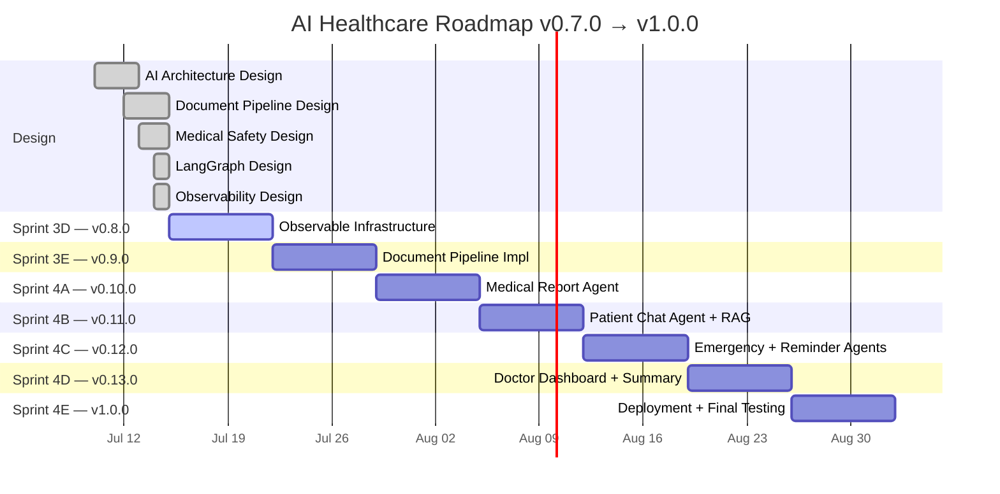
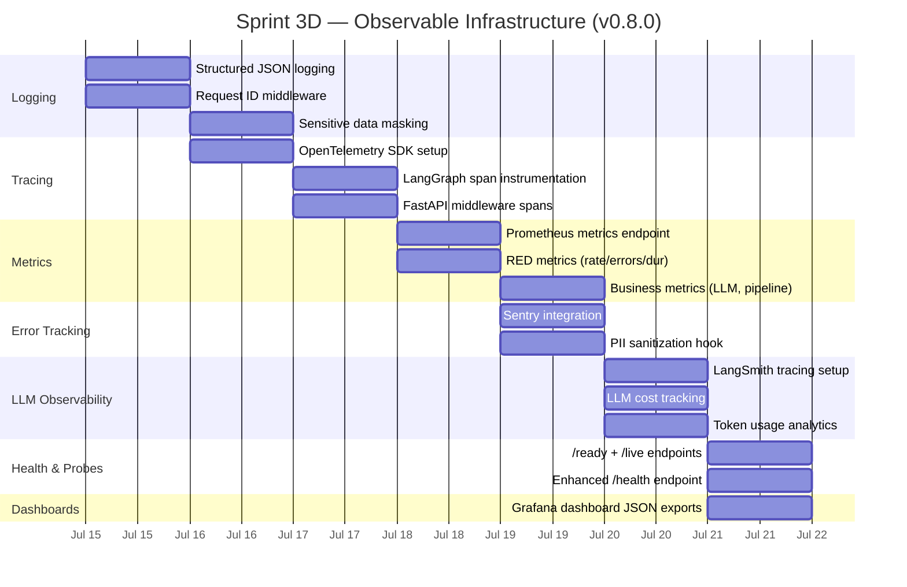
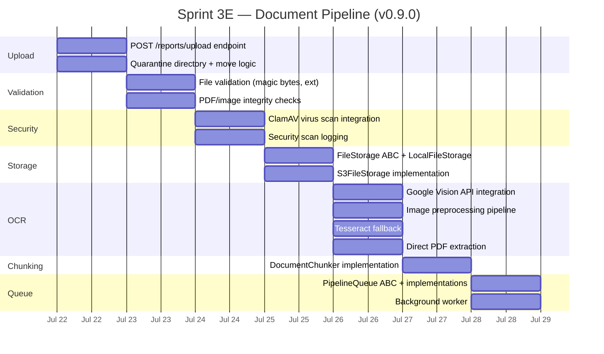
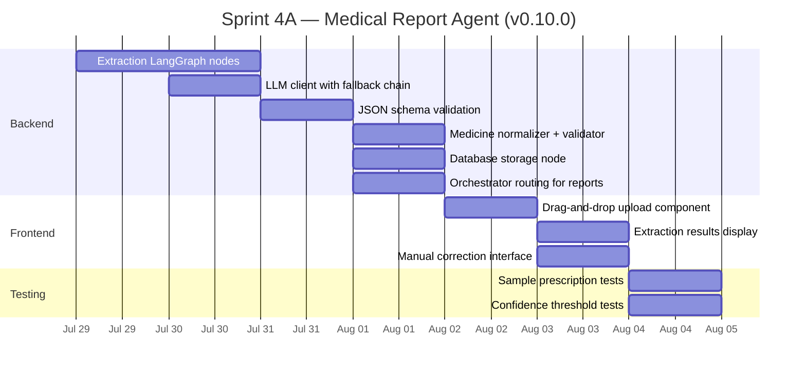
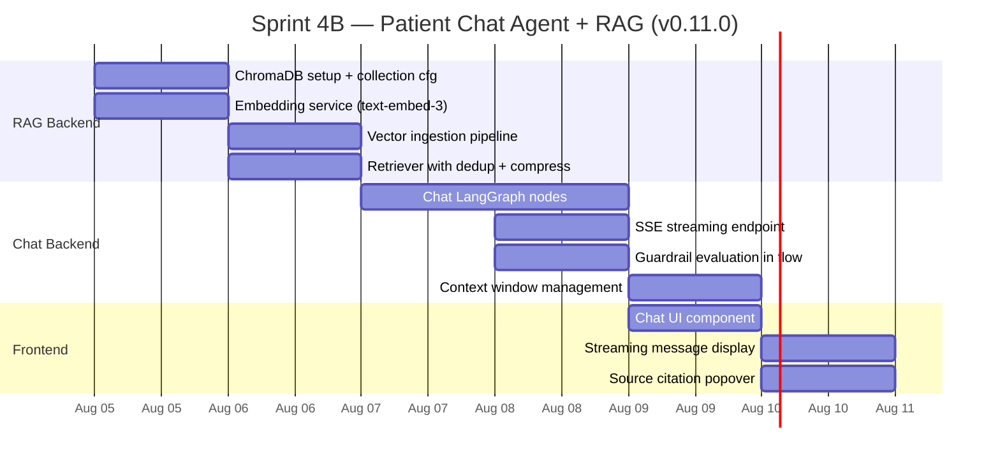
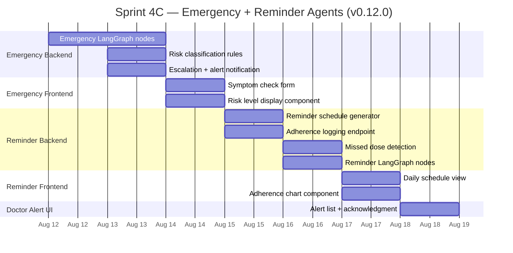
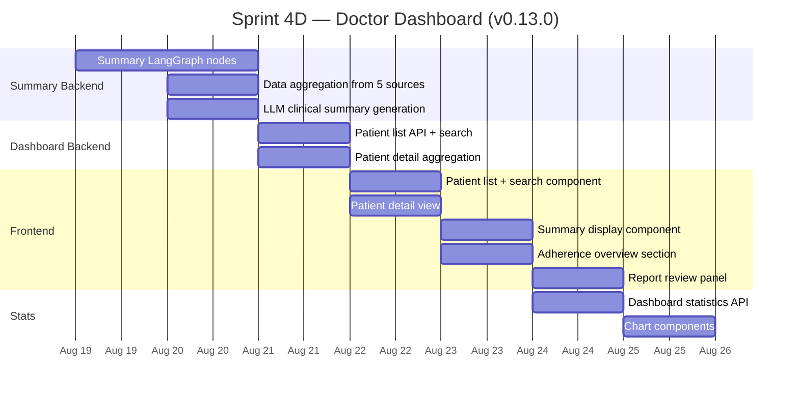
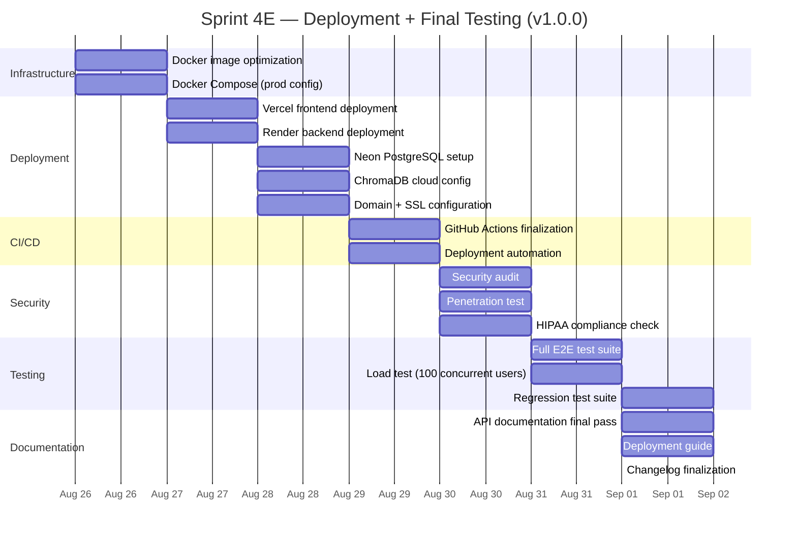

# Engineering Roadmap — v0.7.0 → v1.0.0

> Weekly sprint plan from current state (all architectural designs complete) to MVP launch.
> Each sprint delivers a potentially shippable increment with tests, documentation, and a version bump.
>
> **Current Version:** 0.7.0
> **Target:** 1.0.0 (MVP)
> **Estimated Timeline:** 7 sprints (~7 weeks)
> **Status:** All designs complete — ready for implementation

---

## Gantt Timeline



### Week-by-Week Summary

```
Week  | Sprint | Version | Focus Area              | Deliverables
──────┼────────┼─────────┼─────────────────────────┼────────────────────────────
Jul 15| Sprint 3D | v0.8.0 | Observable Infra       | Metrics, tracing, Sentry,
     |        |         |                         | LangSmith, alerts, dashboards
Jul 22| Sprint 3E | v0.9.0 | Document Pipeline      | Upload, validation, OCR,
     |        |         |                         | storage, chunking, queue
Jul 29| Sprint 4A | v0.10.0 | Medical Report Agent   | LangGraph extraction nodes,
     |        |         |                         | LLM integration, report UI
Aug 05| Sprint 4B | v0.11.0 | Patient Chat Agent     | ChromaDB RAG, streaming,
     |        |         |                         | chat UI, source citations
Aug 12| Sprint 4C | v0.12.0 | Emergency + Reminder   | Triage, escalation,
     |        |         |                         | schedules, adherence tracking
Aug 19| Sprint 4D | v0.13.0 | Doctor Dashboard       | Summary agent, patient list,
     |        |         |                         | detail view, adherence charts
Aug 26| Sprint 4E | v1.0.0  | Deployment + Ship      | Docker, Vercel, Render,
     |        |         |                         | security audit, E2E tests
```

---

## Sprint 3D — Observable Infrastructure (v0.8.0)

**Goal:** Production monitoring, logging, metrics, tracing, alerting, and dashboards.

**Week:** Jul 15 — Jul 21 (7 days)

### Gantt Detail



### Deliverables

| ID | Deliverable | Description |
|----|-------------|-------------|
| OBS-001 | Structured JSON logging | Loguru configured for JSON output (prod) + colorized (dev) with all structured fields |
| OBS-002 | Request ID middleware | UUID v4 `request_id` injected into every request, propagated to logs + traces + state |
| OBS-003 | PII masking filter | Log filter strips patient names, DOB, phone, email, tokens from all log output |
| OBS-004 | OpenTelemetry setup | OTel SDK with OTLP exporter; spans for FastAPI middleware, LangGraph nodes, LLM calls |
| OBS-005 | LangGraph instrumentation | Every node creates child span with agent_name, node_name, duration, token count |
| OBS-006 | Prometheus `/metrics` | Metrics endpoint with RED (rate/errors/duration) for all endpoints + agents |
| OBS-007 | Business metrics | LLM call counts, token usage, cost, agent invocations, guardrail violations |
| OBS-008 | Sentry error tracking | Captures unhandled exceptions, 5xx errors, LLM failures — with PII sanitization |
| OBS-009 | LangSmith tracing | All LLM calls traced with prompt version, model, tokens, latency |
| OBS-010 | Cost tracker | Per-request LLM cost computed from token counts; daily/weekly cost gauges |
| OBS-011 | `/ready` + `/live` endpoints | K8s-friendly probes — shallow liveness, dependency-check readiness |
| OBS-012 | Grafana dashboards | 7 dashboards exported as JSON (executive, LLM ops, API, DB, pipeline, safety, cost) |

### Dependencies

| Dependency | Type | Notes |
|-----------|------|-------|
| `opentelemetry-api`, `opentelemetry-sdk` | Python package | Tracing |
| `opentelemetry-instrumentation-fastapi` | Python package | Auto-instrumentation |
| `prometheus-client` | Python package | Metrics |
| `sentry-sdk` | Python package | Error tracking |
| `langsmith` | Python package | LLM tracing |
| `langchain-community` | Python package | LangChain integration |
| Docker Compose for observability stack | Infrastructure | Prometheus + Grafana + Tempo + Loki |

### Estimated Time

| Activity | Hours |
|----------|-------|
| Logging enhancements | 2 |
| Tracing implementation | 4 |
| Metrics implementation | 4 |
| Sentry integration | 2 |
| LangSmith setup | 2 |
| Cost tracking | 1 |
| Health endpoints | 1 |
| Dashboards | 2 |
| Testing | 3 |
| **Total** | **21** |

### Risk

| Risk | Likelihood | Impact | Mitigation |
|------|-----------|--------|------------|
| OpenTelemetry overhead slows requests | Low | Medium | Use sampling (10% for chat, 100% for emergency) |
| Prometheus label cardinality explosion | Low | High | Enforce label allowlist — no patient_id labels |
| Sentry accidentally captures PII | Medium | High | Mandatory `before_send` sanitization hook |
| LangSmith adds latency to LLM calls | Low | Medium | Async tracing, batch exports |

### Testing

| Test Type | Count | Scope |
|-----------|-------|-------|
| Unit tests | 15 | PII filter, cost calculator, health check logic |
| Integration tests | 10 | Metrics endpoint response, health endpoints, tracing context propagation |
| E2E tests | 3 | Sentry capture, LangSmith trace creation, Prometheus scrape |
| **Total new tests** | **28** | |

### Documentation

| Doc | Description |
|-----|-------------|
| `monitoring/README.md` | How to run observability stack locally |
| Dashboard JSON exports | 7 Grafana dashboards under `monitoring/dashboards/` |
| Runbook | How to respond to each alert type |

### Git Milestone

**Tag:** `v0.8.0`
**Branch:** `sprint/3d-observability`
**Merge:** `main`

### Success Criteria

- [ ] All log entries are structured JSON (prod) with `request_id`, `level`, `logger`, `message`, `timestamp`
- [ ] PII is never present in logs, traces, or Sentry events (verified by test)
- [ ] `/metrics` returns Prometheus-formatted output with all RED + business metrics
- [ ] LangSmith shows complete run trees for every agent invocation
- [ ] Sentry captures errors with full context (minus PII)
- [ ] `/live` responds in < 10ms; `/ready` validates DB + migrations + disk
- [ ] Grafana dashboards display live data from Prometheus
- [ ] All 124 existing tests still pass

---

## Sprint 3E — Document Pipeline Implementation (v0.9.0)

**Goal:** Functional end-to-end document upload pipeline: file upload → validation → virus scan → storage → OCR → chunking → queue.

**Week:** Jul 22 — Jul 28 (7 days)

### Gantt Detail



### Deliverables

| ID | Deliverable | Description |
|----|-------------|-------------|
| PIP-001 | File upload endpoint | `POST /api/v1/reports/upload` with multipart, quarantine, concurrency limits |
| PIP-002 | File validation | 4-layer validation (HTTP → extension → magic bytes → application) |
| PIP-003 | Virus scan | ClamAV integration with `security_scan_log` table |
| PIP-004 | File storage | `FileStorage` ABC with `LocalFileStorage` + `S3FileStorage` |
| PIP-005 | Google Vision OCR | `GoogleVisionOCR` with `document_text_detection`, per-page merging |
| PIP-006 | Image preprocessing | 7-step `ImagePreprocessor` (orientation, grayscale, denoise, CLAHE, binarize, deskew, DPI) |
| PIP-007 | Tesseract fallback | `TesseractOCR` for when Google Vision is unavailable |
| PIP-008 | Direct PDF extraction | `DirectPDFExtractor` for PDFs with embedded text layer |
| PIP-009 | Document chunker | `DocumentChunker` with header-based pre-splitting, recursive character splitting |
| PIP-010 | Pipeline queue | In-memory (dev) + Redis (prod) queue with priority, retry, dead-letter |
| PIP-011 | Background worker | Async worker processing queue jobs with per-stage error handling |

### Dependencies

| Dependency | Type | Notes |
|-----------|------|-------|
| `google-cloud-vision` | Python package | Primary OCR |
| `pytesseract` + `tesseract` | Python + system | Fallback OCR |
| `pypdf` | Python package | Direct PDF text extraction |
| `pdf2image` | Python package | PDF → images for OCR |
| `Pillow` | Python package | Image processing |
| `opencv-python-headless` | Python package | CLAHE, deskew |
| `python-magic` | Python package | Magic byte detection |
| `clamd` | Python package | ClamAV client |
| `aiofiles` | Python package | Async file I/O |
| ClamAV Docker container | Infrastructure | Virus scanner sidecar |

### Estimated Time

| Activity | Hours |
|----------|-------|
| Upload endpoint | 3 |
| File validation | 2 |
| Virus scan | 2 |
| File storage | 2 |
| OCR integration | 5 |
| Image preprocessing | 3 |
| Chunking | 2 |
| Queue + worker | 4 |
| Testing | 5 |
| **Total** | **28** |

### Risk

| Risk | Likelihood | Impact | Mitigation |
|------|-----------|--------|------------|
| Google Vision API key not available | Medium | High | Tesseract fallback always available |
| ClamAV container not running | Medium | Medium | Fail-open — proceed without scan, log warning |
| Large PDFs (>50 pages) timeout | Medium | Medium | Per-page timeout, worker-level processing limits |
| OCR quality low for handwritten text | Medium | Medium | Flag low confidence, request re-upload |

### Testing

| Test Type | Count | Scope |
|-----------|-------|-------|
| Unit tests | 20 | Validator, preprocessor, chunker, queue, storage |
| Integration tests | 15 | Upload + validation flow, OCR + preprocessing, queue lifecycle |
| E2E tests | 3 | Full pipeline (upload → validate → scan → store → OCR → chunk → enqueue) |
| **Total new tests** | **38** | |

### Documentation

| Doc | Description |
|-----|-------------|
| `API docs: Upload` | Request/response examples for report upload |
| Pipeline runbook | How to reset stalled jobs, clear dead-letter queue |
| OCR configuration | Google Vision auth, quality thresholds |

### Git Milestone

**Tag:** `v0.9.0`
**Branch:** `sprint/3e-document-pipeline`
**Merge:** `main`

### Success Criteria

- [ ] Uploaded PDF/image is validated (magic bytes match extension, size < 10MB, not corrupted)
- [ ] Virus scan runs on every file (clean → proceed, infected → delete + log)
- [ ] File stored in patient-scoped directory with correct naming convention
- [ ] OCR extracts text from PDF (embedded + scanned) and images
- [ ] Image preprocessing improves OCR confidence by ≥ 10%
- [ ] Text is chunked with header-based sections, 500-token target, 50-token overlap
- [ ] Pipeline jobs queue with correct priority and retry on failure
- [ ] All 124 existing tests + 38 new tests pass

---

## Sprint 4A — Medical Report Agent (v0.10.0)

**Goal:** AI-powered extraction of structured medical data from OCR text — medicines, disease, follow-up, doctor instructions.

**Week:** Jul 29 — Aug 4 (7 days)

### Gantt Detail



### Deliverables

| ID | Deliverable | Description |
|----|-------------|-------------|
| MRA-001 | LangGraph extraction pipeline | 5 nodes: `extract_entities`, `extract_medicines`, `validate_extraction`, `check_consistency`, `store_results` |
| MRA-002 | LLM integration | `LLMClient` with fallback chain (gpt-4o-mini → 3.5-turbo → rule-based) |
| MRA-003 | Prompt integration | `report_analysis`, `medicine_extraction`, `diagnosis_check` loaded via `PromptLoader` |
| MRA-004 | JSON schema validation | `SchemaValidator` + `JSONRepair` for extraction output |
| MRA-005 | Medicine normalizer | Route/frequency alias expansion (po→oral, bid→twice daily), deduplication |
| MRA-006 | Extraction UI | Drag-and-drop upload, extraction results with confidence indicators |
| MRA-007 | Manual correction | Edit extracted medicines before saving to DB |

### Dependencies

| Dependency | Type | Notes |
|-----------|------|-------|
| Sprint 3E (Document Pipeline) | Sprint | OCR text must be available |
| Sprint 3D (Observability) | Sprint | Traces + cost tracking needed |
| OpenAI API key | Infrastructure | LLM calls |
| `openai` | Python package | OpenAI API client |

### Estimated Time

| Activity | Hours |
|----------|-------|
| LangGraph nodes | 6 |
| LLM client + fallback | 3 |
| Schema validation | 2 |
| Medicine normalizer | 2 |
| Frontend upload + results | 5 |
| Testing | 3 |
| **Total** | **21** |

### Risk

| Risk | Likelihood | Impact | Mitigation |
|------|-----------|--------|------------|
| LLM produces hallucinated medicine names | Medium | High | Business validation: medicine name must appear in OCR text |
| OpenAI rate limiting on batch uploads | Medium | Medium | Throttle to 1 report/second, queue-based processing |
| OCR text too garbled for extraction | Medium | Medium | Confidence threshold: < 0.5 → human review required |

### Testing

| Test Type | Count | Scope |
|-----------|-------|-------|
| Unit tests | 15 | Each LangGraph node, normalizer, schema validator |
| Integration tests | 10 | Full extraction pipeline with mock LLM |
| E2E tests | 5 | Upload → OCR → extract → store → display |
| Sample prescriptions | 10 | Realistic test fixtures (typed, handwritten, different formats) |
| **Total new tests** | **40** | |

### Documentation

| Doc | Description |
|-----|-------------|
| Extraction accuracy report | Accuracy on 10 sample prescriptions |
| Confidence threshold guide | When extraction requires human review |
| Prompt version changelog | Updates to medical/* prompts |

### Git Milestone

**Tag:** `v0.10.0`
**Branch:** `sprint/4a-medical-agent`
**Merge:** `main`

### Success Criteria

- [ ] Uploaded prescription is OCR'd → extracted medicines stored in DB
- [ ] Medicine names are validated against source OCR text (hallucination guard)
- [ ] Confidence score computed per extraction (0.0–1.0)
- [ ] Extraction confidence < 0.5 → flagged for human review
- [ ] Frontend shows upload progress, extraction results, confidence indicators
- [ ] LLM fallback chain works (primary → fallback → rule-based)
- [ ] 10 sample prescriptions extract with ≥ 90% accuracy on medicine names
- [ ] All existing tests + 40 new tests pass

---

## Sprint 4B — Patient Chat Agent + RAG (v0.11.0)

**Goal:** Patient-facing chat with RAG over uploaded reports, source citations, streaming, and multi-turn conversation.

**Week:** Aug 5 — Aug 11 (7 days)

### Gantt Detail



### Deliverables

| ID | Deliverable | Description |
|----|-------------|-------------|
| CHT-001 | ChromaDB setup | Collection with HNSW cosine, metadata filtering by patient_id |
| CHT-002 | Embedding service | `text-embedding-3-small` (1536d), batch size 20, cost tracking |
| CHT-003 | Document ingestion | Chunk → embed → store pipeline triggered after report extraction |
| CHT-004 | RAG retriever | Multi-query generation, deduplication, context compression |
| CHT-005 | Chat LangGraph | 6 nodes: retrieve → compress → generate → guardrails → format → escalate |
| CHT-006 | SSE streaming | Token-by-token streaming with event types (start, token, guardrail, end) |
| CHT-007 | Chat UI | Message list, streaming indicators, source citation popovers |
| CHT-008 | Multi-turn context | Last 20 messages verbatim, older messages summarized |

### Dependencies

| Dependency | Type | Notes |
|-----------|------|-------|
| Sprint 4A (Medical Report Agent) | Sprint | Extracted reports feed RAG |
| Sprint 3D (Observability) | Sprint | LangSmith traces for chat |
| ChromaDB Docker container | Infrastructure | Vector database |
| OpenAI embeddings access | Infrastructure | `text-embedding-3-small` |

### Estimated Time

| Activity | Hours |
|----------|-------|
| ChromaDB + embeddings | 4 |
| RAG retriever | 3 |
| Chat LangGraph nodes | 5 |
| SSE streaming | 2 |
| Guardrail integration | 1 |
| Chat UI | 4 |
| Testing | 4 |
| **Total** | **23** |

### Risk

| Risk | Likelihood | Impact | Mitigation |
|------|-----------|--------|------------|
| ChromaDB not available at startup | Low | High | Retry connection, serve without RAG |
| Embedding rate limiting | Medium | Medium | Batch at 20, throttle to 3K RPM |
| Context window overflow | Low | High | Summary window at 50 messages, hard truncation at 70 |
| SSE client disconnects | Medium | Low | Detect via CancelledError, clean up |

### Testing

| Test Type | Count | Scope |
|-----------|-------|-------|
| Unit tests | 15 | Embedder, retriever, compress, guardrails, context window |
| Integration tests | 12 | Chat flow with mock ChromaDB, streaming, multi-turn |
| E2E tests | 5 | Upload → ingest → chat → verify source citation |
| **Total new tests** | **32** | |

### Documentation

| Doc | Description |
|-----|-------------|
| RAG pipeline config | Embedding model, chunk size, retrieval parameters |
| Chat API docs | Request/response for POST /chat and /chat/stream |
| Prompt usage guide | Which prompts are used in chat flow |

### Git Milestone

**Tag:** `v0.11.0`
**Branch:** `sprint/4b-chat-agent`
**Merge:** `main`

### Success Criteria

- [ ] ChromaDB stores embeddings with patient_id metadata (filtered retrieval)
- [ ] Chat retrieves relevant chunks from patient's own reports only
- [ ] Streaming SSE delivers tokens with event types within 500ms TTFB
- [ ] Guardrails block unsafe responses (diagnosis, dosage changes, prognosis)
- [ ] Sources cited in every response with popover to source text
- [ ] Multi-turn context maintains last 20 messages, summarizes older
- [ ] All existing tests + 32 new tests pass

---

## Sprint 4C — Emergency Detection + Medicine Reminder (v0.12.0)

**Goal:** Symptom triage with escalation + automated medicine reminders with adherence tracking.

**Week:** Aug 12 — Aug 18 (7 days)

### Gantt Detail



### Deliverables

| ID | Deliverable | Description |
|----|-------------|-------------|
| EMG-001 | Emergency LangGraph | 5 nodes: analyze_symptoms → assess_risk → decide_escalation → generate_alert → store_alert |
| EMG-002 | Risk classification | Keyword-based + LLM-enhanced triage (LOW/MEDIUM/HIGH) |
| EMG-003 | Escalation engine | Doctor notification, 911 recommendation, acknowledgment timeout |
| EMG-004 | Emergency alert storage | `emergency_alerts` table write with full alert payload |
| EMG-005 | Symptom check UI | Free-text symptom input with loading state |
| EMG-006 | Risk display | Color-coded risk level with recommendations + disclaimers |
| REM-001 | Schedule generator | Rule-based dose schedule from medicine frequency + dosage |
| REM-002 | Adherence logging | `POST /adherence/log` with medicine_id, scheduled_time, taken_time |
| REM-003 | Missed dose detection | Background task comparing schedule against log every 15 min |
| REM-004 | Reminder LangGraph | 4 nodes: check_schedule → detect_missed → generate_reminders → update_stats |
| REM-005 | Schedule UI | Daily medicine schedule with taken/missed indicators |
| REM-006 | Adherence chart | 7-day/30-day adherence rate visualization |
| DOC-ALERT | Doctor alert management | Alert list with risk color, acknowledgment button |

### Dependencies

| Dependency | Type | Notes |
|-----------|------|-------|
| Sprint 4A (Medical Agent) | Sprint | Medicines must be in DB for reminders |
| Sprint 3D (Observability) | Sprint | Emergency escalation tracing |
| Azure Communication Services / Twilio | Future | SMS notifications for HIGH alerts (v1.1) |

### Estimated Time

| Activity | Hours |
|----------|-------|
| Emergency LangGraph nodes | 4 |
| Risk classification + escalation | 3 |
| Emergency frontend | 2 |
| Reminder schedule generator | 2 |
| Adherence logging + missed dose | 3 |
| Reminder frontend | 3 |
| Doctor alert management | 2 |
| Testing | 4 |
| **Total** | **23** |

### Risk

| Risk | Likelihood | Impact | Mitigation |
|------|-----------|--------|------------|
| False positive HIGH escalation | Medium | High | ALL HIGH keyword matches must be verified by LLM before escalation |
| Missed dose detection delayed | Low | Medium | Cron runs every 15 min; worst case 15 min delay |
| Patient games the system (fake symptoms) | Low | Medium | Suspicion tracker — 3+ attempts triggers human review |
| Over-reliance on AI triage | Medium | High | Strong disclaimer: this is NOT a substitute for professional evaluation |

### Testing

| Test Type | Count | Scope |
|-----------|-------|-------|
| Unit tests | 18 | Risk classifier, escalation engine, schedule generator, missed dose detector |
| Integration tests | 12 | Emergency flow (analyze → classify → escalate), reminder lifecycle |
| E2E tests | 5 | Patient reports symptom → receives triage; medicine scheduled → reminder fires |
| **Total new tests** | **35** | |

### Documentation

| Doc | Description |
|-----|-------------|
| Emergency escalation protocol | Timeouts, escalation chain, doctor notification |
| Reminder system design | Schedule algorithm, adherence calculation |
| Disclaimer policy | All disclaimer types and placement rules |

### Git Milestone

**Tag:** `v0.12.0`
**Branch:** `sprint/4c-emergency-reminder`
**Merge:** `main`

### Success Criteria

- [ ] Symptom triage correctly classifies LOW/MEDIUM/HIGH with ≥ 95% accuracy on test cases
- [ ] HIGH risk triggers escalation alert + 911 recommendation within 60s
- [ ] Keyword scan catches chest pain, difficulty breathing, suicidal ideation before LLM call
- [ ] Disclaimer is injected into every emergency response (type D2–D4 based on risk level)
- [ ] Medicine reminders generate correct daily schedule from extracted medicines
- [ ] Adherence logs track taken/missed doses with timestamp accuracy
- [ ] Missed dose detection triggers reminder within 15 min of scheduled time
- [ ] Doctor alert list shows risk level, patient info, acknowledgment status
- [ ] All existing tests + 35 new tests pass

---

## Sprint 4D — Doctor Dashboard + Summary Agent (v0.13.0)

**Goal:** Comprehensive doctor dashboard with AI-generated patient summaries, adherence overview, and clinical decision support.

**Week:** Aug 19 — Aug 25 (7 days)

### Gantt Detail



### Deliverables

| ID | Deliverable | Description |
|----|-------------|-------------|
| SUM-001 | Summary LangGraph | 4 nodes: aggregate_data → compress_chat → generate_summary → format_summary |
| SUM-002 | Data aggregation | Pull from patients, medicines, reports, symptoms, alerts, chat history |
| SUM-003 | LLM summary | `doctor_summary.md` prompt with clinical narrative, 3 risk flags |
| SUM-004 | Patient list API | Searchable, filterable patient list with adherence + alert badges |
| SUM-005 | Patient detail API | Aggregated patient data for doctor review |
| SUM-006 | Dashboard frontend | Patient list → detail → summary → adherence → reports |
| SUM-007 | Summary component | AI-generated clinical summary with expandable sections |
| SUM-008 | Adherence overview | 7/30 day adherence rate chart, missed dose timeline |
| SUM-009 | Report review | Original OCR text, extracted medicines side-by-side |
| SUM-010 | Doctor stats | Total patients, alerts today, adherence rates, pending reviews |

### Dependencies

| Dependency | Type | Notes |
|-----------|------|-------|
| Sprint 4A (Medical Agent) | Sprint | Extracted medicines for summary |
| Sprint 4B (Chat Agent) | Sprint | Chat history for summary |
| Sprint 4C (Emergency + Reminder) | Sprint | Alerts + adherence for summary |

### Estimated Time

| Activity | Hours |
|----------|-------|
| Summary LangGraph nodes | 4 |
| Data aggregation | 2 |
| Patient list + detail APIs | 2 |
| Dashboard frontend | 6 |
| Summary display | 2 |
| Chart components | 2 |
| Testing | 4 |
| **Total** | **22** |

### Risk

| Risk | Likelihood | Impact | Mitigation |
|------|-----------|--------|------------|
| Summary LLM call expensive ($0.03/output) | Medium | Medium | Only on doctor request, not automatic |
| Large chat histories overflow context | Low | Medium | Compress before summary: summarize 50+ messages |
| Doctor finds AI summary unreliable | Medium | High | Always show source data alongside summary, allow expand |

### Testing

| Test Type | Count | Scope |
|-----------|-------|-------|
| Unit tests | 12 | Summary nodes, data aggregation, metrics computation |
| Integration tests | 10 | Summary generation with mock data, patient list with filters |
| E2E tests | 5 | Doctor logs in → sees patient list → views detail → reads summary |
| **Total new tests** | **27** | |

### Documentation

| Doc | Description |
|-----|-------------|
| Doctor dashboard guide | How to interpret AI summaries, risk flags |
| Summary accuracy report | Accuracy metrics on test patient data |

### Git Milestone

**Tag:** `v0.13.0`
**Branch:** `sprint/4d-doctor-dashboard`
**Merge:** `main`

### Success Criteria

- [ ] Doctor can view list of assigned patients with search/filter
- [ ] Patient detail shows medicines, reports, adherence, alerts, chat history
- [ ] AI summary generates clinical narrative with adherence metrics and risk flags
- [ ] Adherence rate calculated from DB (not LLM) with 7/30 day views
- [ ] Reports display OCR text alongside extracted medicines
- [ ] Dashboard shows statistics (total patients, alerts today, pending reviews)
- [ ] All existing tests + 27 new tests pass

---

## Sprint 4E — Deployment + Final Testing (v1.0.0)

**Goal:** Production deployment, final testing, security audit, and documentation finalization for MVP launch.

**Week:** Aug 26 — Sep 1 (7 days)

### Gantt Detail



### Deliverables

| ID | Deliverable | Description |
|----|-------------|-------------|
| DEP-001 | Optimized Docker builds | Multi-stage, slim images (< 200MB backend, < 100MB frontend) |
| DEP-002 | Vercel deployment | Frontend deployed with environment variables, custom domain |
| DEP-003 | Render deployment | Backend deployed as web service with health checks |
| DEP-004 | Neon PostgreSQL | Managed PostgreSQL with automated backups, connection pooling |
| DEP-005 | ChromaDB cloud | Managed vector database or self-hosted on Render |
| DEP-006 | CI/CD pipeline | Build → test → deploy on every push to main |
| DEP-007 | Security audit | Dependency scan, OWASP top 10 check, secrets scan |
| DEP-008 | E2E test suite | Full user journey tests (register → upload → chat → emergency → doctor) |
| DEP-009 | Load test report | k6 or Locust — 100 concurrent users, key scenarios |
| DEP-010 | Deployment guide | Step-by-step instructions for deploying all services |
| DEP-011 | API docs final | All endpoints documented with request/response examples |

### Dependencies

| Dependency | Type | Notes |
|-----------|------|-------|
| Sprints 3D through 4D | All prior sprints | All features must be implemented |
| Vercel account | Account | Frontend hosting |
| Render account | Account | Backend + ChromaDB hosting |
| Neon account | Account | PostgreSQL hosting |
| Domain name | DNS | e.g., `healthcare-assistant.app` |

### Estimated Time

| Activity | Hours |
|----------|-------|
| Docker optimization | 2 |
| Vercel deployment | 2 |
| Render deployment | 2 |
| Neon setup | 1 |
| CI/CD finalization | 1 |
| Security audit | 3 |
| E2E test suite | 4 |
| Load test | 3 |
| Documentation | 2 |
| **Total** | **20** |

### Risk

| Risk | Likelihood | Impact | Mitigation |
|------|-----------|--------|------------|
| Render cold start latency (>30s) | High | Medium | Use Render's Paid Plan with always-on instances |
| OpenAI API outage | Low | High | All agents have fallback chains ending in rule-based |
| ChromaDB unreliable in cloud | Medium | Medium | Graceful degradation — chat works without RAG |
| Security audit finds issues | Medium | High | Buffer 2 days in sprint for fixes |
| Load test reveals bottlenecks | Medium | Medium | Optimize DB queries, add indexes, cache responses |

### Testing

| Test Type | Count | Scope |
|-----------|-------|-------|
| E2E tests | 10 | Full user journeys (patient + doctor) |
| Load test | 1 | 100 concurrent users, 5 min ramp |
| Security scan | 1 | OWASP dependency check |
| **Total new tests** | **12** | |

### Documentation

| Doc | Description |
|-----|-------------|
| `DEPLOYMENT.md` | Complete deployment guide |
| `SECURITY.md` | Security architecture, audit results |
| `API_DOCUMENTATION.md` | Finalized API docs with all endpoints |

### Git Milestone

**Tag:** `v1.0.0`
**Branch:** `sprint/4e-deployment`
**Merge:** `main`
**Release:** 🚀 MVP Launch

### Success Criteria

- [ ] Frontend deployed to Vercel with custom domain + SSL
- [ ] Backend deployed to Render with health checks + auto-scaling
- [ ] PostgreSQL on Neon with automated daily backups
- [ ] ChromaDB available for RAG queries
- [ ] CI/CD pipeline: push → test → deploy in < 10 min
- [ ] Security audit passes with 0 critical findings
- [ ] E2E tests pass: register → login → upload → chat → emergency → doctor
- [ ] Load test: 100 concurrent users, p95 latency < 5s (chat), < 10s (extraction)
- [ ] All tests across all sprints pass (> 300 total tests)
- [ ] README, DEPLOYMENT.md, API docs complete and accurate

---

## Summary Statistics

### Cumulative Test Count

```
Sprint  | New Tests | Cumulative | Coverage Target
────────┼───────────┼────────────┼────────────────
v0.7.0  |     0     |    124     | (existing baseline)
v0.8.0  |    28     |    152     | 45%
v0.9.0  |    38     |    190     | 55%
v0.10.0 |    40     |    230     | 65%
v0.11.0 |    32     |    262     | 72%
v0.12.0 |    35     |    297     | 80%
v0.13.0 |    27     |    324     | 85%
v1.0.0  |    12     |    336+    | 90%
```

### Total Effort

| Sprint | Version | Hours | Focus |
|--------|---------|-------|-------|
| Sprint 3D | v0.8.0 | 21 | Observable Infrastructure |
| Sprint 3E | v0.9.0 | 28 | Document Pipeline |
| Sprint 4A | v0.10.0 | 21 | Medical Report Agent |
| Sprint 4B | v0.11.0 | 23 | Patient Chat Agent + RAG |
| Sprint 4C | v0.12.0 | 23 | Emergency + Reminder Agents |
| Sprint 4D | v0.13.0 | 22 | Doctor Dashboard + Summary |
| Sprint 4E | v1.0.0 | 20 | Deployment + Final Tests |
| **Total** | | **158** | |

### Version Progression

```
v0.7.0 ─── v0.8.0 ─── v0.9.0 ─── v0.10.0 ─── v0.11.0 ─── v0.12.0 ─── v0.13.0 ─── v1.0.0
  │          │          │           │            │            │            │            │
  │     Observable   Document    Medical     Chat+RAG    Emergency+   Doctor      Deploy+
  │     Infra        Pipeline    Report                  Reminder    Dashboard   Ship
  │
  Design Phase ─────────────────────────────────────────────────────────────────→ Launch
  (complete)
```

### Key Milestones

| Milestone | Version | Date | Significance |
|-----------|---------|------|-------------|
| Design Complete | v0.7.0 | Jul 14 | All architecture designs done |
| Observable | v0.8.0 | Jul 21 | Production monitoring live |
| Pipeline | v0.9.0 | Jul 28 | Documents can be uploaded + OCR'd |
| Extraction | v0.10.0 | Aug 4 | AI extracts medicines from reports |
| Chat | v0.11.0 | Aug 11 | Patients can chat about their data |
| Safety | v0.12.0 | Aug 18 | Emergency triage + reminders live |
| Doctor View | v0.13.0 | Aug 25 | Doctor dashboard with AI summaries |
| **MVP Launch** | **v1.0.0** | **Sep 1** | **Production deployment complete** |
