# LangGraph Production Workflow Design

> Complete production-grade LangGraph workflow design for the AI-powered healthcare
> follow-up assistant. This document governs ALL LangGraph implementation — every
> graph, node, edge, routing decision, and state schema.
>
> **Status:** Design Phase (pre-implementation)
> **Last Updated:** 2026-07-14
> **Author:** AI Healthcare Team
> **LangGraph Version Target:** 0.2.x+

---

## Table of Contents

1. [Overall Graph Architecture](#1-overall-graph-architecture)
2. [State Schema](#2-state-schema)
3. [Node Design & Inventory](#3-node-design--inventory)
4. [Edges & Routing](#4-edges--routing)
5. [Conditional Routing](#5-conditional-routing)
6. [Retry Strategy](#6-retry-strategy)
7. [Interrupts & Human-in-the-Loop](#7-interrupts--human-in-the-loop)
8. [Persistence & Checkpointing](#8-persistence--checkpointing)
9. [Memory Architecture](#9-memory-architecture)
10. [Error Handling](#10-error-handling)
11. [Streaming](#11-streaming)
12. [Subgraphs](#12-subgraphs)
13. [Future Multi-Agent Expansion](#13-future-multi-agent-expansion)
14. [Architecture Decision Records](#14-architecture-decision-records)

---

## 1. Overall Graph Architecture

### 1.1 Top-Level Graph

The system uses a **single top-level Orchestrator graph** that routes to agent subgraphs. Each agent is a self-contained subgraph sharing the same state interface pattern.

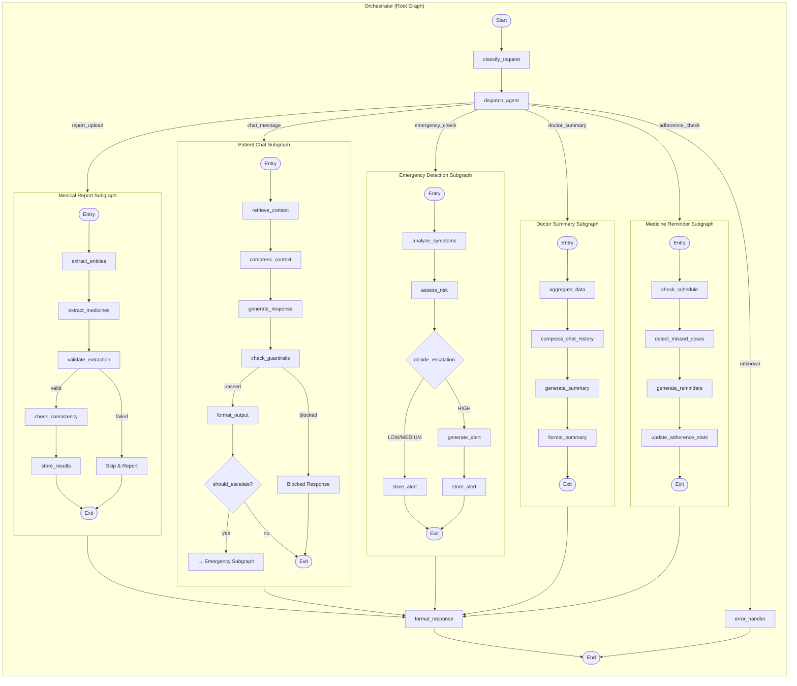

### 1.2 Graph Construction Pattern

Every graph follows this exact construction pattern:

```python
from langgraph.graph import StateGraph, START, END
from langgraph.checkpoint.postgres import PostgresSaver

def build_medical_report_graph() -> StateGraph:
    """Build the Medical Report Agent subgraph."""
    workflow = StateGraph(MedicalReportState)

    # Register nodes
    workflow.add_node("extract_entities", extract_entities)
    workflow.add_node("extract_medicines", extract_medicines)
    workflow.add_node("validate_extraction", validate_extraction)
    workflow.add_node("check_consistency", check_consistency)
    workflow.add_node("store_results", store_results)

    # Register edges
    workflow.add_edge(START, "extract_entities")
    workflow.add_edge("extract_entities", "extract_medicines")
    workflow.add_edge("extract_medicines", "validate_extraction")
    workflow.add_conditional_edges(
        "validate_extraction",
        route_after_validation,
        {"check_consistency": "check_consistency", "end": END},
    )
    workflow.add_edge("check_consistency", "store_results")
    workflow.add_edge("store_results", END)

    return workflow.compile()
```

### 1.3 Orchestrator Graph Construction

```python
def build_orchestrator_graph() -> StateGraph:
    """Build the top-level Orchestrator graph with subgraph nodes."""
    workflow = StateGraph(OrchestratorState)

    workflow.add_node("classify_request", classify_request)
    workflow.add_node("dispatch_agent", dispatch_agent)
    workflow.add_node("format_response", format_response)
    workflow.add_node("error_handler", error_handler)

    # Register subgraphs as nodes
    workflow.add_node("medical_agent", build_medical_report_graph().compile())
    workflow.add_node("chat_agent", build_chat_graph().compile())
    workflow.add_node("emergency_agent", build_emergency_graph().compile())
    workflow.add_node("summary_agent", build_summary_graph().compile())
    workflow.add_node("reminder_agent", build_reminder_graph().compile())

    workflow.add_edge(START, "classify_request")
    workflow.add_conditional_edges(
        "classify_request",
        route_to_agent,
        {
            "medical_agent": "medical_agent",
            "chat_agent": "chat_agent",
            "emergency_agent": "emergency_agent",
            "summary_agent": "summary_agent",
            "reminder_agent": "reminder_agent",
            "error_handler": "error_handler",
        },
    )
    workflow.add_edge("medical_agent", "format_response")
    workflow.add_edge("chat_agent", "format_response")
    workflow.add_edge("emergency_agent", "format_response")
    workflow.add_edge("summary_agent", "format_response")
    workflow.add_edge("reminder_agent", "format_response")
    workflow.add_edge("format_response", END)
    workflow.add_edge("error_handler", END)

    return workflow.compile()
```

### 1.4 Node Interface Contract

Every node in every graph follows this exact signature:

```python
async def node_name(state: AgentState, context: NodeContext) -> AgentState:
    """One-sentence description of what this node does.

    Args:
        state: The current agent state (TypedDict). Nodes RECEIVE a copy
               and must RETURN a new dict — never mutate in place.
        context: Runtime dependencies (LLMClient, AsyncSession, PromptLoader,
                 ToolExecutor, etc.).

    Returns:
        AgentState: Updated state with the node's output fields populated.

    Raises:
        NodeExecutionError: On unrecoverable failure (triggers error edge).
        NodeSkipException: When the node determines it should be skipped
                           (triggers skip edge or default path).
    """
```

---

## 2. State Schema

### 2.1 Base State (Shared by All Agents)

```python
from typing import TypedDict, NotRequired

class BaseAgentState(TypedDict):
    """Fields present in EVERY agent state across all graphs."""
    request_id: str                           # UUID v4 for distributed tracing
    patient_id: str                           # Always present when patient context exists
    user_role: str                            # "patient" | "doctor" | "system"
    errors: list[dict]                        # Accumulated error log — append-only
    retry_count: int                          # Current retry attempt number (resets per request)
    started_at: str                           # ISO 8601 timestamp of request start
    metadata: dict                            # Open field for trace context, feature flags, env
```

### 2.2 Per-Agent State Schemas

**Medical Report State:**

```python
class MedicalReportState(BaseAgentState):
    # Input
    raw_text: str                             # OCR-extracted text from report
    report_id: str                            # FK to reports table
    report_type: str                          # "prescription" | "lab_result" | "discharge_summary"

    # Processing
    extracted_data: NotRequired[dict | None]  # Parsed JSON from report_analysis prompt
    medicines: NotRequired[list[dict] | None] # Extracted medicines list
    validation_status: NotRequired[str | None] # "pending" | "validated" | "failed"
    diagnosis_consistency: NotRequired[dict | None] # Output from diagnosis_check prompt

    # Output
    extraction_confidence: NotRequired[float | None] # 0.0 - 1.0
    requires_human_review: bool               # Flag for low-confidence extractions
```

**Patient Chat State:**

```python
class ChatAgentState(BaseAgentState):
    # Input
    question: str                             # Patient's current question
    chat_history: list[dict]                  # Previous messages [{role, content}]

    # RAG
    search_queries: NotRequired[list[str]]    # Generated search queries for ChromaDB
    retrieved_chunks: NotRequired[list[dict]] # Raw chunks from vector search
    compressed_context: NotRequired[str | None] # After context compression prompt

    # Processing
    draft_response: NotRequired[str | None]   # Raw LLM output before guardrails
    guardrail_check: NotRequired[dict | None] # Guardrail evaluation result

    # Output
    final_response: NotRequired[str | None]   # After guardrails + formatting
    sources: NotRequired[list[dict]]          # Citations [{document_id, chunk, relevance}]
    requires_escalation: bool                 # True → Emergency Agent handoff
```

**Emergency Detection State:**

```python
class EmergencyAgentState(BaseAgentState):
    # Input
    symptoms: str                             # Free-text symptom description
    patient_condition: NotRequired[str | None] # Known conditions from DB
    recent_alerts: NotRequired[list[dict]]    # Last 30 days of alerts

    # Processing
    triage_result: NotRequired[dict | None]   # Output from symptom_triage prompt
    risk_assessment: NotRequired[dict | None] # Output from risk_assessment prompt

    # Output
    risk_level: NotRequired[str | None]       # "LOW" | "MEDIUM" | "HIGH"
    analysis: NotRequired[str | None]         # Clinical reasoning
    recommendations: NotRequired[list[str] | None] # Patient-facing recommendations
    disclaimer: NotRequired[str | None]
    escalate: bool                            # True → trigger escalation flow
    escalation_alert: NotRequired[dict | None] # Doctor alert payload
```

**Medicine Reminder State:**

```python
class ReminderAgentState(BaseAgentState):
    # Input
    mode: str                                 # "check" | "generate" | "adherence_report"
    medicines: list[dict]                     # Active medicines with schedule info

    # Processing
    schedule: NotRequired[list[dict] | None]  # Computed dose schedule for today
    missed_doses: NotRequired[list[dict] | None] # Doses past scheduled time not logged
    adherence_stats: NotRequired[dict | None] # {overall_rate, missed_count, trend}

    # Output
    reminders: NotRequired[list[dict] | None] # [{medicine, time, message, channel}]
    adherence_summary: NotRequired[str | None] # LLM-generated patient message
```

**Doctor Summary State:**

```python
class SummaryAgentState(BaseAgentState):
    # Input
    date_range: NotRequired[tuple[str, str] | None] # (start_date, end_date)

    # Data aggregation
    patient_data: NotRequired[dict | None]    # Demographics, condition, discharge date
    medicines: NotRequired[list[dict] | None] # Active medicines + adherence rates
    recent_symptoms: NotRequired[list[dict] | None] # From chat + alerts
    alerts: NotRequired[list[dict] | None]    # Recent emergency alerts
    chat_summary: NotRequired[str | None]     # Condensed AI interaction summary
    reports: NotRequired[list[dict] | None]   # Recent reports with key findings

    # Output
    summary: NotRequired[dict | None]         # Structured clinical summary
    adherence_metrics: NotRequired[dict | None] # {overall_rate, missed_doses, improving}
    risk_flags: NotRequired[list[str] | None] # Flags for doctor attention
    next_review_date: NotRequired[str | None] # Suggested follow-up window
```

**Orchestrator State (Root Graph):**

```python
class OrchestratorState(TypedDict):
    request_id: str
    request_type: str                         # "report_upload" | "chat_message" | ...
    payload: dict                             # Raw request payload
    patient_id: NotRequired[str]
    user_role: str
    errors: list[dict]
    retry_count: int
    started_at: str
    metadata: dict

    # Routing
    selected_agent: NotRequired[str | None]   # Agent name chosen by classifier
    agent_result: NotRequired[dict | None]    # Complete output from agent subgraph

    # Response
    final_response: NotRequired[dict | None]  # API-ready response payload
    status_code: NotRequired[int]             # HTTP status code
```

### 2.3 State Immutability Rules

```
┌──────────────────────────────────────────────────────────────┐
│                    STATE IMMUTABILITY RULES                   │
├──────────────────────────────────────────────────────────────┤
│ 1. Nodes RECEIVE a copy of state — they must RETURN a new    │
│    dict, never mutate in place                               │
│                                                              │
│ 2. errors list is APPEND-ONLY — once added, errors are       │
│    never removed from the list                                │
│                                                              │
│ 3. retry_count resets to 0 when entering a new top-level      │
│    request (Orchestrator handles this)                        │
│                                                              │
│ 4. extracted_data / final_response are WRITE-ONCE — after    │
│    the producing node sets them, no other node may overwrite  │
│                                                              │
│ 5. State must be JSON-serializable at all times for          │
│    checkpointing — no datetime, no BaseModel, no custom       │
│    objects in state                                           │
│                                                              │
│ 6. NotRequired fields should be checked with .get() or       │
│    `field in state` before access                             │
└──────────────────────────────────────────────────────────────┘
```

---

## 3. Node Design & Inventory

### 3.1 Node Categories

| Category | Pattern | Example | Error Strategy |
|----------|---------|---------|---------------|
| **LLM Call** | Build prompt → Call LLM → Parse response | `extract_entities` | Retry on timeout, fallback model on auth |
| **DB Query** | Query DB → Transform → Store in state | `aggregate_data` | Return partial data, log error, continue |
| **Validation** | Check state → Pass/Fail → Set flags | `validate_extraction` | Set `validation_status = "failed"`, route |
| **Routing** | Evaluate state → Return next node name | `should_escalate` | Default to safe path (no escalation) |
| **Transform** | Transform state data → Set new fields | `compress_context` | Skip compression, use raw chunks |
| **Output** | Format → Guardrails → Write to DB | `format_output` | Return safe default response |

### 3.2 Complete Node Inventory

**Medical Report Agent** (5 nodes):
| Node | Category | Input | Output | Prompt Used |
|------|----------|-------|--------|-------------|
| `extract_entities` | LLM Call | `raw_text` | `extracted_data` | `medical/report_analysis` |
| `extract_medicines` | LLM Call | `raw_text`, `extracted_data.disease` | `medicines` | `medical/medicine_extraction` |
| `validate_extraction` | Validation | `extracted_data`, `medicines` | `validation_status`, `extraction_confidence` | `medical/diagnosis_check` |
| `check_consistency` | Validation | `extracted_data`, `medicines` | `diagnosis_consistency` | None (rule-based cross-ref) |
| `store_results` | DB Query | `extracted_data`, `medicines` | (DB write) | None |

**Patient Chat Agent** (6 nodes):
| Node | Category | Input | Output | Prompt Used |
|------|----------|-------|--------|-------------|
| `retrieve_context` | DB Query | `question`, `patient_id` | `search_queries`, `retrieved_chunks` | `rag/document_retrieval` |
| `compress_context` | Transform | `retrieved_chunks` | `compressed_context` | `rag/context_compression` |
| `generate_response` | LLM Call | `question`, `compressed_context`, `chat_history` | `draft_response` | `chat/patient_chat` |
| `check_guardrails` | Validation | `draft_response`, `question` | `guardrail_check` | `system/guardrails` |
| `format_output` | Output | `draft_response`, `guardrail_check` | `final_response`, `sources` | `system/output_formatter`, `rag/citation_format` |
| `should_escalate` | Routing | `draft_response`, `guardrail_check` | `requires_escalation` | None (rule-based) |

**Emergency Detection Agent** (5 nodes):
| Node | Category | Input | Output | Prompt Used |
|------|----------|-------|--------|-------------|
| `analyze_symptoms` | LLM Call | `symptoms`, `patient_condition` | `triage_result` | `emergency/symptom_triage` |
| `assess_risk` | LLM Call | `triage_result`, `recent_alerts` | `risk_assessment` | `emergency/risk_assessment` |
| `decide_escalation` | Routing | `risk_level`, `recent_alerts` | `escalate` | None (rule-based) |
| `generate_alert` | LLM Call | `risk_assessment`, `patient_id` | `escalation_alert` | `emergency/escalation` |
| `store_alert` | DB Query | `escalation_alert` | (DB write) | None |

**Medicine Reminder Agent** (4 nodes):
| Node | Category | Input | Output |
|------|----------|-------|--------|
| `check_schedule` | DB Query | `medicines` | `schedule` |
| `detect_missed_doses` | DB Query | `schedule` | `missed_doses` |
| `generate_reminders` | Transform | `schedule`, `missed_doses` | `reminders` |
| `update_adherence_stats` | DB Query | `missed_doses`, `medicines` | `adherence_stats` |

**Doctor Summary Agent** (4 nodes):
| Node | Category | Input | Output | Prompt Used |
|------|----------|-------|--------|-------------|
| `aggregate_data` | DB Query | `patient_id`, `date_range` | `patient_data`, `medicines`, `recent_symptoms`, `alerts`, `reports` | None |
| `compress_chat_history` | Transform | `chat_history` (loaded by aggregate) | `chat_summary` | `rag/context_compression` |
| `generate_summary` | LLM Call | All aggregated data | `summary` | `summary/doctor_summary` |
| `format_summary` | Transform | `summary`, DB-computed metrics | `adherence_metrics`, `risk_flags`, `next_review_date` | None |

**Orchestrator** (4 nodes):
| Node | Category | Input | Output |
|------|----------|-------|--------|
| `classify_request` | Routing | `payload`, `request_type` | `selected_agent` |
| `dispatch_agent` | Transform | `state` | `agent_result` (from subgraph invocation) |
| `format_response` | Output | `agent_result` | `final_response`, `status_code` |
| `error_handler` | Output | `errors` | `final_response` (error payload) |

### 3.3 Node Implementation Template

```python
@with_retry(max_retries=2, retryable_exceptions=(LLMTimeoutError, LLMRateLimitError))
async def extract_entities(state: MedicalReportState, context: NodeContext) -> MedicalReportState:
    """Run report_analysis prompt to extract structured data from OCR text."""
    prompt = context.prompt_loader.load("medical/report_analysis")
    rendered = prompt.render(text=state["raw_text"])

    result, error = await safe_llm_call(
        state=state,
        prompt=rendered,
        llm_client=context.llm_client,
        agent_type="medical",
        response_format={"type": "json_object"},
        node_name="extract_entities",
    )

    if error:
        return {
            **state,
            "errors": state["errors"] + [error],
            "validation_status": "failed",
        }

    return {
        **state,
        "extracted_data": result,
        "validation_status": "pending",
    }
```

---

## 4. Edges & Routing

### 4.1 Edge Type Taxonomy

| Edge Type | LangGraph API | Description | Use Case |
|-----------|--------------|-------------|----------|
| **Sequential** | `add_edge("a", "b")` | Always go from A to B | Pipeline nodes (DB → Transform → LLM) |
| **Conditional** | `add_conditional_edges("a", router, mapping)` | Choose next based on state | Validation pass/fail, escalation checks |
| **Parallel** | `add_conditional_edges("a", fan_out_router)` | Multi-target routing | Future: generate + validate simultaneously |
| **Error edge** | Conditionally route on `state["errors"]` | Redirect on failure | Degraded mode, human review fallback |
| **Self-loop** | Router returns same node name | Retry the same node | When `retry_count < max_retries` |

### 4.2 Per-Graph Edge Maps

```mermaid
flowchart LR
    subgraph MedicalEdges["Medical Report Agent"]
        direction TB
        ME1[extract_entities] -->|always| ME2[extract_medicines]
        ME2 -->|always| ME3[validate_extraction]
        ME3 -->|valid| ME4[check_consistency]
        ME3 -->|failed| ME_END1[END]
        ME4 -->|always| ME5[store_results]
        ME5 --> ME_END2[END]
    end

    subgraph ChatEdges["Patient Chat Agent"]
        direction TB
        CE1[retrieve_context] -->|always| CE2[compress_context]
        CE2 -->|always| CE3[generate_response]
        CE3 -->|always| CE4[check_guardrails]
        CE4 -->|passed| CE5[format_output]
        CE4 -->|blocked| CE_END1[END]
        CE5 -->|always| CE6{should_escalate?}
        CE6 -->|yes| CHAT_TO_EMERG[→ Emergency Agent]
        CE6 -->|no| CE_END2[END]
    end

    subgraph EmergencyEdges["Emergency Detection Agent"]
        direction TB
        EE1[analyze_symptoms] -->|always| EE2[assess_risk]
        EE2 -->|always| EE3{decide_escalation}
        EE3 -->|HIGH| EE4[generate_alert]
        EE3 -->|LOW/MEDIUM| EE5[store_alert]
        EE4 -->|always| EE5
        EE5 --> EE_END[END]
    end

    subgraph SummaryEdges["Doctor Summary Agent"]
        direction TB
        SE1[aggregate_data] -->|always| SE2[compress_chat_history]
        SE2 -->|always| SE3[generate_summary]
        SE3 -->|always| SE4[format_summary]
        SE4 --> SE_END[END]
    end

    subgraph ReminderEdges["Medicine Reminder Agent"]
        direction TB
        RE1[check_schedule] -->|always| RE2[detect_missed_doses]
        RE2 -->|always| RE3[generate_reminders]
        RE3 -->|always| RE4[update_adherence_stats]
        RE4 --> RE_END[END]
    end
```

### 4.3 Graph Registration

```
Orchestrator route_to_agent mapping:
  "report_upload"   → "medical_agent"   (Medical Report Subgraph)
  "chat_message"    → "chat_agent"       (Patient Chat Subgraph)
  "emergency_check" → "emergency_agent"  (Emergency Detection Subgraph)
  "doctor_summary"  → "summary_agent"    (Doctor Summary Subgraph)
  "adherence_check" → "reminder_agent"   (Medicine Reminder Subgraph)
  "unknown"         → "error_handler"    (Error response node)

Cross-agent handoffs:
  Chat Agent → Emergency Agent:   When should_escalate returns True
  Medical Agent → Reminder Agent: When new medicines stored (triggered externally)
```

---

## 5. Conditional Routing

### 5.1 Conditional Router Functions

All routers follow this contract:

```python
def router_function(state: AgentState) -> str:
    """Evaluate state and return the next node name or END.

    Rules:
    - Return a string matching a node name or END
    - Pure function: no async, no I/O, no side effects
    - Must have a DEFAULT return (safe path)
    - Register via add_conditional_edges(node, router, {name: name})
    """
```

### 5.2 Router Inventory

**Route after validation (Medical Report):**

```python
def route_after_validation(state: MedicalReportState) -> str:
    """Route to consistency check or end if extraction failed."""
    if state.get("validation_status") == "failed":
        return "end"
    if not state.get("extracted_data"):
        return "end"
    return "check_consistency"
```

**Route on guardrail result (Chat):**

```python
def route_on_guardrail(state: ChatAgentState) -> str:
    """Route based on guardrail severity level."""
    check = state.get("guardrail_check", {})
    action = check.get("action", "allow")

    if action == "block":
        return "end"          # Response blocked — do not deliver
    if action == "escalate_human":
        return "end"          # Escalated — no AI response
    return "format_output"    # Safe to format and deliver
```

**Route escalation decision (Chat → Emergency):**

```python
def route_chat_escalation(state: ChatAgentState) -> str:
    """Route to Emergency Agent if escalation is required."""
    if state.get("requires_escalation"):
        return "emergency_agent"
    return "end"
```

**Route escalation decision (Emergency):**

```python
def route_escalation_action(state: EmergencyAgentState) -> str:
    """Route based on risk level to generate alert or just store."""
    if state.get("risk_level") == "HIGH":
        return "generate_alert"
    return "store_alert"
```

**Route to agent (Orchestrator):**

```python
def route_to_agent(state: OrchestratorState) -> str:
    """Classify request and route to the correct agent subgraph."""
    request_type = state.get("request_type", "unknown")

    routing_map = {
        "report_upload": "medical_agent",
        "chat_message": "chat_agent",
        "emergency_check": "emergency_agent",
        "doctor_summary": "summary_agent",
        "adherence_check": "reminder_agent",
    }
    return routing_map.get(request_type, "error_handler")
```

### 5.3 Error Router

A global error router checks accumulated errors after every node:

```python
def route_on_error(state: AgentState) -> str:
    """Check if accumulated errors require halting or can continue.

    Called after every node to determine if the graph should
    continue normal flow, continue in degraded mode, or halt.
    """
    errors = state.get("errors", [])
    if not errors:
        return "continue_normal"

    # Fatal errors (auth failures, corrupted state) always halt
    fatal_errors = [e for e in errors if e.get("severity") == "fatal"]
    if fatal_errors:
        return "end_with_error"

    # Too many non-fatal errors also halt
    if len(errors) > 3:
        return "end_with_error"

    # Continue but in degraded mode (e.g., skip optional steps)
    return "continue_degraded"
```

### 5.4 Routing Diagram

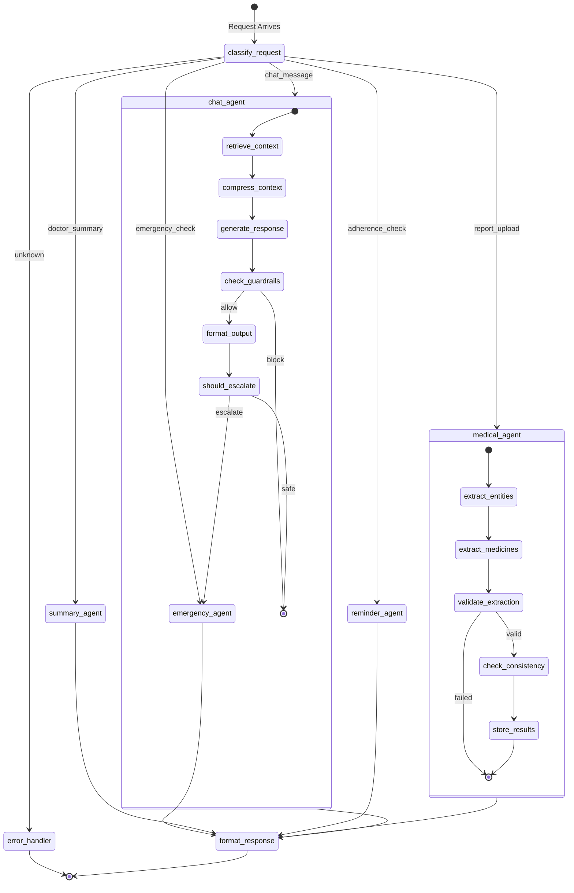

---

## 6. Retry Strategy

### 6.1 Retry Configuration

| Parameter | LLM Nodes | DB Nodes | Transform Nodes |
|-----------|-----------|----------|----------------|
| Max retries | 2 (3 total attempts) | 1 (2 total attempts) | 0 (no retry) |
| Backoff type | Exponential | Linear | N/A |
| Base delay | 1.0s | 0.5s | N/A |
| Max delay | 30s | 5s | N/A |
| Jitter | ±20% | ±10% | N/A |
| Budget per request | 15s total | 5s total | N/A |

### 6.2 Retryable vs Non-Retryable Errors

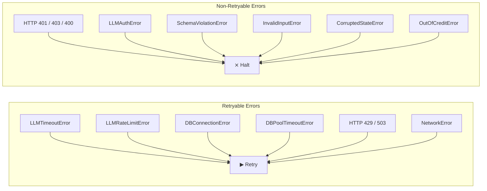

### 6.3 Retry Decorator

```python
import functools
import random
import asyncio
from datetime import datetime

def with_retry(
    max_retries: int = 2,
    base_delay: float = 1.0,
    max_delay: float = 30.0,
    retryable_exceptions: tuple = (
        LLMTimeoutError,
        LLMRateLimitError,
        DBConnectionError,
        DBPoolTimeoutError,
    ),
):
    """Decorator for node functions that need retry logic.

    - Applies exponential backoff with jitter
    - Tracks retry_count in state
    - Exhausts all retries before returning error
    """
    def decorator(func):
        @functools.wraps(func)
        async def wrapper(state, context, *args, **kwargs):
            last_error = None

            for attempt in range(max_retries + 1):
                try:
                    if attempt > 0:
                        state["retry_count"] = attempt
                    return await func(state, context, *args, **kwargs)
                except retryable_exceptions as e:
                    last_error = e
                    if attempt < max_retries:
                        delay = min(base_delay * (2 ** attempt), max_delay)
                        jitter = delay * 0.2 * (random.random() * 2 - 1)
                        await asyncio.sleep(delay + jitter)
                    continue
                except NonRetryableError:
                    raise  # Re-raise non-retryable errors immediately

            # All retries exhausted — accumulate error in state
            state["errors"] = state.get("errors", []) + [{
                "node": func.__name__,
                "message": str(last_error),
                "timestamp": datetime.utcnow().isoformat(),
                "retries_exhausted": True,
                "severity": "error",
            }]
            return state
        return wrapper
    return decorator
```

### 6.4 Retry Budget Enforcement

```python
RETRY_BUDGET_SECONDS = 15
GLOBAL_START: datetime | None = None  # Set per request

async def within_retry_budget() -> bool:
    """Check if the request-level retry budget is not exhausted."""
    global GLOBAL_START
    if GLOBAL_START is None:
        return True
    elapsed = (datetime.utcnow() - GLOBAL_START).total_seconds()
    return elapsed < RETRY_BUDGET_SECONDS

async def budget_aware_node(state, context):
    """Example node that respects retry budget."""
    if not await within_retry_budget():
        # Budget exhausted — skip retry, accept degraded result
        return {**state, "validation_status": "degraded"}
    # Proceed with normal execution
```

### 6.5 Fallback Chain After Retry Exhaustion

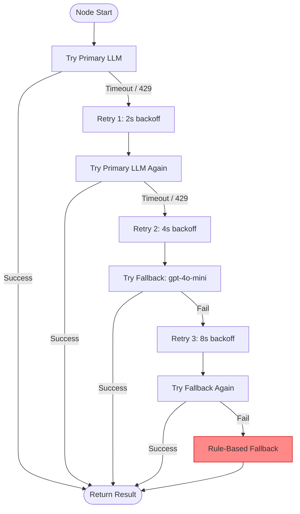

---

## 7. Interrupts & Human-in-the-Loop

### 7.1 Interrupt Points

The graph uses LangGraph interrupts to pause execution and wait for human input at
critical safety junctures:

| Interrupt Point | Trigger | Purpose | Input Expected |
|----------------|---------|---------|---------------|
| `low_confidence_extraction` | `extraction_confidence < 0.5` | Pharmacist verification of extracted medicines | Approve / Reject / Edit |
| `high_risk_escalation` | `risk_level == HIGH` | Doctor acknowledgment required before alert sent | Acknowledge / Override / Escalate |
| `guardrail_block` | `guardrail_check.action == "block"` | Safety team review of blocked response | Release / Confirm block / Modify |
| `human_review_required` | `requires_human_review == True` | General review for low-confidence outputs | Approve / Reject |

### 7.2 Interrupt Configuration

```python
from langgraph.types import Command, interrupt

def check_confidence_for_interrupt(state: MedicalReportState) -> MedicalReportState:
    """Pause for human review if extraction confidence is too low."""
    confidence = state.get("extraction_confidence", 1.0)
    if confidence is not None and confidence < 0.5:
        # Pause graph execution — wait for human input
        human_review = interrupt({
            "type": "low_confidence_extraction",
            "report_id": state["report_id"],
            "extracted_data": state.get("extracted_data"),
            "confidence": confidence,
            "message": "Extraction confidence is low. Please review the extracted data.",
        })

        # human_review contains the clinician's decision
        return {
            **state,
            "extracted_data": human_review.get("edited_data", state.get("extracted_data")),
            "validation_status": "validated" if human_review.get("approved") else "failed",
        }
    return state
```

### 7.3 Interrupt Flow

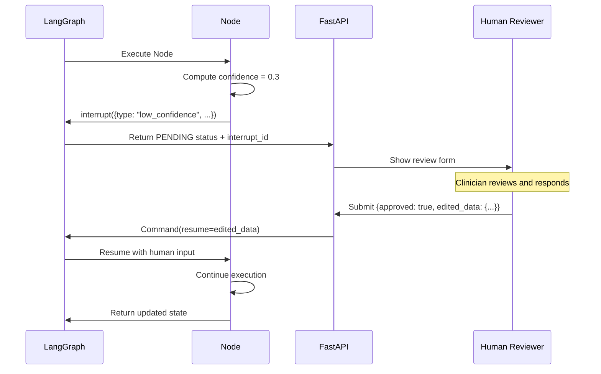

### 7.4 Resuming from Interrupts

```python
# Client-side: resume a paused graph
async def resume_interrupt(
    thread_id: str,
    interrupt_id: str,
    decision: dict,
) -> dict:
    """Resume graph execution with human input."""
    result = await graph.ainvoke(
        None,  # No input needed — resuming
        config={
            "configurable": {"thread_id": thread_id},
            "interrupt_id": interrupt_id,
        },
        command=Command(resume=decision),
    )
    return result
```

### 7.5 Interrupt Timeouts

| Interrupt Type | Timeout | Action on Timeout |
|---------------|---------|-------------------|
| `low_confidence_extraction` | 30 min | Store as `pending_review`, continue |
| `high_risk_escalation` | 15 min | Escalate to secondary doctor, continue |
| `guardrail_block` | 24 hours | Return safe fallback response |
| `human_review_required` | 60 min | Store as `pending_review`, continue |

---

## 8. Persistence & Checkpointing

### 8.1 Checkpoint Strategy

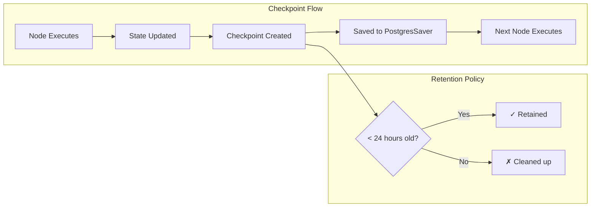

### 8.2 Checkpoint Provider

| Environment | Saver | Config |
|-------------|-------|--------|
| **Production** | `PostgresSaver` | `checkpoint_postgres_uri` from settings |
| **Development** | `MemorySaver` | In-memory, lost on restart |
| **Testing** | `MemorySaver` | Fresh per test case |

```python
from langgraph.checkpoint.postgres import PostgresSaver
from langgraph.checkpoint.memory import MemorySaver

def create_checkpointer() -> PostgresSaver | MemorySaver:
    """Create the appropriate checkpointer based on environment."""
    if settings.ENVIRONMENT == "production":
        conn_string = settings.checkpoint_postgres_uri
        return PostgresSaver.from_conn_string(conn_string)
    return MemorySaver()
```

### 8.3 Checkpoint Schema

```sql
-- Managed by PostgresSaver — included for reference
CREATE TABLE langgraph_checkpoints (
    checkpoint_id UUID PRIMARY KEY DEFAULT gen_random_uuid(),
    thread_id VARCHAR(255) NOT NULL,
    checkpoint JSONB NOT NULL,           -- Serialized checkpoint metadata
    parent_checkpoint_id UUID REFERENCES langgraph_checkpoints(checkpoint_id),
    created_at TIMESTAMPTZ NOT NULL DEFAULT NOW()
);

CREATE INDEX idx_checkpoints_thread ON langgraph_checkpoints(thread_id, created_at DESC);
CREATE INDEX idx_checkpoints_created ON langgraph_checkpoints(created_at);

-- Writes table (stores actual state data)
CREATE TABLE langgraph_checkpoint_writes (
    write_id UUID PRIMARY KEY DEFAULT gen_random_uuid(),
    checkpoint_id UUID NOT NULL REFERENCES langgraph_checkpoints(checkpoint_id),
    channel VARCHAR(255) NOT NULL,
    value JSONB NOT NULL
);

-- TTL cleanup (runs every hour via background task)
DELETE FROM langgraph_checkpoints
WHERE created_at < NOW() - INTERVAL '24 hours';
```

### 8.4 Thread ID Strategy

```
thread_id format:  {agent_name}:{request_id}
Examples:
  medical_agent:req_abc123
  chat_agent:req_def456
  emergency_agent:req_ghi789
  summary_agent:req_jkl012
  reminder_agent:req_mno345

Purpose:
  - Scopes checkpoints to a single request execution
  - Enables resumption on crash
  - Enables debugging via thread_id lookup
  - NOT used for conversation history (that's in chat_history table)
```

### 8.5 Checkpoint Usage

```python
async def run_agent_with_checkpointing(agent_graph, initial_state, thread_id: str):
    """Execute an agent graph with checkpoint persistence."""
    config = {
        "configurable": {"thread_id": thread_id},
    }
    result = await agent_graph.ainvoke(initial_state, config=config)
    return result

async def resume_from_checkpoint(thread_id: str):
    """Resume a previously interrupted graph execution."""
    config = {
        "configurable": {"thread_id": thread_id},
    }
    # Fetch latest checkpoint state
    state = await graph.aget_state(config)
    return state

async def list_checkpoints(thread_id: str) -> list[dict]:
    """List all checkpoints for a given thread."""
    config = {"configurable": {"thread_id": thread_id}}
    checkpoints = []
    async for checkpoint in graph.aget_state_history(config):
        checkpoints.append({
            "checkpoint_id": str(checkpoint.checkpoint_id),
            "node": checkpoint.next,
            "created_at": checkpoint.created_at,
        })
    return checkpoints
```

### 8.6 When NOT to Checkpoint

- ✗ Checkpoints are NOT used for routine conversation history — stored in `chat_history`
- ✗ Checkpoints are NOT used as a primary data store — they are operational logs
- ✗ Checkpoints are NOT preserved across application restarts in dev (`MemorySaver`)
- ✗ Checkpoints are NOT a substitute for database writes — always persist to application tables

---

## 9. Memory Architecture

### 9.1 Memory Types

| Memory Type | Scope | Storage | Duration | Managed By |
|-------------|-------|---------|----------|------------|
| **Conversation History** | Per chat session | `chat_history` table | Persistent | Chat Agent loads at start |
| **Patient Context** | Per patient | `patients` + related tables | Persistent | Context builder nodes |
| **Session State** | Per request | LangGraph checkpoint | 24 hours (TTL) | Automatic — StateGraph |
| **Summarized History** | Per patient (weekly) | Generated on demand | Regenerated weekly | Doctor Summary Agent |
| **Cross-Session Memory** | Per patient | `emergency_alerts`, `adherence_logs` | Persistent | Queried by agents |
| **User Preferences** | Per user | `users.preferences` column | Persistent | Loaded at session start |

### 9.2 Conversation Window Strategy

```mermaid
flowchart TB
    subgraph History["Chat History (chat_history table)"]
        direction TB
        H1[Message 1 - 50: Older history]
        H2[Message 51 - 70: Recent history]
    end

    H1 --> Summarizer[LLM Summarizer]
    Summarizer --> Summary[Single paragraph summary]
    Summary --> ContextBuilder[Context Builder]
    H2 --> ContextBuilder

    ContextBuilder --> ActiveWindow[Active Context:<br/>Summary + Last 20 Messages]
    ActiveWindow --> LLMCall[LLM Call]

    note_right of ContextBuilder
        Result: {summary, chat_history}
        ~1500 tokens total
    end
```

### 9.3 Context Loader Pattern

Each agent has a `build_context()` function that runs BEFORE the graph starts:

```python
async def build_chat_context(patient_id: str, db: AsyncSession) -> ChatAgentState:
    """Load patient data, chat history, medicines into initial state."""
    patient = await patient_repo.get_by_id(db, patient_id)
    medicines = await medicine_repo.get_active_by_patient(db, patient_id)
    history = await chat_repo.get_recent(db, patient_id, limit=20)

    return ChatAgentState(
        request_id=uuid4_str(),
        patient_id=patient_id,
        user_role="patient",
        errors=[],
        retry_count=0,
        started_at=datetime.utcnow().isoformat(),
        metadata={},
        question="",  # Set by endpoint handler
        chat_history=format_history(history),
        requires_escalation=False,
    )
```

### 9.4 Summarized Memory (Cross-Session)

```python
class CrossSessionMemory:
    """Provides cross-session patient context to agents."""

    @staticmethod
    async def load_relevant_context(
        patient_id: str,
        db: AsyncSession,
        include_chat_summary: bool = False,
    ) -> dict:
        """Load cross-session memory relevant to decision-making."""
        context = {
            "recent_emergency_alerts": await emergency_repo.get_recent(db, patient_id, days=30),
            "adherence_summary": await adherence_repo.get_summary(db, patient_id, days=30),
            "active_medicines": await medicine_repo.get_active_by_patient(db, patient_id),
        }

        if include_chat_summary:
            chat_log = await chat_repo.get_all_by_patient(db, patient_id, limit=100)
            context["chat_summary"] = await summarize_chat_history(chat_log)

        return context
```

---

## 10. Error Handling

### 10.1 Error Taxonomy

```
┌─────────────────────────────────────────────────────────────┐
│                    ERROR TAXONOMY                            │
├───────────────┬─────────────────────┬────────────────────────┤
│ Category      │ Examples             │ Recovery Strategy      │
├───────────────┼─────────────────────┼────────────────────────┤
│ Transient     │ LLM timeout,         │ Retry with backoff,    │
│               │ DB pool exhaustion,  │ then fallback model    │
│               │ network glitch       │                        │
├───────────────┼─────────────────────┼────────────────────────┤
│ LLM Quality   │ JSON parse failure,  │ Retry with stricter    │
│               │ incomplete response, │ prompt, then fallback  │
│               │ hallucinated fields  │ model                  │
├───────────────┼─────────────────────┼────────────────────────┤
│ Data Missing  │ Patient not found,   │ Return user-friendly   │
│               │ no medicines,        │ error, skip dependent  │
│               │ empty report text    │ nodes                  │
├───────────────┼─────────────────────┼────────────────────────┤
│ Validation    │ Invalid input,       │ Return error to user   │
│               │ schema violation,    │ with explanation       │
│               │ guardrail block      │                        │
├───────────────┼─────────────────────┼────────────────────────┤
│ Permanent     │ Invalid API key,     │ Stop execution,        │
│               │ corrupted state,     │ log alert, return 500  │
│               │ out of credit        │                        │
├───────────────┼─────────────────────┼────────────────────────┤
│ Safety        │ Guardrail violation, │ Return safe default,   │
│               │ harmful content      │ log audit event        │
└───────────────┴─────────────────────┴────────────────────────┘
```

### 10.2 Safe LLM Call Handler

Every LLM call node wraps execution through `safe_llm_call`:

```python
async def safe_llm_call(
    state: AgentState,
    prompt: str,
    llm_client: LLMClient,
    agent_type: str,
    response_format: dict | None,
    node_name: str,
    max_retries: int = 2,
) -> tuple[dict | None, dict | None]:
    """Execute an LLM call with error handling.

    Returns (parsed_output, error_dict).
    On success: error_dict is None.
    On failure: parsed_output is None, error_dict is populated.
    """
    for attempt in range(max_retries + 1):
        try:
            response = await llm_client.complete(
                prompt=prompt,
                agent_type=agent_type,
                response_format=response_format,
            )
            parsed = json.loads(response)
            return parsed, None

        except json.JSONDecodeError as e:
            if attempt == max_retries:
                return None, {
                    "node": node_name,
                    "message": f"Failed to parse LLM response: {e}",
                    "timestamp": datetime.utcnow().isoformat(),
                    "retry_count": attempt,
                    "severity": "error",
                }
            await asyncio.sleep(2 ** attempt)  # Exponential backoff
            continue

        except LLMTimeoutError as e:
            if attempt == max_retries:
                return None, {
                    "node": node_name,
                    "message": f"LLM timed out after {max_retries} retries",
                    "timestamp": datetime.utcnow().isoformat(),
                    "retry_count": attempt,
                    "severity": "error",
                }
            await asyncio.sleep(2 ** attempt)
            continue

        except LLMAuthError as e:
            return None, {
                "node": node_name,
                "message": f"LLM auth failed: {e}",
                "timestamp": datetime.utcnow().isoformat(),
                "retry_count": attempt,
                "severity": "fatal",  # Non-retryable
            }
```

### 10.3 Error Accumulation Pattern

```python
# Every node follows this error pattern:
async def some_node(state: AgentState, context: NodeContext) -> AgentState:
    result, error = await safe_llm_call(state, prompt, context.llm_client, ...)

    if error:
        # Accumulate error — never raise
        return {
            **state,
            "errors": state.get("errors", []) + [error],
            "validation_status": "failed",
        }

    return {**state, "extracted_data": result}
```

### 10.4 Degraded Mode Behavior

```python
# When errors accumulate but don't exceed threshold:
DEGRADED_MODE_ACTIONS = {
    "extraction": {
        "skip": "check_consistency",       # Skip optional cross-reference
        "default": "use_extracted_only",   # Use primary extraction without verification
    },
    "chat": {
        "skip": "rag_retrieval",           # Skip RAG, respond from knowledge only
        "default": "no_source_citations",  # Omit source citations
    },
    "summary": {
        "skip": "compress_chat_history",   # Skip compression, include raw history
        "default": "template_fallback",    # Use template instead of LLM generation
    },
}
```

### 10.5 Error Flow Diagram

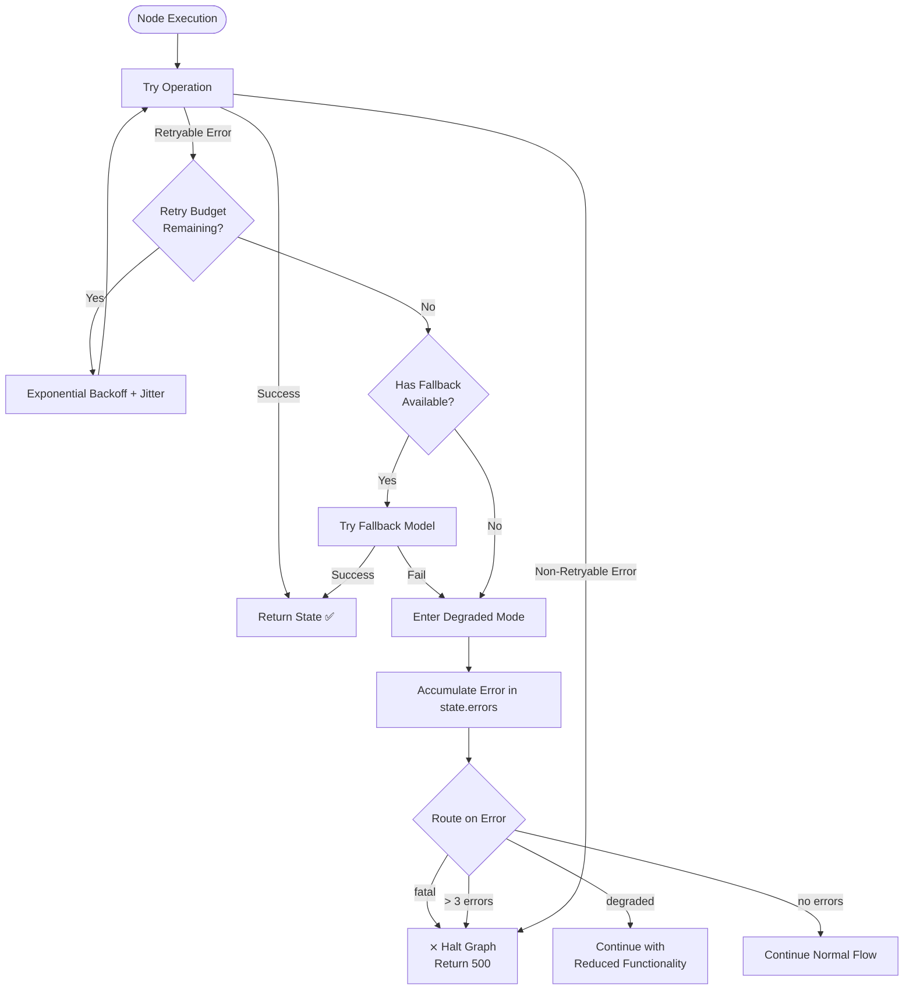

---

## 11. Streaming

### 11.1 When to Stream

| Scenario | Stream? | Method | Rationale |
|----------|---------|--------|-----------|
| Chat response to patient | **Yes** | Token-by-token SSE | Improves UX — reduces perceived latency |
| Emergency triage result | **Yes** | Token-by-token SSE | Urgency — patient sees analysis as it's generated |
| Doctor summary | **No** | Full response | Professional use — accuracy over speed |
| Medicine extraction | **No** | Full response | Structured JSON — must be complete to be useful |
| Guardrail evaluation | **No** | Full response | Must evaluate complete text before delivery |
| Reminder messages | **No** | Full response | Generated by background task — no user waiting |

### 11.2 Streaming Protocol

```python
from fastapi.responses import StreamingResponse
from langgraph.graph import StateGraph
import json

async def stream_chat_response(question: str, patient_id: str):
    """Stream a chat response token-by-token using SSE."""
    initial_state = await build_chat_context(patient_id, db)
    initial_state["question"] = question

    config = {"configurable": {"thread_id": f"chat:{uuid4()}"}}

    async def event_generator():
        yield {"event": "start", "data": json.dumps({"request_id": initial_state["request_id"]})}

        async for event in chat_graph.astream_events(
            initial_state,
            config=config,
            version="v2",
        ):
            kind = event["event"]

            if kind == "on_chat_model_stream":
                chunk = event["data"]["chunk"]
                if chunk.content:
                    yield {"event": "token", "data": json.dumps({"token": chunk.content})}

            elif kind == "on_chain_end":
                # Final state — includes sources, guardrail check, etc.
                state = event["data"]["output"]
                yield {"event": "end", "data": json.dumps({
                    "sources": state.get("sources", []),
                    "requires_escalation": state.get("requires_escalation", False),
                })}

            elif kind == "on_chain_start" and event["name"] == "check_guardrails":
                yield {"event": "guardrail_check", "data": json.dumps({"status": "checking"})}

            elif kind == "on_chain_start" and event["name"] == "should_escalate":
                yield {"event": "escalation_check", "data": json.dumps({"status": "checking"})}

        yield {"event": "done", "data": "{}"}

    return StreamingResponse(
        event_generator(),
        media_type="text/event-stream",
        headers={
            "Cache-Control": "no-cache",
            "Connection": "keep-alive",
            "X-Accel-Buffering": "no",
        },
    )

# FastAPI endpoint
@router.post("/chat/stream")
async def chat_stream(request: ChatRequest):
    return await stream_chat_response(request.question, request.patient_id)
```

### 11.3 SSE Event Types

| Event | When | Payload |
|-------|------|---------|
| `start` | Graph execution begins | `{request_id}` |
| `token` | Each new token from LLM | `{token: "..."}` |
| `guardrail_check` | Guardrail evaluation in progress | `{status: "checking"}` |
| `escalation_check` | Escalation evaluation in progress | `{status: "checking"}` |
| `end` | Graph execution complete | `{sources: [...], requires_escalation: bool}` |
| `error` | Error during execution | `{message: "...", code: "..."}` |
| `done` | Stream complete | `{}` |

### 11.4 Streaming Edge Cases

| Edge Case | Handling |
|-----------|----------|
| **Client disconnects** | Detect via `asyncio.CancelledError` — clean up resources |
| **Guardrail blocks mid-stream** | Stop token generation, yield `guardrail_block` event, end stream |
| **LLM rate limited** | Pause stream, switch to fallback model, yield `fallback` event |
| **Empty response** | Yield empty `done` event — frontend shows fallback message |
| **Multiple LLM calls** | Multiple `on_chat_model_stream` sequences — yield `phase` events between them |

```python
# Client disconnect handling
async def event_generator():
    try:
        # ... streaming logic ...
    except asyncio.CancelledError:
        logger.info(f"Client disconnected from stream {request_id}")
        # Cleanup — no further processing needed
    except Exception as e:
        logger.error(f"Stream error {request_id}: {e}")
        yield {"event": "error", "data": json.dumps({"message": "Stream interrupted"})}
```

---

## 12. Subgraphs

### 12.1 Subgraph Architecture

Each agent is a self-contained `StateGraph` compiled as a subgraph node within the
Orchestrator's graph. Subgraphs:

- Share the **same state schema** as the parent (no boundary translation needed)
- Have **their own nodes, edges, and conditional routing**
- Are **independently testable** — can be invoked standalone
- Can be **swapped** without changing the Orchestrator

### 12.2 Subgraph Definition Pattern

```python
def build_medical_report_subgraph() -> StateGraph:
    """Build the Medical Report agent as a standalone subgraph.

    Can be invoked directly (for testing) or as a subgraph node
    within the Orchestrator.
    """
    subgraph = StateGraph(MedicalReportState)

    # Nodes
    subgraph.add_node("extract_entities", extract_entities)
    subgraph.add_node("extract_medicines", extract_medicines)
    subgraph.add_node("validate_extraction", validate_extraction)
    subgraph.add_node("check_consistency", check_consistency)
    subgraph.add_node("store_results", store_results)

    # Edges
    subgraph.add_edge("extract_entities", "extract_medicines")
    subgraph.add_edge("extract_medicines", "validate_extraction")
    subgraph.add_conditional_edges(
        "validate_extraction",
        route_after_validation,
        {"check_consistency": "check_consistency", END: END},
    )
    subgraph.add_edge("check_consistency", "store_results")

    return subgraph
```

### 12.3 Subgraph Registration in Orchestrator

```python
# Inside build_orchestrator_graph():
orchestrator.add_node("medical_agent", build_medical_report_subgraph().compile())
orchestrator.add_node("chat_agent", build_chat_subgraph().compile())
orchestrator.add_node("emergency_agent", build_emergency_subgraph().compile())
orchestrator.add_node("summary_agent", build_summary_subgraph().compile())
orchestrator.add_node("reminder_agent", build_reminder_subgraph().compile())
```

### 12.4 Subgraph Testing

```python
async def test_medical_subgraph_independently():
    """Test the medical report subgraph in isolation."""
    subgraph = build_medical_report_subgraph().compile()

    initial_state = MedicalReportState(
        request_id="test-123",
        patient_id="patient-1",
        user_role="system",
        errors=[],
        retry_count=0,
        started_at=datetime.utcnow().isoformat(),
        metadata={},
        raw_text="Take Amoxicillin 500mg twice daily for 7 days",
        report_id="report-1",
        report_type="prescription",
        requires_human_review=False,
    )

    result = await subgraph.ainvoke(initial_state)
    assert result["validation_status"] == "validated"
    assert len(result.get("medicines", [])) > 0
    assert result["medicines"][0]["name"].lower() == "amoxicillin"
```

### 12.5 Cross-Subgraph Handoffs

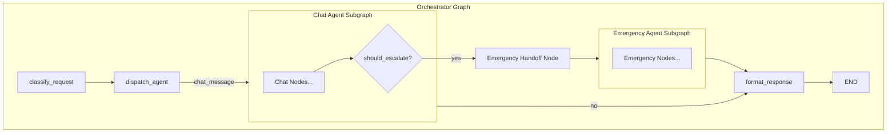

**Handoff implementation:**

```python
class EmergencyHandoffNode:
    """Bridge node that transforms Chat state into Emergency state."""

    async def __call__(self, state: OrchestratorState, context: NodeContext) -> OrchestratorState:
        chat_state = state["agent_result"]

        # Build emergency state from chat context
        emergency_state = EmergencyAgentState(
            request_id=f"{state['request_id']}_emergency",
            patient_id=state["patient_id"],
            user_role=state["user_role"],
            errors=[],
            retry_count=0,
            started_at=datetime.utcnow().isoformat(),
            metadata=state["metadata"],
            symptoms=chat_state.get("question", ""),
            patient_condition=chat_state.get("patient_condition"),
            recent_alerts=[],
            escalate=False,
        )

        # Invoke Emergency subgraph
        emergency_graph = build_emergency_subgraph().compile()
        result = await emergency_graph.ainvoke(emergency_state)

        return {**state, "agent_result": result}
```

### 12.6 Subgraph Isolation Rules

```
┌──────────────────────────────────────────────────────────────┐
│                    SUBGRAPH ISOLATION RULES                   │
├──────────────────────────────────────────────────────────────┤
│ 1. Subgraphs operate on their OWN state schema — they do not │
│    access the Orchestrator's state directly                  │
│                                                              │
│ 2. Handoff nodes (e.g., Chat → Emergency) translate state    │
│    between subgraph schemas. This is the ONLY cross-graph    │
│    data flow.                                                │
│                                                              │
│ 3. Subgraphs are COMPILED independently — they can be tested │
│    in isolation without the Orchestrator                     │
│                                                              │
│ 4. Subgraphs share the same NodeContext dependency injection │
│    (LLM client, DB session, prompt loader)                   │
│                                                              │
│ 5. Each subgraph has its OWN checkpoint thread — the parent   │
│    Orchestrator creates child thread IDs for sub-invocations │
│                                                              │
│ 6. Errors within a subgraph are contained — they propagate   │
│    to the parent via the returned state, not as exceptions   │
└──────────────────────────────────────────────────────────────┘
```

---

## 13. Future Multi-Agent Expansion

### 13.1 Expansion Paths

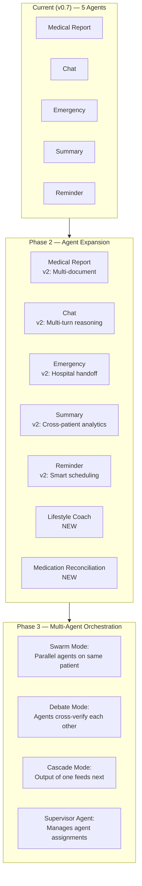

### 13.2 Supervisor Agent (Future)

```python
class SupervisorAgent:
    """Future agent that manages assignment and prioritization of sub-agents.

    Design sketch — not for current implementation.
    """

    def __init__(self):
        self.agent_registry = {
            "medical_report": MedicalReportAgent,
            "chat": ChatAgent,
            "emergency": EmergencyAgent,
            "summary": SummaryAgent,
            "reminder": ReminderAgent,
            "lifestyle_coach": LifestyleCoachAgent,      # Future
            "medication_reconciliation": MedRecAgent,    # Future
        }

    async def orchestrate(self, request: dict) -> dict:
        """Determine which agents to invoke and in what order.

        Future: This would use an LLM call with the full agent
        registry as context to dynamically build a workflow.
        """
        # Step 1: Classify intent
        intent = await self._classify_intent(request)

        # Step 2: Build execution plan
        plan = await self._build_plan(intent)

        # Step 3: Execute with dynamic routing
        results = {}
        for step in plan:
            agent = self.agent_registry[step["agent"]]
            result = await agent.run(step["input"])
            results[step["agent"]] = result

            # Dynamic re-planning based on results
            if step.get("replan"):
                plan = await self._replan(intent, results)

        return results
```

### 13.3 Parallel Agent Execution

```python
class ParallelAgentExecutor:
    """Execute multiple agents in parallel on the same patient context.

    Future: Enable fan-out patterns where independent agents
    run simultaneously and results are merged.
    """

    async def execute_parallel(
        self,
        agents: list[str],
        patient_id: str,
        context: NodeContext,
    ) -> dict[str, Any]:
        """Run independent agents concurrently."""
        tasks = {}
        for agent_name in agents:
            graph = self._get_graph(agent_name)
            state = await self._build_state(agent_name, patient_id, context)
            tasks[agent_name] = graph.ainvoke(state)

        # Wait for all to complete
        results = await asyncio.gather(*tasks.values(), return_exceptions=True)

        return {
            name: result for name, result in zip(agents, results)
            if not isinstance(result, Exception)
        }
```

### 13.4 Agent Communication Protocol

```
┌─────────────────────────────────────────────────────────────┐
│              AGENT COMMUNICATION PROTOCOL (FUTURE)           │
├─────────────────────────────────────────────────────────────┤
│ Message format:                                              │
│ {                                                           │
│   "from": "medical_report_agent",                           │
│   "to": "reminder_agent",                                   │
│   "type": "new_medicines_extracted",                        │
│   "payload": {                                              │
│     "medicines": [...],                                     │
│     "patient_id": "...",                                    │
│     "report_id": "..."                                      │
│   },                                                        │
│   "priority": "normal",                                     │
│   "ttl_seconds": 3600                                       │
│ }                                                           │
│                                                             │
│ Communication channels:                                     │
│   - Sync: Direct subgraph invocation (current)              │
│   - Async: Message queue (future — Redis pub/sub)           │
│                                                             │
│ Security rules:                                             │
│   - Agents only read messages addressed to them             │
│   - Message payload is scoped to patient_id                 │
│   - Cross-patient messages are FORBIDDEN                    │
│   - All messages are logged to audit table                  │
└─────────────────────────────────────────────────────────────┘
```

### 13.5 Supervisor Subgraph (Future Design)

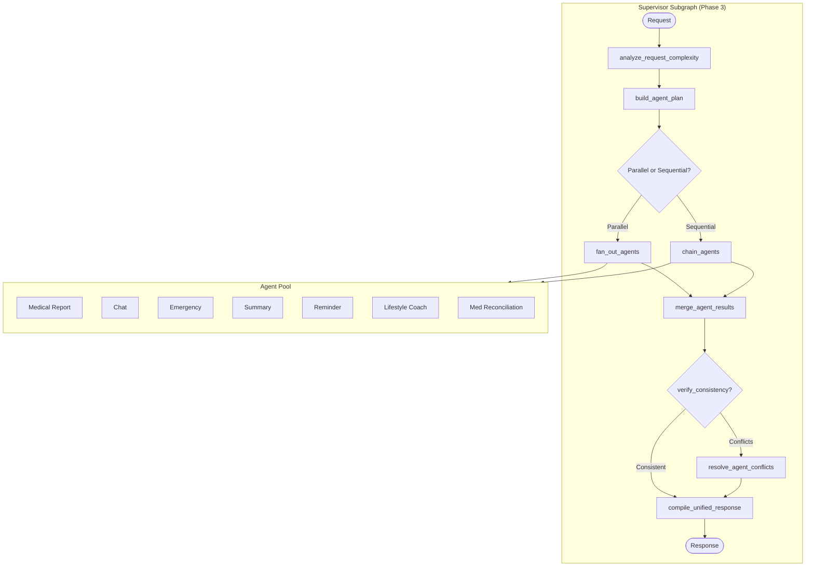

### 13.6 Scaling Guidelines

| Phase | Agents | Pattern | Orchestration | When |
|-------|--------|---------|---------------|------|
| **Current** | 5 | Each subgraph invoked independently | Router-based dispatch | Now |
| **Phase 2** | 7-10 | Same pattern + new agents | Router + intent classification | Post-MVP |
| **Phase 3** | 10+ | Swarm / Debate / Cascade | Supervisor Agent with LLM planning | Post-launch |

---

## 14. Architecture Decision Records

### ADR-LG-001: Subgraph over Flat Graph

**Status:** Accepted

**Context:** The 5 agents could be implemented as a single flat graph with all nodes
at the same level, or as separate subgraphs.

**Decision:** Use subgraphs. Each agent is a self-contained `StateGraph` compiled as
a node in the Orchestrator's graph.

**Consequences:**
- (+) Independent testing — each subgraph testable in isolation
- (+) Clear separation of concerns — agent logic is not interleaved
- (+) Future expansion — new agents added by registering a new subgraph node
- (-) Slightly more boilerplate for subgraph construction
- (-) Cross-agent handoffs require bridge nodes

### ADR-LG-002: TypedDict over BaseModel for State

**Status:** Accepted

**Context:** LangGraph supports `TypedDict`, `dataclass`, and `BaseModel` for state.

**Decision:** Use `TypedDict` for all state schemas.

**Consequences:**
- (+) JSON-serializable by default — no custom encoder needed for checkpointing
- (+) Lightweight — no Pydantic validation overhead
- (+) NotRequired fields enable partial state updates across nodes
- (-) No runtime validation — must validate critical fields in nodes

### ADR-LG-003: MemorySaver for Dev, PostgresSaver for Production

**Status:** Accepted

**Context:** Checkpoint persistence is needed for resilience in production, but adds
complexity in development.

**Decision:** Use `MemorySaver` in dev/test and `PostgresSaver` in production,
selected via environment config.

**Consequences:**
- (+) Zero-config local development
- (+) Full crash recovery in production
- (-) Need to test checkpoint-dependent features in both modes
- (-) PostgresSaver requires a separate connection pool from application DB

### ADR-LG-004: Interrupts for Low-Confidence and High-Risk Only

**Status:** Accepted

**Context:** Interrupts pause graph execution for human input, but every interrupt
adds latency and complexity.

**Decision:** Use interrupts only at two points: (1) low-confidence extraction
(< 0.5) and (2) high-risk escalation (risk_level == HIGH). All other validations
use conditional routing (pass/fail/skip) without interrupting.

**Consequences:**
- (+) Minimal interruption to normal flow (~95% of requests pass without interrupt)
- (+) Safety-critical paths always get human review
- (-) Low-confidence results with no interrupt stored as "pending_review" until human checks

### ADR-LG-005: State Immutability with Full-Return Pattern

**Status:** Accepted

**Context:** Nodes can mutate state in place or return new state dicts.

**Decision:** Nodes always return a new dict (using `{**state, updated_key: value}`).
Never mutate the received state in place.

**Consequences:**
- (+) Checkpoint integrity — state snapshots are reliable
- (+) Idempotent nodes — replaying from checkpoint produces same result
- (+) Easier debugging — no hidden state mutations
- (-) Verbose — requires spread operator in every node

---

## Appendix A: Quick Reference

### A.1 File Layout

```
backend/
├── app/
│   ├── agents/
│   │   ├── orchestrator/
│   │   │   ├── graph.py          # build_orchestrator_graph()
│   │   │   ├── nodes.py          # classify_request, dispatch_agent, format_response
│   │   │   └── routers.py        # route_to_agent()
│   │   ├── medical/
│   │   │   ├── graph.py          # build_medical_report_subgraph()
│   │   │   ├── nodes.py          # extract_entities, extract_medicines, ...
│   │   │   └── routers.py        # route_after_validation()
│   │   ├── chat/
│   │   │   ├── graph.py
│   │   │   ├── nodes.py
│   │   │   └── routers.py
│   │   ├── emergency/
│   │   │   ├── graph.py
│   │   │   ├── nodes.py
│   │   │   └── routers.py
│   │   ├── summary/
│   │   │   ├── graph.py
│   │   │   ├── nodes.py
│   │   │   └── routers.py
│   │   ├── reminder/
│   │   │   ├── graph.py
│   │   │   ├── nodes.py
│   │   │   └── routers.py
│   │   └── common/
│   │       ├── base_node.py      # NodeSkipException, NodeExecutionError
│   │       ├── retry.py          # @with_retry decorator
│   │       ├── safe_llm.py      # safe_llm_call()
│   │       └── context.py        # NodeContext dataclass
│   ├── core/
│   │   ├── llm_client.py         # LLMClient with fallback chain
│   │   ├── prompt_loader.py      # PromptLoader
│   │   └── tool_executor.py      # ToolExecutor
│   └── api/
│       └── routes/
│           ├── chat.py           # POST /chat (stream + non-stream)
│           ├── reports.py        # POST /reports/upload
│           ├── emergency.py      # POST /emergency/check
│           └── doctors.py        # GET /doctors/{id}/patients/{id}/summary
└── tests/
    └── agents/
        ├── test_medical_graph.py
        ├── test_chat_graph.py
        ├── test_emergency_graph.py
        ├── test_summary_graph.py
        ├── test_reminder_graph.py
        └── test_orchestrator.py
```

### A.2 Key Dependencies

```python
# NodeContext — runtime dependencies injected into every node
@dataclass
class NodeContext:
    llm_client: LLMClient              # With automatic fallback chain
    db: AsyncSession                   # SQLAlchemy async session
    prompt_loader: PromptLoader        # Cached prompt reader
    tool_executor: ToolExecutor        # Tool execution (Chat Agent)
    config: dict                       # Runtime config flags
```

### A.3 Constants

```python
RETRY_BUDGET_SECONDS = 15
CHECKPOINT_TTL_HOURS = 24
MAX_ERRORS_BEFORE_HALT = 3
CONFIDENCE_HUMAN_REVIEW_THRESHOLD = 0.5
CHAT_HISTORY_WINDOW = 20
CHAT_HISTORY_SUMMARY_THRESHOLD = 50
```
