# Observability Architecture

> Complete observability design for the AI-powered healthcare follow-up assistant.
> Covers logging, tracing, metrics, health checks, alerting, dashboards, and LLM-specific
> monitoring. This document governs all observability implementation.
>
> **Status:** Design Phase (pre-implementation)
> **Last Updated:** 2026-07-14
> **Author:** AI Healthcare Team
> **Applies To:** Backend API, AI Agents, Document Pipeline, Database

---

## Table of Contents

1. [Observability Strategy](#1-observability-strategy)
2. [Logging](#2-logging)
3. [Tracing](#3-tracing)
4. [Metrics](#4-metrics)
5. [Health Checks](#5-health-checks)
6. [Readiness Probes](#6-readiness-probes)
7. [Liveness Probes](#7-liveness-probes)
8. [LangSmith](#8-langsmith)
9. [Sentry](#9-sentry)
10. [Performance Monitoring](#10-performance-monitoring)
11. [Cost Tracking](#11-cost-tracking)
12. [LLM Usage Analytics](#12-llm-usage-analytics)
13. [Database Metrics](#13-database-metrics)
14. [API Metrics](#14-api-metrics)
15. [Alerting](#15-alerting)
16. [Dashboards](#16-dashboards)
17. [Architecture Decision Records](#17-architecture-decision-records)

---

## 1. Observability Strategy

### 1.1 Three Pillars

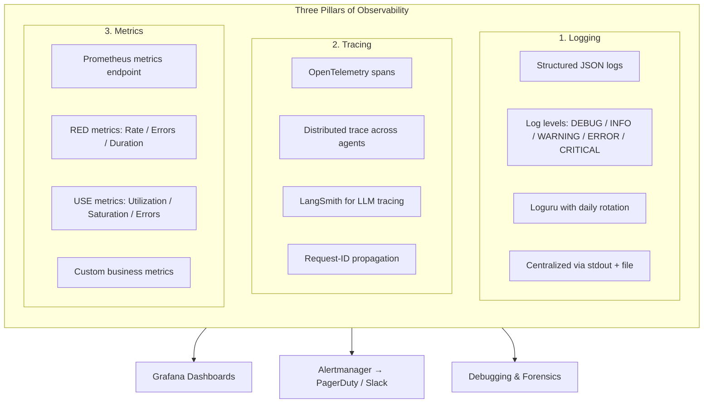

### 1.2 Observability Levels

| Level | Audience | Purpose | Tools |
|-------|----------|---------|-------|
| **L1 — Health** | Ops / K8s | Is the service alive? | Liveness + Readiness probes |
| **L2 — Performance** | Engineering | How fast / reliable is it? | Prometheus metrics, Grafana |
| **L3 — Debugging** | Developers | Why did this fail? | Structured logs, Sentry, LangSmith |
| **L4 — Business** | Product / Clinical | What are patients doing? | LLM analytics, cost tracking, dashboards |
| **L5 — Safety** | Compliance / Audit | Is it safe? | Audit log, guardrail metrics, human review |

### 1.3 Data Flow

```mermaid
flowchart LR
    subgraph Sources["Observability Sources"]
        direction TB
        S1[FastAPI Middleware]
        S2[LangGraph Agents]
        S3[LLM Calls]
        S4[Document Pipeline]
        S5[Database Queries]
        S6[Background Tasks]
    end

    subgraph Collectors["Collectors"]
        direction TB
        C1[Loguru → stdout + file]
        C2[OpenTelemetry Collector]
        C3[Prometheus Metrics Endpoint]
        C4[LangSmith SDK]
        C5[Sentry SDK]
    end

    subgraph Storage["Storage"]
        direction TB
        ST1[Log files<br/>30-day retention]
        ST2[Jaeger / Tempo<br/>Tracing backend]
        ST3[Prometheus<br/>Metrics DB]
        ST4[LangSmith<br/>LLM traces]
        ST5[Sentry<br/>Error storage]
    end

    subgraph Visualization["Visualization"]
        direction TB
        V1[Grafana<br/>Dashboards]
        V2[LangSmith<br/>LLM Dashboard]
        V3[Sentry<br/>Issue Tracking]
    end

    subgraph Alerting["Alerting"]
        direction TB
        A1[Alertmanager]
        A2[Slack Alerts]
        A3[PagerDuty<br/>On-call]
        A4[Email Alerts]
    end

    Sources --> Collectors
    Collectors --> Storage
    Storage --> Visualization
    Storage --> Alerting
```

### 1.4 Technology Stack

| Component | Technology | Status | Priority |
|-----------|-----------|--------|----------|
| **Logging framework** | Loguru | ✅ Implemented | P0 |
| **Log format** | Structured JSON | Design | P1 |
| **Log aggregation** | Grafana Loki | Design | P2 |
| **Tracing** | OpenTelemetry SDK | Design | P1 |
| **Trace backend** | Grafana Tempo | Design | P2 |
| **Metrics** | Prometheus client | Design | P1 |
| **Metrics endpoint** | `/metrics` on FastAPI | Design | P1 |
| **Dashboards** | Grafana | Design | P2 |
| **LLM tracing** | LangSmith | Design | P0 |
| **Error tracking** | Sentry | Design | P1 |
| **Health checks** | Custom `/health`, `/ready`, `/live` | Partial | P0 |
| **Alerting** | Alertmanager + Slack + PagerDuty | Design | P2 |
| **Uptime monitoring** | Better Uptime / Pingdom | Design | P2 |

---

## 2. Logging

### 2.1 Logging Architecture

```mermaid
flowchart TB
    subgraph Sources["Log Sources"]
        S1[FastAPI requests]
        S2[AI Agent nodes]
        S3[LLM calls]
        S4[Document pipeline stages]
        S5[Database queries]
        S6[Background tasks]
        S7[Auth events]
    end

    subgraph Pipeline["Logging Pipeline"]
        direction TB
        Sources --> L1[Loguru Logger]

        L1 --> Format{Format Decision}

        Format -->|Development| Console[Colorized Console<br/>human-readable]
        Format -->|Production| JSON[JSON Formatter<br/>machine-readable]

        JSON --> File[Daily Rotating File<br/>30-day retention<br/>gzip compressed]
        JSON --> Stdout[Docker stdout<br/>collected by container runtime]

        File --> Loki[Grafana Loki<br/>(future)]
        Stdout --> Loki
    end

    subgraph Consumers["Log Consumers"]
        Loki --> Grafana[Grafana Explore<br/>ad-hoc querying]
        Loki --> Dashboards[Grafana Dashboards<br/>log-derived panels]
        Loki --> Alerts[Log-based Alerting<br/>e.g., error rate spike]
        File --> Forensics[Forensic Analysis<br/>on-disk fallback]
    end
```

### 2.2 Log Levels

| Level | Usage | Examples |
|-------|-------|----------|
| `DEBUG` | Development details, not emitted in prod | Variable values, intermediate computations |
| `INFO` | Normal operational events | Request completed, agent node entered, LLM call succeeded |
| `WARNING` | Recoverable issues, degraded mode | Fallback model used, retry occurred, partial data returned |
| `ERROR` | Failed operations, not affecting other requests | LLM call failed after retries, DB query failed |
| `CRITICAL` | System-wide failures requiring immediate action | DB connection lost, API key invalid, app startup failure |

### 2.3 Structured Log Schema

Every log entry follows this schema in production:

| Field | Type | Required | Example |
|-------|------|----------|---------|
| `timestamp` | ISO 8601 | Yes | `2026-07-14T10:30:00.123Z` |
| `level` | string | Yes | `INFO` |
| `logger` | string | Yes | `app.agents.medical.nodes` |
| `message` | string | Yes | `Extraction entities completed` |
| `request_id` | string | No | `req_abc123` |
| `patient_id` | string | No | `pat_456` |
| `agent_name` | string | No | `medical_report` |
| `node_name` | string | No | `extract_entities` |
| `duration_ms` | number | No | `1234` |
| `error` | object | No | `{"type": "LLMTimeout", "message": "..."}` |
| `trace_id` | string | No | `trace_xyz` |
| `span_id` | string | No | `span_789` |
| `metadata` | object | No | `{"retry_count": 2, "model": "gpt-4o"}` |

### 2.4 Log Format: Development vs Production

```python
# Structured JSON format (production)
{
  "timestamp": "2026-07-14T10:30:00.123Z",
  "level": "INFO",
  "logger": "app.agents.medical.nodes",
  "message": "Extraction entities completed",
  "request_id": "req_abc123",
  "patient_id": "pat_456",
  "duration_ms": 1234,
  "metadata": {
    "model": "gpt-4o-mini",
    "tokens": 567,
    "confidence": 0.92
  }
}
```

```python
# Colorized console format (development)
2026-07-14 10:30:00.123 | INFO     | app.agents.medical.nodes:extract_entities:42 | Extraction entities completed | req_abc123 | 1234ms
```

### 2.5 What to Log at Each Layer

**API Layer (FastAPI middleware):**

| Event | Level | Details |
|-------|-------|---------|
| Request received | INFO | method, path, client_ip, user_agent, request_id |
| Response sent | INFO | status_code, duration_ms, content_length |
| 4xx error | WARNING | validation_error, missing_field |
| 5xx error | ERROR | full traceback, request context |
| Rate limit hit | WARNING | patient_id, endpoint, retry_after |

**AI Agent Layer:**

| Event | Level | Details |
|-------|-------|---------|
| Node entered | INFO | agent_name, node_name, state summary |
| Node completed | INFO | agent_name, node_name, duration_ms |
| LLM call started | DEBUG | prompt_path, model, input_tokens |
| LLM call completed | INFO | prompt_path, model, output_tokens, duration_ms |
| LLM fallback used | WARNING | primary_model, fallback_model, reason |
| Guardrail block | WARNING | rule violated, severity, response preview |

**Document Pipeline Layer:**

| Event | Level | Details |
|-------|-------|---------|
| Upload received | INFO | file_type, file_size, patient_id |
| Validation passed/failed | INFO/WARNING | validation_layer, reason |
| Virus scan result | INFO | clean/infected/skipped |
| OCR completed | INFO | method, confidence, word_count |
| Extraction completed | INFO | confidence, entity_count |
| Pipeline stage failed | ERROR | stage_name, error_details, retry_count |

**Database Layer:**

| Event | Level | Details |
|-------|-------|---------|
| Query executed | DEBUG | query_preview, duration_ms |
| Slow query (>500ms) | WARNING | full_query, duration_ms, params |
| Connection acquired/released | DEBUG | pool_size, active_connections |
| Connection pool exhausted | CRITICAL | max_pool_size, waiting_requests |

### 2.6 Logging Configuration

| Parameter | Value | Rationale |
|-----------|-------|-----------|
| File rotation | Daily | Predictable file naming |
| Retention | 30 days | Compliance + debugging |
| Compression | gzip | 90% space reduction |
| Max file size | 100 MB | Prevents oversized single files |
| Console format (dev) | Colorized | Developer readability |
| Console format (prod) | JSON | Machine parsing |
| Log level (dev) | DEBUG | Full visibility |
| Log level (prod) | INFO | Reduce noise, capture errors |
| Sensitive data masking | PII, tokens, passwords | HIPAA compliance |

### 2.7 Sensitive Data Masking

```mermaid
flowchart LR
    subgraph Masking["Log Data Masking Rules"]
        direction TB
        M1[Patient name → [PATIENT NAME]]
        M2[Date of birth → [DOB]]
        M3[Phone number → [PHONE]]
        M4[Email → [EMAIL]]
        M5[JWT token → [TOKEN]]
        M6[API key → [API KEY]]
        M7[SSN / MRN → [IDENTIFIER]]
        M8[Free-text health info → logged ONLY if essential]
    end

    Raw[Raw Log] --> Filter[PII Filter]
    Filter --> Safe[Cleaned Log]
    Safe --> Storage[Log Storage]
```

---

## 3. Tracing

### 3.1 Trace Architecture

```mermaid
graph TB
    subgraph Traces["Distributed Tracing"]
        direction TB

        subgraph Root["Root Span — HTTP Request"]
            direction TB
            R1[POST /api/v1/chat/message]
            R2[request_id: req_abc123]
        end

        subgraph Middleware["Middleware Spans"]
            M1[auth_middleware: 5ms]
            M2[rate_limit_check: 1ms]
        end

        subgraph Orchestrator["Orchestrator Span"]
            O1[classify_request: 2ms]
            O2[dispatch_agent: 1ms]
        end

        subgraph Agent["Chat Agent Subgraph"]
            direction TB
            A1[retrieve_context: 150ms]
            A2[compress_context: 800ms]
            A3[generate_response: 1200ms]
            A4[check_guardrails: 900ms]
            A5[format_output: 50ms]
        end

        subgraph LLM["LLM Call Spans"]
            L1[LLM: document_retrieval: 120ms]
            L2[LLM: context_compression: 700ms]
            L3[LLM: patient_chat: 1100ms]
            L4[LLM: guardrails: 850ms]
        end

        Root --> Middleware
        Middleware --> Orchestrator
        Orchestrator --> Agent
        Agent --> LLM

        note_right_of Root
            Trace Context:
            trace_id, span_id, parent_span_id
            propagated via HTTP headers
        end
    end
```

### 3.2 Span Attributes

Every span includes:

| Attribute | Type | Example |
|-----------|------|---------|
| `service.name` | string | `ai-healthcare-backend` |
| `service.version` | string | `0.7.0` |
| `request_id` | string | `req_abc123` |
| `patient_id` | string | `pat_456` |
| `agent_name` | string | `chat_agent` |
| `node_name` | string | `generate_response` |
| `llm.model` | string | `gpt-4o` |
| `llm.prompt_path` | string | `chat/patient_chat` |
| `llm.input_tokens` | int | `450` |
| `llm.output_tokens` | int | `120` |
| `http.method` | string | `POST` |
| `http.path` | string | `/api/v1/chat/message` |
| `http.status_code` | int | `200` |

### 3.3 Trace Sampling Strategy

| Traffic Type | Sampling Rate | Rationale |
|-------------|---------------|-----------|
| Chat messages | 100% | User-facing, need full visibility |
| Emergency checks | 100% | Safety-critical, every trace matters |
| Report uploads | 100% | Document pipeline debugging |
| Doctor summaries | 10% | Low volume, sample for perf |
| Reminder checks | 1% | Background task, high volume |
| 4xx/5xx errors | 100% | Always capture failures |
| Guardrail blocks | 100% | Safety audit requirement |

### 3.4 Trace Context Propagation

```python
# Trace context is propagated through:
# 1. HTTP headers (W3C Trace-Context)
# 2. LangGraph state (request_id + trace_id)
# 3. Message queue headers (background tasks)
# 4. Log entries (trace_id + span_id)

PROPAGATION_HEADERS = {
    "traceparent": "00-{trace_id}-{span_id}-01",
    "tracestate": "ai-healthcare=request_id_{request_id}",
}

# Pipeline:
# Incoming Request ──> extract trace context from headers
#                   ──> create root span
#                   ──> inject trace context into LangGraph state
#                   ──> each node creates child span
#                   ──> LLM calls create nested spans
#                   ──> response sent with trace headers
```

### 3.5 OpenTelemetry SDK Configuration

| Component | Configuration |
|-----------|--------------|
| **Exporter** | OTLP gRPC to OpenTelemetry Collector |
| **Collector endpoint** | `localhost:4317` (dev), `otel-collector:4317` (prod) |
| **Batch processor** | max_queue_size=2048, scheduled_delay=5000ms |
| **Sampler** | `ParentBased(rate_limiting=100)` |
| **Resource attributes** | `service.name`, `service.version`, `deployment.environment` |

---

## 4. Metrics

### 4.1 Metric Categories

```mermaid
graph TB
    subgraph Metrics["Metrics Taxonomy"]
        direction TB

        subgraph RED["RED Metrics (Every Service)"]
            direction TB
            RED_R[Rate: Requests per second]
            RED_E[Errors: Error count / rate]
            RED_D[Duration: Latency distribution]
        end

        subgraph USE["USE Metrics (Every Resource)"]
            direction TB
            USE_U[Utilization: % busy]
            USE_S[Saturation: queue depth]
            USE_E[Errors: failure count]
        end

        subgraph Business["Business Metrics (Healthcare)"]
            direction TB
            B1[Chats per patient per day]
            B2[Emergency escalations per hour]
            B3[Adherence rate trend]
            B4[Reports processed per hour]
            B5[Guardrail violations per day]
            B6[LLM cost per patient per day]
        end
    end
```

### 4.2 Metrics Registry

**RED Metrics (Endpoint-Level):**

| Metric Name | Type | Labels | Description |
|-------------|------|--------|-------------|
| `http_requests_total` | Counter | `method`, `path`, `status` | Total HTTP requests |
| `http_requests_active` | Gauge | `method`, `path` | Currently in-flight requests |
| `http_request_duration_seconds` | Histogram | `method`, `path` | Request latency (buckets: 0.05, 0.1, 0.25, 0.5, 1, 2.5, 5, 10) |
| `http_errors_total` | Counter | `method`, `path`, `status` | HTTP error responses (4xx, 5xx) |

**Agent-Level Metrics:**

| Metric Name | Type | Labels | Description |
|-------------|------|--------|-------------|
| `agent_invocations_total` | Counter | `agent_name`, `node_name` | Agent node invocations |
| `agent_node_duration_seconds` | Histogram | `agent_name`, `node_name` | Node execution latency |
| `agent_node_errors_total` | Counter | `agent_name`, `node_name` | Node execution errors |
| `agent_retries_total` | Counter | `agent_name`, `node_name` | Retry attempts |
| `agent_fallbacks_total` | Counter | `agent_name`, `from_model`, `to_model` | LLM fallback activations |
| `agent_human_reviews_queued` | Gauge | `agent_name` | Pending human reviews |
| `agent_interrupts_total` | Counter | `agent_name`, `interrupt_type` | Human-in-the-loop interrupts |

**LLM Metrics:**

| Metric Name | Type | Labels | Description |
|-------------|------|--------|-------------|
| `llm_calls_total` | Counter | `model`, `agent_name`, `prompt_path` | Total LLM calls |
| `llm_call_duration_seconds` | Histogram | `model`, `agent_name` | LLM response time |
| `llm_tokens_input_total` | Counter | `model` | Input tokens consumed |
| `llm_tokens_output_total` | Counter | `model` | Output tokens consumed |
| `llm_cost_total` | Counter | `model`, `agent_name` | Cumulative cost in USD |
| `llm_cost_per_request` | Gauge | `agent_name` | Cost per individual request |
| `llm_errors_total` | Counter | `model`, `error_type` | LLM API errors (timeout, rate-limit, auth) |
| `llm_success_rate` | Gauge | `model` | % successful calls (1h window) |

**Document Pipeline Metrics:**

| Metric Name | Type | Labels | Description |
|-------------|------|--------|-------------|
| `pipeline_uploads_total` | Counter | `file_type` | Documents uploaded |
| `pipeline_stage_duration_seconds` | Histogram | `stage` | Per-stage processing time |
| `pipeline_ocr_confidence` | Gauge | `method` | Average OCR confidence |
| `pipeline_extraction_confidence` | Gauge | --- | Average extraction confidence |
| `pipeline_queue_depth` | Gauge | `priority` | Current queue size |
| `pipeline_stage_errors_total` | Counter | `stage`, `error_type` | Per-stage errors |
| `pipeline_stalled_jobs` | Gauge | --- | Jobs in processing > 5 min |

**Database Metrics:**

| Metric Name | Type | Labels | Description |
|-------------|------|--------|-------------|
| `db_connection_pool_size` | Gauge | `pool_name` | Current pool connections |
| `db_connection_active` | Gauge | `pool_name` | Active connections |
| `db_connection_waiting` | Gauge | `pool_name` | Connections waiting for pool |
| `db_query_duration_seconds` | Histogram | `operation` | Query latency |
| `db_slow_queries_total` | Counter | `operation` | Queries > 500ms |
| `db_pool_exhausted_total` | Counter | `pool_name` | Pool exhaustion events |

**Business Metrics:**

| Metric Name | Type | Labels | Description |
|-------------|------|--------|-------------|
| `active_patients` | Gauge | --- | Patients with activity in 24h |
| `messages_per_chat` | Histogram | --- | Messages per chat session |
| `emergency_escalations_total` | Counter | `risk_level` | Escalations by severity |
| `guardrail_violations_total` | Counter | `severity`, `rule` | Guardrail violations |
| `daily_active_users` | Gauge | `role` | DAU by role (patient/doctor) |
| `medicines_extracted_total` | Counter | --- | Medicines extracted by AI |

### 4.3 Metrics Endpoint

```python
# GET /metrics
# Content-Type: text/plain; version=0.4.0
#
# Prometheus scrape endpoint mounted on FastAPI app.
# Protected by internal-network-only access in production.

SCRAPE_CONFIG = {
    "scrape_interval": "15s",
    "scrape_timeout": "10s",
    "metrics_path": "/metrics",
}

# Exporters filter: exclude sensitive labels
METRICS_LABEL_ALLOWLIST = [
    "method", "path", "status", "agent_name", "node_name",
    "model", "stage", "risk_level", "severity", "file_type",
    "role", "error_type", "pool_name",
]

METRICS_LABEL_BLOCKLIST = [
    "patient_id", "request_id", "user_id", "doctor_id",
    "report_id", "chat_id",
]
```

### 4.4 Metric Collection Architecture

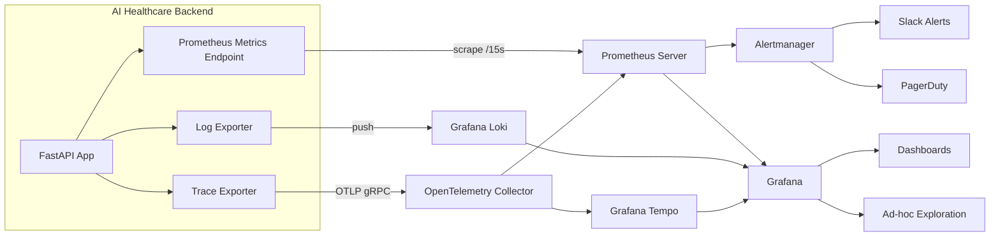

---

## 5. Health Checks

### 5.1 Health Check Endpoints

| Endpoint | Purpose | Response Time | Cache |
|----------|---------|--------------|-------|
| `GET /health` | Overall system health | <100ms | No |
| `GET /health/details` | Detailed component health | <200ms | No |
| `GET /ready` | Readiness for K8s | <200ms | No |
| `GET /live` | Liveness for K8s | <10ms | Yes, 30s TTL |

### 5.2 Health Check Components

```mermaid
graph TB
    HealthCheck[GET /health] --> CheckList{Checklist}

    CheckList --> DB[Database<br/>connection + ping]
    CheckList --> Redis[Redis<br/>(if configured)]
    CheckList --> ChromaDB[ChromaDB<br/>vector store ping]
    CheckList --> ClamAV[ClamAV<br/>virus scanner]
    CheckList --> Disk[Disk Space<br/>uploads dir]
    CheckList --> LLM[LLM API<br/>simple completion]
    CheckList --> Queue[Background Queue<br/>worker health]

    DB -->|pass| Aggregate[Aggregate Status]
    Redis -->|pass| Aggregate
    ChromaDB -->|pass| Aggregate
    ClamAV -->|pass| Aggregate
    Disk -->|pass| Aggregate
    LLM -->|pass| Aggregate
    Queue -->|pass| Aggregate

    DB -->|fail| Degraded
    LLM -->|fail| Degraded

    Aggregate -->|all pass| Healthy[healthy 🟢]
    Aggregate -->|one fail| Degraded[degraded 🟡]
    Aggregate -->|DB fail| Unhealthy[unhealthy 🔴]
```

### 5.3 Health Check Response Schema

```json
{
  "status": "healthy",
  "version": "0.7.0",
  "timestamp": "2026-07-14T10:30:00Z",
  "uptime_seconds": 86400,
  "services": {
    "database": {
      "status": "up",
      "latency_ms": 2.3,
      "pool_size": 8,
      "active_connections": 3,
      "table_count": 12,
      "migration_revision": "0001_initial_schema"
    },
    "chromadb": {
      "status": "up",
      "latency_ms": 15.1,
      "collection_count": 3,
      "document_count": 1452
    },
    "redis": {
      "status": "not_configured"
    },
    "clamav": {
      "status": "up",
      "latency_ms": 5.2
    },
    "disk": {
      "status": "healthy",
      "usage_percent": 42,
      "free_bytes": 53687091200
    },
    "queue": {
      "status": "up",
      "pending_jobs": 3,
      "active_workers": 2
    }
  }
}
```

### 5.4 Health Check Status Logic

| Status | Condition | Action |
|--------|-----------|--------|
| `healthy` 🟢 | All services pass | Normal operation |
| `degraded` 🟡 | 1+ non-critical services fail (LLM, Redis, ClamAV) | Continue, notify ops |
| `unhealthy` 🔴 | Database fails, or 3+ services fail | Stop routing traffic, alert on-call |

### 5.5 Health Check Implementation Notes

- DB check: `SELECT 1` with 2s timeout
- ChromaDB check: `hearbeat()` API with 5s timeout
- Redis check: `PING` command with 2s timeout
- ClamAV check: `PING` command over TCP with 5s timeout
- Disk check: `statvfs` on upload directory — warn at 85%, critical at 95%
- LLM check: Simple 10-token completion with cheapest model — 10s timeout
- Queue check: Verify worker process is alive, check for stalled jobs
- All checks have circuit breakers: 3 consecutive failures → skip check for 30s

---

## 6. Readiness Probes

### 6.1 Readiness Definition

Readiness indicates whether the service is **ready to accept traffic**. A service
is ready when all startup dependencies are available.

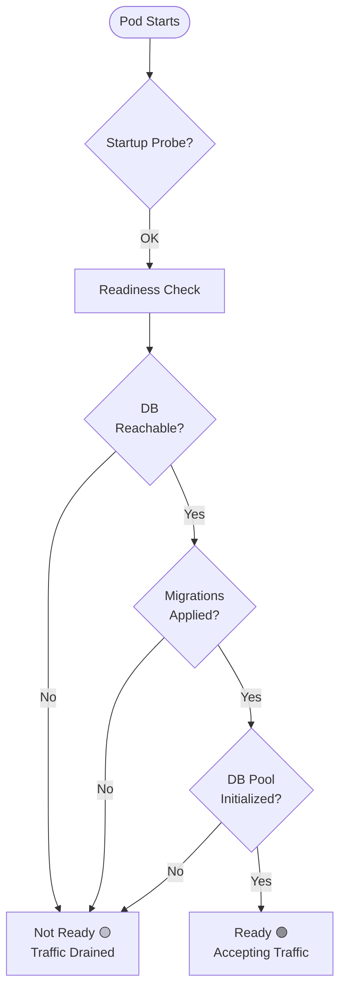

### 6.2 Readiness Criteria

| Condition | Required? | Check |
|-----------|-----------|-------|
| Database reachable | **Yes** | `SELECT 1` succeeds |
| Migrations applied | **Yes** | `alembic_version` table exists with current revision |
| ChromaDB reachable | Yes (if configured) | Heartbeat API |
| Redis reachable | Yes (if configured) | PING command |
| Disk writable | **Yes** | Can create temp file in upload dir |
| LLM API key present | Yes | API key env var is non-empty |

### 6.3 Readiness Response

```python
# GET /ready → 200 OK if ready, 503 Service Unavailable if not
READY_RESPONSE = {
    "status": "ready",      # or "not_ready"
    "checks": {
        "database": "pass",
        "chromadb": "pass",
        "disk": "pass",
    },
    "unready_services": [], # List of failed services
}
```

### 6.4 Kubernetes Probe Configuration

```yaml
readinessProbe:
  httpGet:
    path: /ready
    port: 8000
  initialDelaySeconds: 10
  periodSeconds: 15
  timeoutSeconds: 5
  failureThreshold: 3
  successThreshold: 1
```

---

## 7. Liveness Probes

### 7.1 Liveness Definition

Liveness indicates whether the service process is **alive and functioning**. If
liveness fails, Kubernetes restarts the pod.

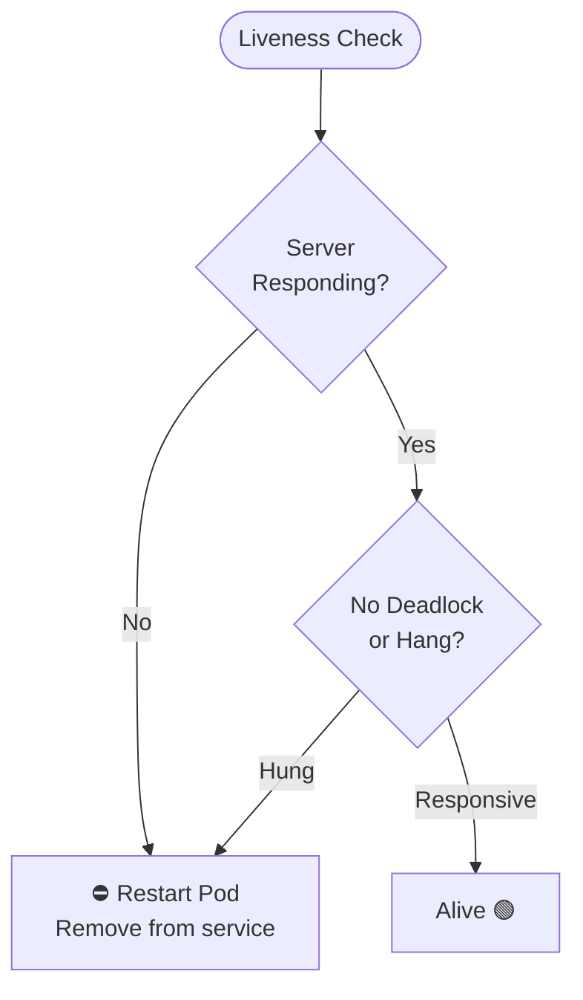

### 7.2 Liveness Criteria

| Condition | Required? | Check |
|-----------|-----------|-------|
| HTTP server responsive | **Yes** | Accepts and responds to requests |
| Not in deadlock state | **Yes** | Request processing within timeout |
| Background workers alive | Yes | Process check for queue workers |

### 7.3 Liveness Minimalism

The liveness probe is intentionally **shallow** — it only checks that the process
is running and responding. Deep dependency checks belong in readiness and health.

```python
# GET /live → 200 OK (always — unless process is hung)
LIVE_RESPONSE = {
    "status": "alive",
    "timestamp": "2026-07-14T10:30:00Z",
}
```

### 7.4 Kubernetes Probe Configuration

```yaml
livenessProbe:
  httpGet:
    path: /live
    port: 8000
  initialDelaySeconds: 30
  periodSeconds: 10
  timeoutSeconds: 3
  failureThreshold: 3
  successThreshold: 1
```

---

## 8. LangSmith

### 8.1 LangSmith Integration

LangSmith provides LLM-specific observability: trace every LLM call, evaluate
response quality, monitor latency, and debug prompt chains.

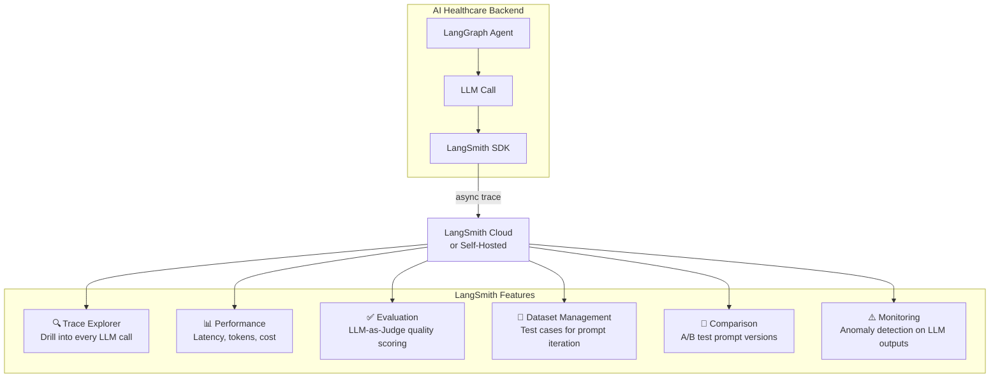

### 8.2 LangSmith Configuration

| Parameter | Dev | Prod |
|-----------|-----|------|
| **Endpoint** | `https://api.smith.langchain.com` | Self-hosted or cloud |
| **Project name** | `ai-healthcare-dev` | `ai-healthcare-prod` |
| **Tracing** | Enabled (all traces) | Enabled (sampled: 10% chat, 100% emergency) |
| **Evaluation** | Manual | Automated nightly |
| **API key** | `.env` LANGSMITH_API_KEY | Vault / K8s secret |

### 8.3 LangSmith Run Tree

Every agent execution creates a LangSmith run tree:

```
Root Run: chat_agent (request_id: req_abc123)
├── Node: retrieve_context
│   └── LLM Call: rag/document_retrieval [duration: 120ms, tokens: 340]
├── Node: compress_context
│   └── LLM Call: rag/context_compression [duration: 700ms, tokens: 890]
├── Node: generate_response
│   └── LLM Call: chat/patient_chat [duration: 1100ms, tokens: 1560]
├── Node: check_guardrails
│   └── LLM Call: system/guardrails [duration: 850ms, tokens: 720]
├── Node: format_output
│   └── (no LLM — pure transform)
└── Node: should_escalate
    └── (no LLM — rule-based)
```

### 8.4 LangSmith Annotations

Every LangSmith run is annotated with:

```json
{
  "request_id": "req_abc123",
  "patient_id": "pat_456",
  "agent_name": "chat_agent",
  "prompt_version": "chat/patient_chat@v2.0.0",
  "guardrail_action": "allow",
  "hallucination_risk": 0.12,
  "requires_escalation": false,
  "environment": "production"
}
```

### 8.5 LangSmith Evaluation

| Evaluation | Frequency | Method | Threshold |
|-----------|-----------|--------|-----------|
| Response quality | Nightly | LLM-as-Judge (gpt-4o) | Score ≥ 7/10 |
| Guardrail compliance | Per-run | rule-based check | 0 violations |
| Hallucination rate | Nightly | Factual consistency check | < 5% hallucinated |
| Latency | Per-run | Duration tracking | p95 < 5s |

---

## 9. Sentry

### 9.1 Sentry Integration

Sentry captures **application errors** with full context — stack traces, request
state, and user context.

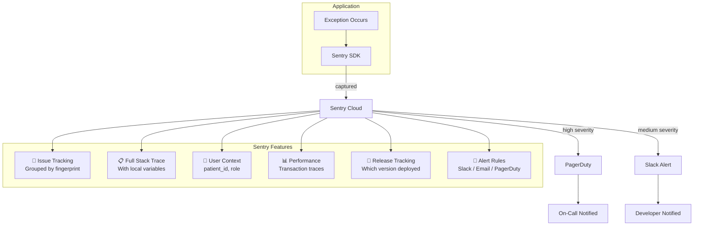

### 9.2 What to Capture

| Event Type | Capture? | Severity | Notes |
|-----------|----------|----------|-------|
| Unhandled exceptions | **Yes** | Fatal | Auto-captured by SDK |
| HTTP 5xx errors | **Yes** | Error | With request context |
| LLM API failures | **Yes** | Error | After all retries exhausted |
| DB connection failures | **Yes** | Fatal | System-wide impact |
| Guardrail violations | **Yes** | Warning | With response preview |
| Slow requests (>10s) | **Yes** | Warning | With trace |
| Rate limit hits | No | — | Use metrics instead |
| 4xx client errors | No | — | Normal operation |
| DEBUG-level events | No | — | Log only |

### 9.3 Sentry Configuration

```python
SENTRY_CONFIG = {
    "dsn": settings.SENTRY_DSN,         # From env / vault
    "environment": settings.ENVIRONMENT,
    "release": "0.7.0",                 # From version
    "traces_sample_rate": 0.1,          # 10% of transactions
    "profiles_sample_rate": 0.05,       # 5% of profiles
    "send_default_pii": False,          # HIPAA: never send PII
    "max_breadcrumbs": 50,
    "attach_stacktrace": True,
    "before_send": sanitize_event,      # PII filter before sending
}
```

### 9.4 PII Sanitization Hook

```python
def sanitize_event(event: dict, hint: dict) -> dict | None:
    """Remove PII from Sentry events before sending.

    Rules:
    - Strip patient_id from event context
    - Strip request body (may contain free-text health info)
    - Keep path, method, status_code
    - Keep error type and stack trace
    """
    if "request" in event:
        event["request"].pop("data", None)           # Remove request body
        event["request"].pop("cookies", None)        # Remove cookies
        event["request"].pop("headers", {}).pop("Authorization", None)

    if "user" in event:
        # Only retain role, never PII
        event["user"] = {
            "role": event["user"].get("role", "unknown"),
        }

    return event
```

### 9.5 Sentry Alert Rules

| Condition | Action | Channel |
|-----------|--------|---------|
| Fatal error (any) | Notify on-call immediately | PagerDuty |
| Error rate > 1% in 5 min | Notify on-call | PagerDuty |
| New issue created (error) | Notify team | Slack #alerts |
| Slow transaction (p95 > 10s) | Weekly digest | Email |
| New release regression | Notify developers | Slack #deploys |

---

## 10. Performance Monitoring

### 10.1 Performance Objectives

```mermaid
graph LR
    subgraph Targets["Performance Targets (p95)"]
        direction TB
        T1[Chat Response: < 5s]
        T2[Emergency Triage: < 8s]
        T3[Medicine Extraction: < 10s]
        T4[Doctor Summary: < 15s]
        T5[Document Upload: < 2s]
        T6[OCR Processing: < 60s per page]
        T7[API Response (non-LLM): < 200ms]
    end

    subgraph SLOs["Service Level Objectives"]
        direction TB
        S1[Availability: 99.5%]
        S2[LLM Success Rate: 99%]
        S3[Error Rate: < 1%]
        S4[DB Query p95: < 100ms]
    end
```

### 10.2 Performance Monitoring Points

| Component | What to Monitor | How | Alert Threshold |
|-----------|----------------|-----|-----------------|
| **API endpoints** | Latency p50/p95/p99 | Prometheus histograms | p95 > 5s (chat) |
| **Agent nodes** | Per-node latency | Prometheus + LangSmith | Any node > 10s |
| **LLM calls** | Time to first token, total duration | LangSmith spans | p95 > 8s |
| **Vector search** | ChromaDB query time | Prometheus | p95 > 1s |
| **OCR** | Per-page processing time | Application metrics | > 120s per page |
| **DB queries** | Query execution time | SQLAlchemy events | > 500ms flagged |
| **Upload** | File write time | Application metrics | > 5s for 10MB |
| **Queue** | Job wait time | Queue metrics | > 60s in queue |

### 10.3 Performance Budgets

```python
PERFORMANCE_BUDGETS = {
    "chat_response_p95_ms": 5000,
    "emergency_triage_p95_ms": 8000,
    "extraction_p95_ms": 10000,
    "summary_p95_ms": 15000,
    "api_non_llm_p95_ms": 200,
    "db_query_p95_ms": 100,
    "vector_search_p95_ms": 1000,
    "ocr_per_page_p95_ms": 60000,
}

# Budget status is exposed as a Prometheus gauge:
# performance_budget_remaining{component="chat_response"} 0.85
# > 1.0 = within budget, < 0 = over budget
```

### 10.4 Performance Regression Detection

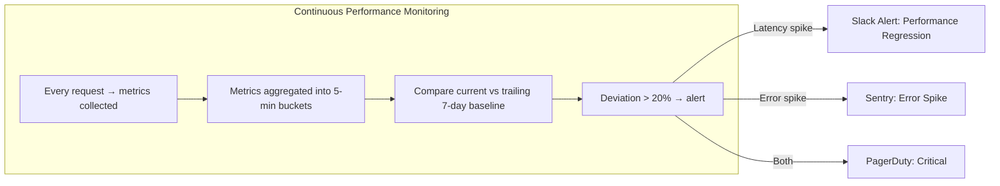

---

## 11. Cost Tracking

### 11.1 Cost Categories

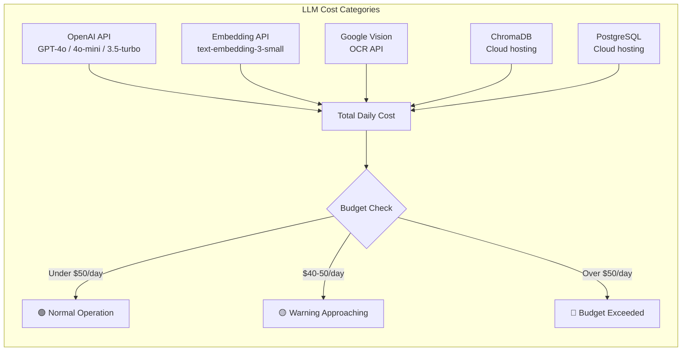

### 11.2 Cost Per Model

Based on the AI Architecture cost analysis:

| Model | Input $/1K tokens | Output $/1K tokens | Est. Annual Cost |
|-------|-------------------|--------------------|-------------------|
| gpt-4o | $0.01 | $0.03 | $600 |
| gpt-4o-mini | $0.0015 | $0.006 | $240 |
| gpt-3.5-turbo | $0.0005 | $0.0015 | $15 |
| text-embedding-3-small | $0.00002 | — | $2 |
| Google Vision | $1.50 / 1000 pages | — | $100 |

**Estimated total annual cost: ~$957** for 100K chat conversations + 10K reports + 5K summaries + 5K emergencies.

### 11.3 Cost Tracking Metrics

| Metric Name | Type | Labels | Description |
|-------------|------|--------|-------------|
| `llm_cost_total` | Counter | `model`, `agent_name` | Cumulative cost USD |
| `llm_cost_daily` | Gauge | — | Resets daily at 00:00 UTC |
| `llm_cost_per_request` | Histogram | `agent_name` | Cost distribution |
| `llm_cost_by_patient` | Gauge | `patient_id` (internal only) | Per-patient cost |
| `llm_tokens_input_total` | Counter | `model` | Cumulative input tokens |
| `llm_tokens_output_total` | Counter | `model` | Cumulative output tokens |

### 11.4 Budget Alert Rules

| Condition | Action | Channel |
|-----------|--------|---------|
| Daily cost > $40 (80% of budget) | Warn | Slack #cost-alerts |
| Daily cost > $50 (budget limit) | Alert | Slack + Email |
| Daily cost > $75 | Critical | PagerDuty + Slack |
| Weekly cost trending up > 10% | Warning notification | Slack |
| Monthly cost > $150 | Review report | Email to team lead |

### 11.5 Cost Optimization Signals

The observability system tracks signals that trigger cost optimization:

| Signal | What It Means | Action |
|--------|--------------|--------|
| High cost per chat | Long responses or many LLM calls | Review prompt length, reduce context |
| Fallback model usage high | Primary model failing | Investigate API issues |
| Embedding cost spike | Large document batch | Review chunking strategy |
| Google Vision cost spike | Many image uploads | Review OCR necessity per file |
| Daily budget consistently near limit | Usage growing | Plan capacity / optimize prompts |

---

## 12. LLM Usage Analytics

### 12.1 LLM Analytics Dashboard

```mermaid
graph TB
    subgraph Analytics["LLM Usage Analytics"]
        direction TB

        subgraph Usage["Usage Metrics"]
            U1[📊 Calls per hour per agent]
            U2[📊 Calls per model]
            U3[📊 Tokens consumed (input vs output)]
            U4[📊 Cost by agent & model]
        end

        subgraph Quality["Quality Metrics"]
            Q1[✅ Success rate by model]
            Q2[⚠️ Error rate by error type]
            Q3[🔁 Fallback rate by agent]
            Q4[📐 JSON parse failure rate]
        end

        subgraph Safety["Safety Metrics"]
            S1[🛡️ Guardrail violation rate]
            S2[🚨 Blocked response rate]
            S3[👤 Human review rate]
            S4[📋 Escalation rate by severity]
        end

        subgraph Performance["Performance Metrics"]
            P1[⏱️ Latency p50/p95/p99 by model]
            P2[📈 Time to first token]
            P3[📉 Retry rate by agent]
            P4[🔄 Fallback cascade depth]
        end
    end
```

### 12.2 Per-Agent LLM Usage Table

```python
LLM_USAGE_REPORT = {
    "agent": "chat_agent",
    "period": "2026-07-14",
    "calls": 1847,
    "models": {
        "gpt-4o": {"calls": 1520, "tokens_in": 684000, "tokens_out": 182400, "cost": 23.56},
        "gpt-4o-mini": {"calls": 287, "tokens_in": 129150, "tokens_out": 34440, "cost": 0.40},
        "gpt-3.5-turbo": {"calls": 40, "tokens_in": 18000, "tokens_out": 4800, "cost": 0.02},
    },
    "errors": {"timeout": 23, "rate_limit": 12, "auth": 0, "parse_failure": 8},
    "fallbacks": {"to_mini": 35, "to_35": 12, "to_rule": 0},
    "avg_latency_ms": 2100,
    "p95_latency_ms": 4200,
    "guardrail_block_rate": 0.008,
    "human_review_rate": 0.015,
}
```

### 12.3 Prompt Version Tracking

Every LLM call tracks the exact prompt version used:

```json
{
  "prompt_path": "chat/patient_chat",
  "prompt_version": "2.0.0",
  "prompt_checksum": "sha256:a1b2c3...",
  "model": "gpt-4o",
  "temperature": 0.7,
  "max_tokens": 2048,
  "response_format": "json_object"
}
```

---

## 13. Database Metrics

### 13.1 Database Monitoring Categories

```mermaid
graph TB
    subgraph DBMetrics["Database Observability"]
        direction TB

        subgraph Connection["Connection Pool"]
            CP1[Pool size (current / max)]
            CP2[Active connections]
            CP3[Idle connections]
            CP4[Waiting clients]
            CP5[Pool exhausted events]
        end

        subgraph Performance["Query Performance"]
            QP1[Queries per second]
            QP2[Avg query latency]
            QP3[Slow queries > 500ms]
            QP4[Full table scans]
            QP5[Index usage stats]
        end

        subgraph Storage["Storage & Health"]
            SH1[Database size]
            SH2[Table sizes]
            SH3[Index sizes]
            SH4[Vacuum age]
            SH5[Replication lag]
        end
    end
```

### 13.2 Database Metrics (PostgreSQL)

| Metric Name | Source | Description | Alert |
|-------------|--------|-------------|-------|
| `db_pool_usage_percent` | App metrics | `active / max * 100` | > 80% → warn |
| `db_query_latency_ms` | App histograms | Per-query latency | p95 > 500ms |
| `db_slow_queries_total` | App counter | Queries > 500ms | > 50/hour |
| `db_pool_exhausted_total` | App counter | Pool exhaustion | Any → critical |
| `db_size_bytes` | SQL query | Total database size | — |
| `db_table_count` | SQL query | Number of tables | — |
| `db_transaction_rollback_rate` | PostgreSQL stats | Rollbacks / total | > 5% → warn |
| `db_deadlocks_total` | PostgreSQL stats | Deadlock count | Any → critical |

### 13.3 Database Query Tags

Every SQL query is tagged for observability:

```python
# Queries are tagged with metadata using SQL comments:
# /* operation=get_patient, agent=chat, request_id=abc */ SELECT * FROM patients WHERE id = :id

# Tags:
# - operation:   what the query does (get_patient, list_medicines, insert_chat)
# - agent:       which agent initiated the query
# - request_id:  traceable request identifier
# - table:       primary table accessed
```

### 13.4 Slow Query Logging

```python
# Slow query log format (logged via SQLAlchemy event listener):
SLOW_QUERY_LOG = {
    "timestamp": "2026-07-14T10:30:00.123Z",
    "duration_ms": 1234,
    "operation": "list_reports",
    "table": "reports",
    "query": "SELECT * FROM reports WHERE patient_id = :pid ORDER BY uploaded_at DESC",
    "parameters": {"pid": "pat_456"},
    "agent": "chat_agent",
    "request_id": "req_abc123",
    "explain_plan": "Seq Scan on reports (cost=0.00..35.50 rows=10 width=120)",
}
```

---

## 14. API Metrics

### 14.1 Endpoint Taxonomy

```mermaid
graph TB
    subgraph APIEndpoints["API Endpoints — Metrics by Group"]
        direction TB

        subgraph Auth["Auth Endpoints"]
            A1[POST /auth/register]
            A2[POST /auth/login]
            A3[POST /auth/refresh]
            A4[POST /auth/logout]
        end

        subgraph Chat["Chat Endpoints"]
            C1[POST /chat/message]
            C2[POST /chat/stream]
        end

        subgraph Emergency["Emergency Endpoints"]
            E1[POST /emergency/check]
        end

        subgraph Reports["Report Endpoints"]
            R1[POST /reports/upload]
            R2[GET /reports/{id}]
            R3[GET /reports]
        end

        subgraph Health["Health Endpoints"]
            H1[GET /health]
            H2[GET /ready]
            H3[GET /live]
            H4[GET /metrics]
        end
    end
```

### 14.2 Per-Endpoint Metrics

Every endpoint tracks:

| Metric | Description | Labels |
|--------|-------------|--------|
| `http_requests_total` | Total request count | `method`, `path`, `status` |
| `http_request_duration_seconds` | Latency histogram | `method`, `path` |
| `http_request_size_bytes` | Request body size | `method`, `path` |
| `http_response_size_bytes` | Response body size | `method`, `path` |
| `http_requests_in_flight` | Current concurrent requests | `method`, `path` |
| `http_rate_limited_total` | Rate-limited requests | `path` |

### 14.3 API-Level SLOs

| Endpoint Group | Target Latency (p95) | Target Availability |
|---------------|---------------------|---------------------|
| Auth (login, register, refresh) | < 500ms | 99.9% |
| Chat (message, stream) | < 5s | 99.5% |
| Emergency (check) | < 8s | 99.9% |
| Reports (upload) | < 2s (response) | 99.5% |
| Reports (get, list) | < 200ms | 99.9% |
| Health endpoints | < 100ms | 99.99% |
| Metrics endpoint | < 100ms | 99.99% |

### 14.4 Middleware Instrumentation

Every request passes through instrumentation middleware that:

1. Generates `request_id` (UUID v4) if not provided
2. Extracts or creates `trace_id` from trace context headers
3. Records start time
4. Wraps request execution in Prometheus histograms
5. Captures response status and duration on completion
6. Logs structured request/response summary

```python
# Middleware spans:
# Request Received  →  [Auth]  →  [Rate Limit]  →  [Controller]  →  [Agent]  →  Response Sent
#     ↓                 ↓            ↓                  ↓             ↓             ↓
#   log INFO          log DEBUG    log WARNING         log INFO     log INFO      log INFO
#   metric: +1        metric: +1   metric: +1          metric: +1   metric: +1   metric: duration
```

---

## 15. Alerting

### 15.1 Alert Severity Levels

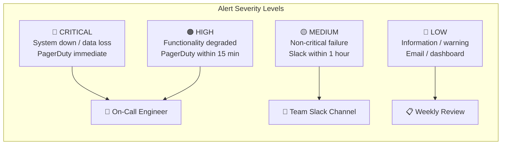

### 15.2 Alert Rules

**Critical Alerts (PagerDuty, 24/7):**

| Rule | Condition | Window | Response |
|------|-----------|--------|----------|
| Service down | Health check returns unhealthy | 1 min | Immediate |
| Database down | DB health check fails | 1 min | Immediate |
| High error rate | HTTP 5xx rate > 5% | 5 min | Immediate |
| Pool exhausted | DB pool exhaustion event | Immediate | Immediate |
| Guardrail failure | Output guardrail evaluation fails | 5 min | 15 min |

**High Alerts (PagerDuty, business hours):**

| Rule | Condition | Window | Response |
|------|-----------|--------|----------|
| Elevated latency | Chat p95 > 8s | 5 min | 15 min |
| LLM failure rate | LLM success rate < 95% | 5 min | 15 min |
| Daily budget | Cost > $50/day | Resets daily | 1 hour |
| Slow queue | Pipeline queue depth > 100 | 5 min | 30 min |
| High fallback rate | Fallback usage > 20% | 15 min | 1 hour |

**Medium Alerts (Slack):**

| Rule | Condition | Window | Response |
|------|-----------|--------|----------|
| Elevated 4xx rate | 4xx rate > 10% | 15 min | 1 hour |
| Slow queries | DB slow query count > 50/h | 15 min | 1 hour |
| OCR low confidence | Average OCR confidence < 0.7 | 1 hour | 4 hours |
| Low disk space | Disk usage > 85% | Check every hour | 24 hours |
| Stalled pipeline jobs | Jobs processing > 30 min | 15 min | 4 hours |

**Low Alerts (Email / Dashboard):**

| Rule | Condition | Window | Response |
|------|-----------|--------|----------|
| Certificate expiry | TLS cert expires < 30 days | Daily | 7 days |
| Backup failure | Daily backup fails | Daily | 24 hours |
| Migration drift | Alembic revision mismatch | Daily | 7 days |
| Deprecation warnings | API deprecation headers | Daily | 30 days |

### 15.3 Alert Routing

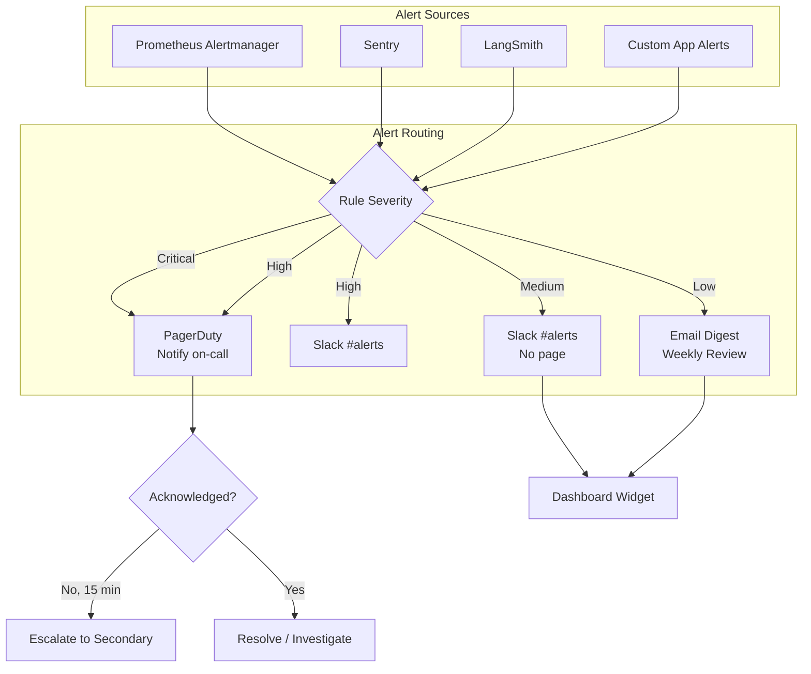

### 15.4 Alert Definitions (Prometheus)

```yaml
# Sample Prometheus alerting rules

groups:
  - name: ai-healthcare-critical
    rules:
      - alert: ServiceDown
        expr: up{job="ai-healthcare-backend"} == 0
        for: 1m
        labels:
          severity: critical
        annotations:
          summary: "AI Healthcare backend is down"

      - alert: HighErrorRate
        expr: rate(http_errors_total{status=~"5.."}[5m]) / rate(http_requests_total[5m]) > 0.05
        for: 5m
        labels:
          severity: critical
        annotations:
          summary: "HTTP 5xx error rate > 5%"

      - alert: LLMBudgetExceeded
        expr: llm_cost_daily > 50
        for: 0m
        labels:
          severity: high
        annotations:
          summary: "Daily LLM budget exceeded ($50)"

      - alert: ChatLatencyHigh
        expr: histogram_quantile(0.95, rate(http_request_duration_seconds_bucket{path="/chat/message"}[5m])) > 8
        for: 5m
        labels:
          severity: high
        annotations:
          summary: "Chat p95 latency > 8s"

      - alert: SlowPipelineQueue
        expr: pipeline_queue_depth > 100
        for: 5m
        labels:
          severity: medium
        annotations:
          summary: "Document pipeline queue depth > 100"
```

---

## 16. Dashboards

### 16.1 Dashboard Inventory

| Dashboard | Audience | Refresh | Data Sources |
|-----------|----------|---------|-------------|
| **Executive Summary** | Product / Ops | 1 min | Prometheus |
| **LLM Operations** | Engineering | 30s | Prometheus + LangSmith |
| **API Performance** | Engineering | 15s | Prometheus |
| **Database Health** | Engineering / Ops | 30s | Prometheus + PostgreSQL |
| **Document Pipeline** | Engineering | 30s | Prometheus |
| **Safety & Compliance** | Clinical / Audit | 5 min | Prometheus + Audit DB |
| **Cost Analytics** | Engineering / Product | 1 hour | Prometheus |

### 16.2 Executive Summary Dashboard

```mermaid
graph TB
    subgraph Executive["Executive Summary Dashboard"]
        direction TB

        Row1["Row 1: System Status"]
        R1A[🟢 Overall Health] --- R1B[🎯 Uptime: 99.8%] --- R1C[👥 Active Patients: 47]

        Row2["Row 2: Daily Activity"]
        R2A[💬 Chats Today: 234] --- R2B[🚨 Escalations: 3] --- R2C[📄 Reports: 12] --- R2D[💊 Reminders: 845]

        Row3["Row 3: Performance at a Glance"]
        R3A[⚡ Chat Latency p95: 3.2s] --- R3B[❌ Error Rate: 0.8%] --- R3C[💰 Daily Cost: $32.45] --- R3D[🛡️ Guardrail Blocks: 2]

        Row4["Row 4: 7-Day Trends"]
        R4A[📈 Active Users] --- R4B[📈 Avg Response Time] --- R4C[📈 Daily Cost Trend]
    end
```

### 16.3 LLM Operations Dashboard

| Panel | Type | Metric | Refresh |
|-------|------|--------|---------|
| LLM Calls per Minute | Time series | `rate(llm_calls_total[5m])` | 30s |
| LLM Success Rate | Gauge | `1 - rate(llm_errors_total[5m]) / rate(llm_calls_total[5m])` | 30s |
| LLM Latency (p50/p95/p99) | Time series | `histogram_quantile(0.95, rate(llm_call_duration_seconds_bucket[5m]))` | 30s |
| Token Consumption | Time series (stacked) | `rate(llm_tokens_input_total[5m])` + `rate(llm_tokens_output_total[5m])` | 30s |
| Cost by Model | Bar chart | `rate(llm_cost_total[1h])` by `model` | 1 min |
| Cost by Agent | Bar chart | `rate(llm_cost_total[1h])` by `agent_name` | 1 min |
| Fallback Rate | Time series | `rate(agent_fallbacks_total[5m])` | 30s |
| Agent Node Latency | Heatmap | `agent_node_duration_seconds_bucket` | 1 min |
| Errors by Agent | Table | `agent_node_errors_total` | 1 min |
| Human Reviews Queued | Gauge | `agent_human_reviews_queued` | 30s |

### 16.4 API Performance Dashboard

| Panel | Type | Metric | Refresh |
|-------|------|--------|---------|
| Requests per Second | Time series | `rate(http_requests_total[5m])` | 15s |
| Status Code Breakdown | Time series (stacked) | `rate(http_requests_total[5m])` by `status` | 15s |
| Latency by Endpoint | Bar chart | `histogram_quantile(0.95, rate(http_request_duration_seconds_bucket[5m]))` by `path` | 15s |
| Active Requests | Gauge | `http_requests_in_flight` | 15s |
| Error Rate | Time series | `rate(http_errors_total[5m]) / rate(http_requests_total[5m])` | 15s |
| Top Slow Endpoints | Table | p95 latency by path, sorted descending | 30s |

### 16.5 Database Dashboard

| Panel | Type | Metric | Refresh |
|-------|------|--------|---------|
| Connection Pool Usage | Time series | `db_connection_active / db_connection_pool_size` | 30s |
| Query Latency (p50/p95) | Time series | `histogram_quantile(0.95, rate(db_query_duration_seconds_bucket[5m]))` | 30s |
| Slow Query Rate | Time series | `rate(db_slow_queries_total[5m])` | 30s |
| Active Connections | Gauge | `db_connection_active` | 30s |
| Pool Exhaustion Events | Counter | `rate(db_pool_exhausted_total[5m])` | 30s |
| Table Sizes | Bar chart | `db_table_size_bytes` | 1 hour |

### 16.6 Document Pipeline Dashboard

| Panel | Type | Metric | Refresh |
|-------|------|--------|---------|
| Uploads per Hour | Time series | `rate(pipeline_uploads_total[1h])` | 30s |
| Pipeline Stage Durations | Time series (stacked) | `pipeline_stage_duration_seconds` by stage | 30s |
| OCR Confidence | Gauge | `avg(pipeline_ocr_confidence)` | 1 min |
| Extraction Confidence | Gauge | `avg(pipeline_extraction_confidence)` | 1 min |
| Queue Depth | Gauge | `pipeline_queue_depth` by priority | 15s |
| Stage Error Rate | Time series | `rate(pipeline_stage_errors_total[5m])` by stage | 30s |
| Pipeline Success Rate | Gauge | Successful / Total jobs (1h window) | 1 min |

### 16.7 Safety & Compliance Dashboard

| Panel | Type | Metric | Refresh |
|-------|------|--------|---------|
| Guardrail Violations per Day | Bar chart | `rate(guardrail_violations_total[24h])` by severity | 5 min |
| Blocked Responses | Time series | `guardrail_violations_total{severity="block"}` | 5 min |
| Emergency Escalations | Time series | `rate(emergency_escalations_total[1h])` by risk_level | 1 min |
| Human Review Queue | Gauge | `agent_human_reviews_queued` | 1 min |
| Pending Reviews by Type | Table | Count of pending reviews by interrupt type | 1 min |
| Audit Log Event Rate | Time series | Rate of audit log entries by event type | 5 min |
| Medical Safety Score | Gauge | Composite: (1 - blocked_rate) * escalation_response_time | 5 min |

### 16.8 Cost Analytics Dashboard

| Panel | Type | Metric | Refresh |
|-------|------|--------|---------|
| Daily Cost Trend (30 days) | Time series | `sum(rate(llm_cost_total[1d]))` | 1 hour |
| Cost Breakdown by Model | Pie chart | `sum by (model) (llm_cost_total)` | 1 hour |
| Cost Breakdown by Agent | Pie chart | `sum by (agent_name) (llm_cost_total)` | 1 hour |
| Cost per Patient | Table | Top 10 patients by cost | 1 hour |
| Budget Remaining | Gauge | `50 - llm_cost_daily` | 5 min |
| Estimated Monthly | Gauge | `llm_cost_daily * 30` | 1 hour |

---

## 17. Architecture Decision Records

### ADR-OBS-001: Loguru over Standard Logging

**Status:** Accepted

**Context:** Python's `logging` module is verbose to configure, lacks structured
output, and has poor async support. Options are `loguru`, `structlog`, or custom
JSON formatter on stdlib.

**Decision:** Use Loguru for all logging. Configure structured JSON output in
production and colorized console output in development.

**Consequences:**
- (+) Zero-boilerplate logging — `logger.info("ready")` works everywhere
- (+) Built-in rotation and retention
- (+) Async-capable (via `opt()`)
- (-) Another dependency beyond stdlib
- (-) Intercept handler needed for third-party libs using stdlib logging

### ADR-OBS-002: Prometheus over DataDog / New Relic

**Status:** Accepted

**Context:** Metrics collection needs an open-source, self-hostable solution that
works with Kubernetes. Options: Prometheus + Grafana, DataDog, New Relic.

**Decision:** Use Prometheus for metrics collection and Grafana for dashboards.
Self-hosted for dev, managed (Grafana Cloud) potential for prod.

**Consequences:**
- (+) No per-node licensing costs
- (+) Industry standard for K8s metrics
- (+) Pull-based model works well with ephemeral containers
- (-) Requires separate infrastructure (Prometheus server)
- (-) No built-in alert management (requires Alertmanager)

### ADR-OBS-003: OpenTelemetry for Tracing

**Status:** Accepted

**Context:** Trace context needs to propagate across FastAPI middleware, LangGraph
agents, LLM calls, and background tasks.

**Decision:** Use OpenTelemetry SDK with OTLP exporter to an OpenTelemetry Collector.
Use Grafana Tempo as the trace storage backend.

**Consequences:**
- (+) Vendor-agnostic — can swap backends (Jaeger, Tempo, Zipkin)
- (+) W3C trace context standard for propagation
- (+) Rich ecosystem of automatic instrumentation
- (-) Additional infrastructure (OTel Collector + Tempo)
- (-) Overhead on every request (minimal at 100% sampling)

### ADR-OBS-004: LangSmith for LLM-Specific Observability

**Status:** Accepted

**Context:** LLM observability requires prompt tracking, token counting, latency
per-model, and evaluation — metrics that general-purpose tools don't provide.

**Decision:** Use LangSmith specifically for LLM traceability. It complements
(does not replace) Prometheus metrics and Sentry error tracking.

**Consequences:**
- (+) Deep LLM-specific insights (prompt versions, model comparison)
- (+) Built-in evaluation framework (LLM-as-Judge)
- (+) Tight LangGraph integration
- (-) Additional per-call cost for tracing
- (-) Another SaaS tool to manage

### ADR-OBS-005: Separate Liveness, Readiness, and Health Endpoints

**Status:** Accepted

**Context:** Kubernetes needs both liveness (is the process alive?) and readiness
(is the process ready to serve traffic?). A single health endpoint conflates both.

**Decision:** Three separate endpoints:
- `/live` — shallow process check (responds always unless hung)
- `/ready` — dependency check (DB, migrations, ChromaDB)
- `/health` — comprehensive system health (for human operators)

**Consequences:**
- (+) K8s probes are fast and reliable (thin endpoints)
- (+) `/health` can be slow and detailed without affecting K8s
- (-) More endpoints to maintain
- (-) Deployment automation needs to distinguish all three

### ADR-OBS-006: PII Filtering at Collection Boundary

**Status:** Accepted

**Context:** HIPAA requires that patient health information not be sent to
third-party observability services (Sentry, LangSmith, etc.).

**Decision:** Strip PII at the collection boundary — before data leaves the
application. Logs and traces retain `request_id` and `patient_id` (for internal
correlation) but never PHI (medical free-text, names, dates).

**Consequences:**
- (+) HIPAA-compliant observability pipeline
- (+) No need for BAA with Sentry/LangSmith for non-PHI data
- (-) Debugging is harder when health information is stripped from traces
- (-) Must ensure internal log storage is HIPAA-compliant instead

### ADR-OBS-007: Metrics Labels Exclude Patient-Level Data

**Status:** Accepted

**Context:** Prometheus metrics with high-cardinality labels (patient_id, user_id)
can cause performance issues and potentially leak PII.

**Decision:** No patient-level or user-level labels in Prometheus metrics. Use
aggregated metrics only (rates, counts, histograms). Patient-level analytics come
from the application database, not the metrics system.

**Consequences:**
- (+) Prometheus stays performant (no label explosion)
- (+) No PII in metrics system
- (-) Cannot build per-patient dashboards in Grafana from metrics
- (-) Need application DB queries for patient-level analytics

---

## Appendix A: Quick Reference

### A.1 Endpoint Summary

| Endpoint | Purpose | Response Time | Cache | Auth |
|----------|---------|--------------|-------|------|
| `GET /health` | Full system health | < 200ms | No | Internal only |
| `GET /health/details` | Detailed component health | < 500ms | No | Internal only |
| `GET /ready` | Kubernetes readiness | < 200ms | No | None |
| `GET /live` | Kubernetes liveness | < 10ms | 30s TTL | None |
| `GET /metrics` | Prometheus metrics | < 100ms | None | Internal only |

### A.2 Ports

| Service | Port | Protocol |
|---------|------|----------|
| FastAPI (metrics + health) | 8000 | HTTP |
| Prometheus | 9090 | HTTP |
| Grafana | 3000 | HTTP |
| Alertmanager | 9093 | HTTP |
| OpenTelemetry Collector | 4317 | gRPC |
| Grafana Tempo | 3200 | HTTP |
| Grafana Loki | 3100 | HTTP |

### A.3 Environment Variables

```ini
# Observability configuration
LOG_LEVEL=INFO
LOG_FORMAT=json                    # json | console
SENTRY_DSN=https://...@o...ingest.us.sentry.io/...
SENTRY_ENVIRONMENT=production
LANGSMITH_API_KEY=lsv2_...
LANGSMITH_PROJECT=ai-healthcare-prod
LANGSMITH_TRACING_SAMPLING_RATE=0.1
OTEL_EXPORTER_OTLP_ENDPOINT=http://otel-collector:4317
OTEL_SERVICE_NAME=ai-healthcare-backend
PROMETHEUS_MULTIPROC_DIR=/tmp/prometheus
```

### A.4 File Locations

```
backend/
├── app/
│   ├── core/
│   │   ├── logging.py               # Loguru configuration (implemented)
│   │   ├── health.py                # DatabaseHealthChecker (implemented)
│   │   └── telemetry.py             # OpenTelemetry setup (future)
│   ├── middleware/
│   │   ├── request_id.py            # Request ID middleware
│   │   ├── metrics.py               # Prometheus metrics middleware
│   │   ├── tracing.py               # OpenTelemetry tracing middleware
│   │   └── sentry.py                # Sentry init
│   ├── api/
│   │   └── v1/
│   │       ├── health.py            # GET /health, /health/details
│   │       ├── ready.py             # GET /ready (future)
│   │       ├── live.py              # GET /live (future)
│   │       └── metrics.py           # GET /metrics (future)
│   └── services/
│       ├── cost_tracker.py          # LLM cost tracking
│       └── llm_analytics.py         # LLM usage analytics
├── logs/                            # Log files (30-day retention)
├── monitoring/                      # Grafana dashboards (JSON exports)
│   ├── executive-summary.json
│   ├── llm-operations.json
│   ├── api-performance.json
│   ├── database-health.json
│   ├── document-pipeline.json
│   ├── safety-compliance.json
│   └── cost-analytics.json
└── docker-compose.observability.yml # Prometheus + Grafana + Tempo + Loki
```
